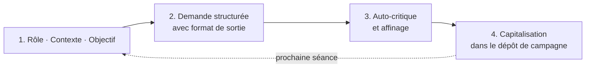

> 🗂️ **Section Diátaxis** : Tutoriel (apprentissage guidé) · **Niveau Bloom** : Appliquer
> **Objectifs pédagogiques** : *utiliser* un LLM pour préparer sa première séance, *appliquer* une méthode de prompt en quatre questions, *produire* un premier artefact de jeu réutilisable.

# Tutoriel : premiers pas avec un LLM pour le JDR

Ce tutoriel vous fait réussir **une tâche concrète et complète** : produire un scénario jouable d'une page pour votre prochaine séance, en une quinzaine de minutes, sans connaissance préalable des LLM.

Si vous cherchez une réponse à un problème précis en cours de route, allez plutôt dans les [Guides pratiques](../10-guides/Guides%20pratiques%20pour%20le%20MJ.md). Pour comprendre les concepts, voir [Explication](../30-explication/Skills%20et%20MCP%20dans%20le%20JDR.md).

## Prérequis

* Un compte sur un chatbot IA (Le Chat, Claude, ChatGPT…) ou un modèle local via [LM Studio](../30-explication/%C3%89cosyst%C3%A8me%20d'outils%20IA%20pour%20le%20JDR.md#lm-studio-des-mod%C3%A8les-locaux-%C3%A0-la-table).
* Une idée en une phrase du genre et de l'univers de votre partie.

## Étape 1 — Poser le décor

Ouvrez une conversation et donnez le **rôle**, le **contexte** et l'**objectif** :

```text
Tu es un meneur de jeu expérimenté de jeu de rôle médiéval-fantastique.
Ma table joue un groupe de 4 personnages de niveau 2 dans la cité portuaire
de Sel-Meurtrière. Je souhaite un scénario jouable en une soirée.
```

## Étape 2 — Demander une ébauche structurée

```text
Propose-moi le pitch d'un scénario avec : un accroche qui implique les PJ,
trois scènes clés, un antagoniste avec sa motivation, et deux issues
possibles. Présente le tout en markdown avec des titres.
```

## Étape 3 — Critiquer et affiner

Faites vérifier le résultat (niveau Bloom *Évaluer* — vous y reviendrez) :

```text
Relis ton scénario : identifie les incohérences, les clichés et ce qui
manque pour tenir une soirée de jeu. Corrige puis rends la version finale.
```

## Étape 4 — Capitaliser

Conservez le résultat dans un dossier `campagne/scenarios/`. Ce fichier est
le premier élément de votre dépôt de campagne (voir le
[guide GitHub](../10-guides/Guides%20pratiques%20pour%20le%20MJ.md)).

## Récapitulatif de la méthode



## Où aller ensuite ?

* Un problème précis en jeu ? → [Guides pratiques](../10-guides/Guides%20pratiques%20pour%20le%20MJ.md)
* « C'est quoi un LLM, une fenêtre contextuelle ? » → [Usage des LLM dans le JDR](../30-explication/Fondamentaux%20des%20LLM%20pour%20le%20JDR.md) et le [Glossaire](../20-reference/Glossaire.md)
* Automatiser cette méthode → [Skills et MCP](../30-explication/Skills%20et%20MCP%20dans%20le%20JDR.md)
