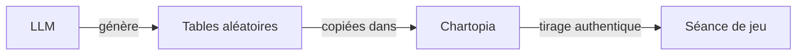
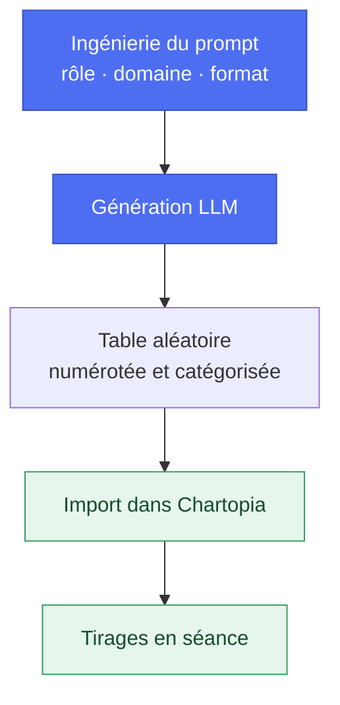

> 🗂️ **Section Diátaxis** : Guide pratique (recette orientée problème) · **Niveaux Bloom** : Appliquer → Créer
> **Objectifs pédagogiques** : *créer* des tables aléatoires avec un LLM, *intégrer* les tables dans Chartopia, *exploiter* des tirages authentiques en séance

> 📖 Extrait de l'article fondateur « Usage des LLM dans le JDR », refondu selon le framework Diátaxis. Licence [CC BY-NC-ND 4.0](https://creativecommons.org/licenses/by-nc-nd/4.0/).

# Chartopia avec un LLM

## Comment faire usage d’un LLM vers Chartopia

> 🗂️ **Diátaxis** : Recette pratique (how-to, orientée problème) · **Bloom** : Appliquer → Créer
> 🎯 **Objectifs pédagogiques** : *appliquer* une méthode d'ingénierie de prompt, *créer* des tables aléatoires contextualisées, *intégrer* le résultat dans Chartopia

Parmi les choses sur lesquelles les LLM sont particulièrement efficaces figure la génération de listes contextualisées grâce à leur capacité à “comprendre” et à synthétiser des informations complexes en fonction du contexte donné. Ça tombe bien parce que c’est essentiel pour Chartopia. Les LLM peuvent via un Prompt réaliser ce type de génération, tels que la création d’une liste de rencontres de monstres, de trésors, d’avantages, de défauts, de lieu, d’objet ou la définition de caractéristiques de PNJ, et produire des listes précises et pertinentes qui répondent parfaitement aux exigences de Chartopia.

### Création de tables aléatoires avec un LLM

Pour obtenir un résultat qualitatif, il est préférable de faire un peu d'ingénierie sur le Prompt en amont, c'est-à-dire de définir les éléments qui vont permettre de générer la liste qui répond le mieux à nos attentes (rappel complet dans [l'ingénierie du prompt](../30-explication/Fondamentaux%20des%20LLM%20pour%20le%20JDR.md#quest-ce-que-lingénierie-du-prompt)).

#### Le rôle et l’ancienneté

Pour générer au mieux des tables aléatoires, plusieurs rôles peuvent être impliqués, chacun apportant une perspective et une expertise différentes. Par exemple nous retenons pour ce point de ce guide 3 rôles et nous leur affectons une ancienneté de 30 ans da
ns le milieu :

* Auteur de jeu de rôle  
* Game designer  
* Maître de jeu (MJ)

#### Le domaine

Spécifi
ez clairement le thème ou le domaine du tableau (par exemple, "jeu de rôle fantasy", "cyberpunk", etc.). Voici une liste de différents domaines ou thèmes pour les jeux de rôle que vous pouvez utiliser pour définir le thème de votre tableau aléatoire :

* **Fantasy** : Monde médiéval fantastique peuplé de créatures mythiques, de magie et de chevaliers.  
* **Science-fiction** : Futur lointain avec des technologies avancées, des voyages spatiaux et des extraterrestres.  
* **Cyberpunk** : Univers dystopique avec des mégacorporations, des hackers, et une esthétique high-tech, low-life.  
* **Steampunk** : Monde victorien alternatif avec des technologies à vapeur et des inventions excentriques.  
* **Horreur** : Thème axé sur la peur, les monstres et les mystères surnaturels.  
* **Post-apocalyptique** : Univers dévasté par une catastrophe majeure, où les survivants luttent pour leur survie.  
* **Historique** : Aventures se déroulant à une période spécifique de l'histoire, comme l'Antiquité, le Moyen Âge, ou la Renaissance.  
* **Super-héros** : Monde contemporain ou futuriste où des individus possèdent des pouvoirs extraordinaires.  
* **Espionnage** : Univers centré sur les intrigues, les missions secrètes et les agents infiltrés.  
* **Western** : Aventures dans le Far West avec des cow-boys, des hors-la-loi et des villes frontalières.  
* **Pirates** : Monde maritime avec des corsaires, des trésors cachés et des batailles navales.  
* **Mythologique** : Univers inspiré des mythes et légendes de diverses cultures, comme la mythologie grecque, nordique ou égyptienne.  
* **Uchronie** : Réécriture de l'histoire avec des événements divergents, créant une réalité alternative.  
* **Space Opera** : Aventures épiques dans l'espace avec des empires galactiques, des batailles spatiales et des héros interstellaires.  
* **Fantastique Urbain** : Monde contemporain où la 
magie et les créatures mythiques existent en secret.  
* **Cthulhu/Mythes de Lovecraft** : Univers basé sur
 les écrits de H.P. Lovecraft, avec des horreurs cosmiques et des cultes occultes.  
* **Mystère/Enquête** : Thème centré sur la résolution d'énigmes, de crimes ou de mystères paranormaux.  
* **Noir** : Ambiance sombre et cynique, souvent dans un cadre urbain avec des détectives privés et des intrigues complexes.  
* **Samouraïs/Japon Féodal** : Monde inspiré du Japon médiéval avec des samouraïs, des ninjas et des intrigues de cour.  
* **High Fantasy** : Monde où la magie est omniprésente et les conflits épiques entre le bien et le mal sont courants.

Voici un exemple de liste des jeux de rôle classés par domaine sous forme de tableau :

| Domaine | Jeu 1 | Jeu 2 | Jeu 3 | Jeu 4 |
| :---- | :---- | :---- | :---- | :---- |
| **Low Fantasy** | Trône de fer | Wastburg | Warhammer Fantasy Roleplay | Hârn |
| **Fantasy** | Chroniques Oubliées Fantasy | Pathfinder | The One Ring | Donjons & Dragons |
| **High**  | Legend of the Five Rings (L5R) | Earthdawn | Donjons & Dragons | Exalted |
| **Grim Fantasy** | Warhammer Fantasy Roleplay | Symbaroum | GODS | Shadows of Esteren |
| **Science-fiction** | Starfinder | Traveller | Alien | The Expanse |
| **Cyberpunk** | Cyberpunk 2020 / Red | Shadowrun | Blade Runner | Interface Zero |
| **Steampunk** | Castle Falkenstein | Iron Kingdoms | Victoriana | Etherscope |
| **Horreur** | L'Appel de Cthulhu | Vampire: La Mascarade | Delta Green | Vaesen |
| **Post-apocalyptique** | Mutant Year Zero | Fallout | Gamma World | Eclipse Phase |
| **Historique** | Pendragon | Aquelarre | Imperator | Tenga |
| **Super-héros** | Mutants & Masterminds | Champions | Marvel Heroic Roleplaying | DC Heroes |
| **Espionnage** | James Bond 007 | Top Secret | Nights Black Agents | Spycraft |
| **Western** | Deadlands | Aces & Eights | Boot Hill | Wild West Exodus |
| **Pirates** | 7th Sea | Capitaine Vaudoo | Skull & Bones | Pirates of the Span
ish Main |
| **Mythologique** | Mythic Greece | Scion | Glorantha (RuneQuest) | Agon |
| **Uchronie** | Fate
 of the Norns | Space: 1889 | GURPS Alternate Earths | Castle Falkenstein |
| **Space Opera** | Dune: Adventures in the Imperium | Star Wars: Edge of the Empire Age of rebellion Forces and Destiny | Fading Suns | Star Trek Adventures |
| **Fantastique Urbain** | Urban Shadows | Dresden Files RPG | World of Darkness | Monster of the Week |
| **Cthulhu/Mythes de Lovecraft** | L'Appel de Cthulhu | Trail of Cthulhu | Cthulhu Dark | Delta Green |
| **Mystère/Enquête** | Gumshoe | Sherlock Holmes Consulting Detective | Esoterrorists | The Dresden Files |
| **Noir** | Blades in the Dark | Noirlandia | A Dirty World | Hard City |
| **Samouraïs/Japon Féodal** | Tenga | Bushido | Sengoku | Legend of the Five Rings |
| **Contemporain** | Millenium’s End | Chroniques Oubliées Contemporain | Fiasco | Unknown Armies |

Cette table inclut des jeux populaires et diversifiés dans chaque domaine, idéalement, votre prompt doit être renforcé par un apport de contexte lié à cet univers via un résumé de 10 à 15 lignes.

#### Le format

Indiquez que vous souhaitez une liste sous forme de table aléatoire et que chaque entrée doit être numérotée pour faciliter les jets de dés, en précisant dans chaque cas le dé utilisé (d4/d6/d8/d10/d12/d20/d30/d100).

#### Le nombre d'entrées

Indiquez combien d'entrées vous souhaitez dans chaque catégorie (par exemple, 10, 20, 100, etc.). Gardez en tête que les tables de Chartopia ne sont pas limitées à un format de dés, ce qui signifie que vous pouvez avoir une table de 45 ou 113 entrées.

#### Les catégories

Si vous avez plusieurs catégories ou types d'entrées (comme des objets magiques, des rencontres, des trésors, etc.), précisez-les.

#### La structure de sortie

Fournissez un exemple de format ou de structure pour chaque entrée de la table.

| Le format de sortie sera sous la forme suivante :  | numéro | Libellé d’événement | Description de 
l’événement |  |
| :---- |

### Exemple de Prompt

------

En tant que \[Rôle : Auteur\] de \[Contexte : jeu 
de rôle\] avec \[Ancienneté : 20 ans \] d’expérience, vous souhaitez \[Objectif : générer\] |Format : une liste\] de \[Catégorie : d’événements aléatoires\] pour un \[Contexte : cadre de jeu de rôle\] \[Domaine : cyberpunk\] nommé \[Contexte/Contrainte : Shadowrun\] dans sa \[Contexte/Contrainte : 3éme édition\] \[Contexte/Contrainte : motorisé par un système D6 à seuil de succès\]. La liste \[Contrainte : doit contenir\] \[Contrainte : 20 entrées numérotées\]. Le format de sortie sera sous la forme suivante : \| numéro \| Libellé d’événement \| Description de l’événement \|

------

#### Exemple de résultat du Prompt

| Numéro | Libellé d’événement | Description de l’événement |
| ----- | ----- | ----- |
| 1 | Piratage de la Matrice | Une faille de sécurité dans la Matrice permet à un groupe de pirates de dérober des données sensibles d'une mégacorporation. |
| … | … | … |
| 20 | Artefact Atlante | Un artefact Atlante antique est découvert et devient la cible de divers groupes cherchant à en exploiter le pouvoir. |

Note : Dans notre exemple, Shadowrun étant un univers multi dimensions (monde physique, monde virtuel, domaine & plan astraux), il faudrait également ajouter cette contrainte de contexte dans le prompt pour obtenir des listes plus cohérentes. On pourrait également ajouter au contexte les factions impactés par l’événement ou à l'origine de l’événement. Mais nous vous recommandons de générer plusieurs tables et ensuite de réaliser un formulaire de génération combiné dans Chartopia.

### Intégration avec Chartopia

Prenez les listes générées et importez-les dans Chartopia pour créer des tables aléatoires. Chaque entrée peut être un lieu, un événement, un objet, une caractéristique, un avantage, un défaut ou un PNJ avec les descriptions fournies.

**Exemple de table de lieux dans Chartopia** :

| 1d20 | Lieu |  
|------|-----------------------------
----------|  
| 1 | La Taverne du Dragon Vert |  
| 2 | La Forêt des Murmures |  
| ...  | ... |  
| 20 | Le M
arché Nocturne |

### Pour aller plus loin avec Chartopia

Chartopia Tutorial (Part 1\) [https://www.youtube.com/watch?v=QfsrqSAV3Oo](https://www.youtube.com/watch?v=QfsrqSAV3Oo)  
Chartopia Tutorial (Part 2\) [https://www.youtube.com/watch?v=bWYNblqn1fw](https://www.youtube.com/watch?v=bWYNblqn1fw)  
Chartopia Tutorial (Part 3\) [https://www.youtube.com/watch?v=XRyWWBjGzh4](https://www.youtube.com/watch?v=XRyWWBjGzh4) 

