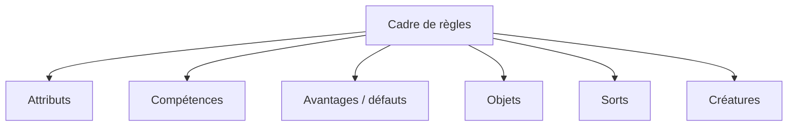
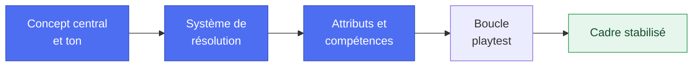
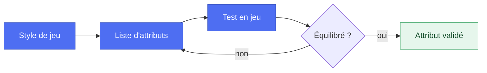
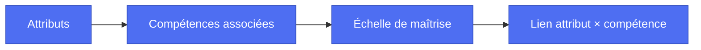
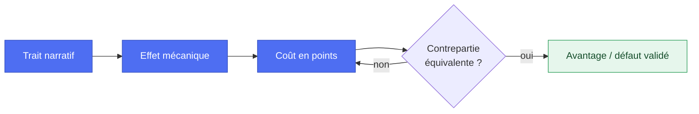
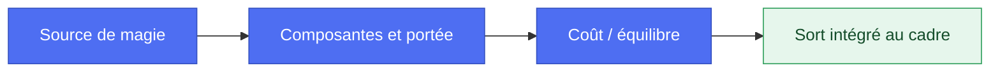
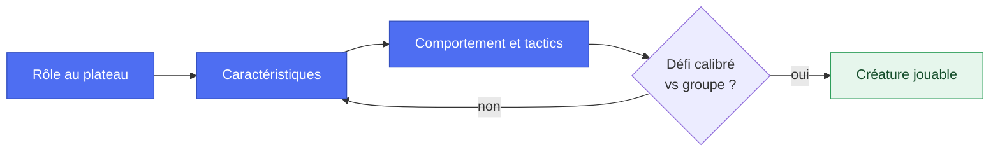

> 🗂️ **Section Diátaxis** : Guide pratique (recette orientée problème) · **Niveaux Bloom** : Créer
> **Objectifs pédagogiques** : *concevoir* un cadre de règles complet, *créer* attributs, compétences, objets et sorts, *équilibrer* des créatures

> 📖 Extrait de l'article fondateur « Usage des LLM dans le JDR », refondu selon le framework Diátaxis. Licence [CC BY-NC-ND 4.0](https://creativecommons.org/licenses/by-nc-nd/4.0/).

# Guides — conception de règles

## Conception d’un cadre de règle

> 🗂️ **Diátaxis** : Recette pratique (how-to) · **Bloom** : Créer
> 🎯 **Objectifs pédagogiques** : *concevoir* une architecture de règles, *choisir* les mécaniques de résolution, *structurer* la création de personnages

### Objectif

Créer un système de règles cohérent, équilibré et flexible qui soutient l'expérience de jeu souhaitée, en définissant les mécaniques principales qui régissent les actions des personnages et la résolution des conflits.

### Fonctionnement

Élaboration d'un ensemble de mécaniques de jeu interconnectées, basées sur les principes fondamentaux choisis pour le jeu. Le système doit être suffisamment robuste pour couvrir une variété de situations tout en restant accessible aux joueurs.

### Étapes à suivre

* Définir le concept central et le ton du jeu  
* Choisir le système de résolution principal (dés, cartes, etc.)  
* Concevoir le système de création de personnages  
* Établir les attributs et compétences de base  
* Élaborer les règles de combat et de conflits  
* Définir le système de progression des personnages  
* Créer les règles pour la magie ou les technologies spéciales (si applicable)  
* Développer les mécaniques de gestion des ressources  
* Établir les règles pour les interactions sociales et l'exploration  
* Concevoir un système de récompenses et de conséquences  
* Rédiger les règles pour le maître de jeu (gestion des PNJ, création d'aventures, etc.)

### Résultat attendu

Un système de règles complet et cohérent qui soutient le style 
de jeu visé, offrant un équilibre entre simplicité d'utilisation et profondeur tactique. Le système doit être suffisamment flexible pour s'adapter à diverses situations de jeu tout en maintenant l'ambiance et le rythme souhaités pour l'expérience de jeu.

### Exemple de Prompt

------

En tant que concepteur de jeux de rôle expérimenté (30 ans)

aides moi à créer un cadre de règles pour un nouveau jeu de rôle en suivant le modèle ci-dessous

N'hésitez pas à me poser des questions pour clarifier certains aspects ou proposer des alternatives.

**Template de cadre de règles**

Concept et ton : 
- Genre : Quel est le genre principal (heroic fantasy, sci-fi, etc.) ?
- Ton : Quelle est l'ambiance générale (épique, sombre, humoristique, etc.) ?
- Complexité : Quel niveau de complexité visez-vous (léger, moyen, complexe) ?
- Système de résolution : Méthode : Quel type de système (d20, pool de dés, cartes, etc.) ?
- Échelle de difficulté : Comment sont déterminés les seuils ? Succès/Échecs :
- Comment sont gérés les degrés de réussite ou d'échec ?

**Création de personnages**
- Méthode : Comment les personnages sont-ils créés (points, aléatoire, archétypes) ?
- Attributs : Quels sont les attributs principaux ?
- Compétences : Comment sont structurées les compétences ?
- Background : Quelle importance est donnée à l’histoire personnelle ?

**Combat et conflits**
- Initiative : Comment est déterminé l’ordre des actions ?
- Actions : Combien d’actions par tour et comment sont-elles gérées ?
- Dégâts : Comment sont-ils calculés et appliqués ?
- Santé : Comment la santé est-elle gérée ?

**Progression**
- Expérience : Comment les personnages gagnent-ils de l’expérience ?
- Amélioration : Comment s’améliorent-ils ?
- Niveaux : Y a-t-il un système de niveaux ou une progression fluide ?

**Magie/Technologies spéciales**
- Système : Comment fonctionnent la magie ou les technologies ?
- Coût : Quel est le coût d’utilisation (points, fatigue, ressources) ?
- Apprentissage : Comment acq
uiert-on de nouveaux sorts ou technologies ?

**Gestion des ressources**
- Inventaire : Comment est géré l’équipement ?
- Économie : Quel système monétaire ou d’échange est utilisé ?
- Ressources spéciales : Y a-t-il des ressources uniques à gérer (karma, santé mentale, etc.) ?

**Interactions sociales et exploration**
- Compétences sociales : Comment sont gérées les interactions sociales ?
- Exploration : Quelles mécaniques soutiennent l’exploration ?

**Récompenses et conséquences**
- Récompenses : Quels types de récompenses sont donnés ?
- Conséquences : Comment sont gérées les conséquences des actions ?

**Règles pour le MJ**
- Création d’aventures : Quelles lignes directrices pour créer des aventures ?
- Gestion des PNJ : Comment gérer les personnages non-joueurs ?
- Équilibrage : Quelles règles pour équilibrer défis et récompenses ?

**Innovations et particularités**
- Mécaniques uniques : Y a-t-il des mécaniques innovantes ou particulières ?
- Intégration thématique : Comment les règles renforcent-elles le thème du jeu ?

**Contexte**
*(Coller ici le contexte intial du cadre et vos notes)*

------

## Création d'un attribut

> 🗂️ **Diátaxis** : Recette pratique (how-to) · **Bloom** : Créer
> 🎯 **Objectifs pédagogiques** : *créer* des attributs cohérents avec le système, *calibrer* leur impact mécanique

### Objectif 

Définir une caractéristique fondamentale d'un personnage qui reflète ses capacités innées et influence plusieurs aspects du jeu.

### Fonctionnement

L'attribut est une valeur numérique ou descriptive qui sert de base pour de nombreux calculs et tests dans le jeu.

### Étapes à suivre

* Définir le nom et la nature de l'attribut  
* Déterminer l'échelle de valeurs possible  
* Établir comment l'attribut affecte les mécaniques de jeu  
* Créer des descripteurs pour différentes valeurs de l'attribut  
* Définir comment l'attribut peut évoluer au cours du jeu

### Résultat attendu

Un attribut clairement défini, équilibré et intégré aux mécaniques de jeu, qui contribue à la caractérisation du personnage.

### Exemple de Prompt

------

En tant que concepteur de jeux de rôle avec 30 ans d’expérience

Tu dois m'aider à créer un 
attribut pour un nouveau personnage de JDR.

Utilise le template suivant pour structurer ton approche. N'hésites pas à me poser des questions pour clarifier certains aspects ou proposer des alternatives.

**Template de création d'un attribut**

**Définir le nom et la nature de l'attribut**
- Quel type d'attribut est pertinent pour votre jeu (physique, mental, social, etc.) ?
- Quel nom reflète le mieux la capacité ou la caractéristique que vous voulez inclure ?

**Déterminer l'échelle de valeurs possible**
- Quelle échelle de valeurs est appropriée (numérique, descriptive) ?
- Quelle sera la plage de valeurs (1-10, 1-100, faible à exceptionnel, etc.) ?

**Établir comment l'attribut affecte les mécaniques de jeu**
- Quels aspects du jeu l'attribut influencera-t-il (combat, interactions sociales, exploration, etc.) ?
- Comment ces influences se manifestent-elles en termes de règles et de gameplay ?

**Créer des descripteurs pour différentes valeurs de l'attribut**
- Quels sont les descripteurs appropriés pour chaque tranche de valeurs ?
- Comment ces descripteurs reflètent-ils les capacités du personnage dans le jeu ?

**Définir comment l'attribut peut évoluer au cours du jeu**
- Quels mécanismes permettront d'améliorer ou de diminuer l'attribut (quêtes, objets, entraînements, etc.) ?
- Y a-t-il des événements ou des actions spécifiques qui peuvent modifier l'attribut ? 

**Exemple d'utilisation**
- Décrit une situation de jeu où l'attribut est utilisé pour illustrer son impact sur le gameplay et la narration.

**Contexte**
*(Coller ici le contexte initial du cadre et vos notes)*

------

## Création d'une compétence

> 🗂️ **Diátaxis** : Recette pratique (how-to) · **Bloom** : Créer
> 🎯 **Objectifs pédagogiques** : *dériver* les compétences des attributs, *définir* spécialisations et niveaux de maîtrise

### Objectif

Concevoir une aptitude spécifique que les personnages peuvent développer et utiliser dans le jeu.

### Fonctionnement

La compétence représente une connaissance ou une capacité acquise, généralement liée à un ou plusieurs attributs.

### Étapes à suivre

* Nommer la compétence  
* Définir son domaine d'application  
* Déterminer le(s) attri
but(s) associé(s)  
* Établir le système de notation (pourcentage, niveau, etc.)  
* Créer des exemples d'utilisation dans le jeu  
* Définir les mécaniques de progression de la compétence

### Résultat attendu

Une compétence bien définie, avec des applications claires dans le jeu et un système de progression cohérent.

### Exemple de Prompt

------

En tant que concepteur de jeux de rôle avec 30 ans d’expérience

Tu dois m'aider à créer une compétence pour un nouveau personnage de JDR.

Utilise le template suivant pour structurer votre approche. N'hésites pas à me poser des questions pour clarifier certains aspects ou proposer des alternatives.

Template de création d'une Compétence

**Nommer la compétence**
- Quel nom reflète le mieux la compétence et son utilité dans le jeu ?

**Définir son domaine d'application**
Dans quels contextes la compétence sera-t-elle utilisée (combat, interactions sociales, artisanat, etc.) ?
Quelles actions spécifiques la compétence permettra-t-elle de réaliser ?

**Déterminer le(s) attribut(s) associé(s)**
Quels attributs du personnage influencent cette compétence (force, intelligence, agilité, etc.) ?
Comment ces attributs modifient-ils l'efficacité de la compétence ?

**Établir le système de notation (pourcentage, niveau, etc.)**
Quel système de notation convient le mieux (niveaux, pourcentage, descriptions qualitatives) ?
Quelle sera la plage de valeurs ou les niveaux possibles ?
**Créer des exemples d'utilisation dans le jeu**
Quelles sont des situations spécifiques où la compétence pourrait être mise en pratique ?
Comment la compétence affecte-t-elle les résultats de ces situations ?
**Définir les mécaniques de progression de la compétence**
Quels mécanismes permettent aux personnages d'améliorer cette compétence (entraînement, expérience, objets) ?
Y a-t-il des événements spécifiques ou des actions répétées qui influencent la progression de la compétence ?

**Exemple d'utilisation**
- Décrit une situation de jeu où la compétenc
e est utilisé pour illustrer son impact sur le gameplay et la narration.

**Contexte**
*(Coller ici le contexte initial du cadre et vos notes)*

------

## Création d'un avantage/défaut

> 🗂️ **Diátaxis** : Recette pratique (how-to) · **Bloom** : Créer → Évaluer
> 🎯 **Objectifs pédagogiques** : *créer* des traits asymétriques, *évaluer* leur coût en points et leur équilibre

### Objectif

Concevoir une caractéristique distinctive qui apporte une force ou une faiblesse à un personnage.

### Fonctionnement

L'avantage ou le défaut modifie les capacités du personnage de manière positive ou négative dans certaines situations.

### Étapes à suivre

* Nommer l'avantage/défaut  
* Décrire son effet sur le personnage  
* Déterminer les bonus ou malus mécaniques associés  
* Définir les conditions d'activation ou d'application  
* Établir le coût ou le gain en points de création (si applicable)  
* Créer des exemples de situations où l'avantage/défaut entre en jeu

### Résultat attendu

Un avantage ou un défaut équilibré qui ajoute de la profondeur au personnage et influence le jeu de manière intéressante.

### Exemple de Prompt

------

En tant que concepteur de jeux de rôle avec 30 ans d’expérience

Tu dois m'aider à créer un avantage / un défaut pour un nouveau personnage de JDR. 

Utilise le template suivant pour structurer votre approche. N'hésites pas à me poser des questions pour clarifier certains aspects ou proposer des alternatives.

**Template de création d'un Avantage/Défaut**

**Nommer l'avantage/défaut**
- Quel nom reflète le mieux cette caractéristique et son impact sur le personnage ?

**Décrire son effet sur le personnage**
- En quoi cette caractéristique influence-t-elle les capacités ou comportements du personnage ?
- Est-ce une modification positive (avantage) ou négative (défaut) ?

**Déterminer les bonus ou malus mécaniques associés**
- Quels sont les effets précis de cette caractéristique sur les mécaniques du jeu (bonus de compétences, malus en combat, etc.) ?
- Ces effets sont-ils temporaires ou permanents ?

**Définir les conditions d'activation ou d'application**
- Dans quelles situations cette caractéristique se manifeste-t-elle ?
- Y
 a-t-il des déclencheurs spécifiques ou des conditions nécessaires pour son activation ?

**Établir le coût ou le gain en points de création (si applicable)**
- Combien de points de création l'avantage coûte-t-il, ou combien le défaut en rapporte-t-il ?
- Ce coût ou gain est-il équilibré par rapport à l'effet de la caractéristique ?

**Créer des exemples de situations où l'avantage/défaut entre en jeu**
- Quels sont des scénarios typiques où cette caractéristique aurait un impact significatif ?
- Comment cela pourrait-il influencer le déroulement de la partie ?

**Exemple d'utilisation**
- Décrit une situation de jeu où l'avantage / désavantage est utilisé pour illustrer son impact sur le gameplay et la narration.

**Contexte**
*(Coller ici le contexte initial du cadre et vos notes)*

------

## Création d'un objet

> 🗂️ **Diátaxis** : Recette pratique (how-to) · **Bloom** : Créer
> 🎯 **Objectifs pédagogiques** : *créer* des objets avec mécanique et rareté, *situer* leur place dans l'économie du jeu

### Objectif

Concevoir un objet qui peut être utilisé, porté ou possédé par les personnages dans le jeu.

### Fonctionnement

L'objet a des caractéristiques spécifiques et peut conférer des bonus, permettre des actions spéciales ou avoir une valeur narrative.

### Étapes à suivre

* Nommer l'objet  
* Décrire son apparence et ses caractéristiques physiques  
* Définir ses propriétés mécaniques (bonus, capacités spéciales, etc.)  
* Établir sa rareté et sa valeur  
* Déterminer les conditions d'utilisation ou de port  
* Créer un historique ou une signification culturelle (si pertinent)

### Résultat attendu

Un objet intéressant et utile, bien intégré dans l'univers du jeu et les mécaniques.

### Exemple de Prompt

------

En tant que concepteur de jeux de rôle avec 30 ans d’expérience

Tu dois m'aider à créer un objet pour un nouveau JDR.

Utilise le template suivant pour structurer votre approche. N'hésites pas à me poser des questions pour clarifier certains aspects ou proposer des alternatives.

Template de création d'un Objet

**Nommer l'objet**
Questions : Quel nom reflète le mieux la nature et l'utilité de l'objet ?

**Décrire son apparence et se
s caractéristiques physiques**
- À quoi ressemble l'objet (forme, couleur, matériau) ?
- Y a-t-il des caractéristiques distinctives (inscriptions, symboles, etc.) ?

**Définir ses propriétés mécaniques (bonus, capacités spéciales, etc.)**
- Quels effets l'objet a-t-il sur les mécaniques du jeu (bonus aux compétences, capacités spéciales, etc.)
- Ces effets sont-ils temporaires ou permanents ?

**Établir sa rareté et sa valeur**
- L'objet est-il commun, rare, ou unique ?
- Quelle est sa valeur (monétaire ou autre) dans l'univers du jeu ?

**Déterminer les conditions d'utilisation ou de port**
- Y a-t-il des restrictions sur qui peut utiliser ou porter l'objet ?
- L'objet nécessite-t-il des conditions spéciales pour être utilisé (magie, compétences particulières, etc.) ?

**Créer un historique ou une signification culturelle (si pertinent)**
- L'objet a-t-il une histoire ou une origine particulière ?
- Y a-t-il des légendes ou des faits culturels associés à cet objet ?

**Exemple d'utilisation**
- Décrit une situation de jeu où l'objet est utilisé pour illustrer son impact sur le gameplay et la narration.

**Contexte**
*(Coller ici le contexte initial du cadre et vos notes)*

------

## Création d'un sort

> 🗂️ **Diátaxis** : Recette pratique (how-to) · **Bloom** : Créer
> 🎯 **Objectifs pédagogiques** : *créer* des sorts avec composantes, portée et coût, *harmoniser* la magie avec le cadre

### Objectif

Concevoir une capacité magique ou surnaturelle que les personnages peuvent utiliser.

### Fonctionnement

Le sort a des effets spécifiques, un coût d'utilisation et potentiellement des conditions ou limitations.

### Étapes à suivre

* Nommer le sort  
* Décrire ses effets visuels et narratifs  
* Définir ses effets mécaniques  
* Établir le coût d'utilisation (mana, fatigue, etc.)  
* Déterminer les conditions de lancement (composantes, temps, etc.)  
* Définir la durée et la portée du sort  
* Créer des variations ou des améliorations possibles

### Résultat attendu

Un sort bien équilibré, avec des effets clairs et des applications intéressantes dans le jeu.

### Exemple de Prompt

------

En tant que concepteur de jeux de rôle avec 30 ans d’expérie
nce

Tu dois m'aider à créer un sort pour un JDR.

Utilise le template suivant pour structurer votre approche. N'hésites pas à me poser des questions pour clarifier certains aspects ou proposer des alternatives.

**Template de création d'un Sort**

**Nommer le sort**
- Quel nom reflète le mieux la nature et l'effet du sort ?

**Décrire ses effets visuels et narratifs**
- À quoi ressemble le sort lorsqu'il est lancé (lumière, sons, transformations, etc.) ?
- Comment le sort est-il perçu dans l'univers du jeu ?

**Définir ses effets mécaniques**
- Quels sont les effets précis du sort sur les mécaniques du jeu (dégâts, soins, altérations d'état, etc.) ?
- Ces effets sont-ils instantanés ou progressifs ?

**Établir le coût d'utilisation (mana, fatigue, etc.)**
- Qu'est-ce que le personnage doit dépenser pour lancer le sort (mana, points de vie, fatigue) ?
- Ce coût est-il fixe ou variable en fonction de la puissance du sort ?

**Déterminer les conditions de lancement (composantes, temps, etc.)**
- Le sort nécessite-t-il des composantes matérielles, des incantations spécifiques ou un temps de préparation ?
- Y a-t-il des restrictions quant à l'endroit ou le moment où le sort peut être lancé ?

**Définir la durée et la portée du sort**
- Quelle est la durée des effets du sort (instantané, minutes, heures, permanent) ?
- Quelle est la portée du sort (distance à laquelle il peut être lancé) ?

**Créer des variations ou des améliorations possibles**
- Le sort peut-il être amélioré ou modifié (versions plus puissantes, effets additionnels) ?
- Quelles seraient les conditions pour accéder à ces améliorations ?

**Exemple d'utilisation**
- Décrit une situation de jeu où le sort est utilisé pour illustrer son impact sur le gameplay et la narration.

**Contexte**
*(Coller ici le contexte initial du cadre et vos notes)*

------

## Création d'une créature/monstre

> 🗂️ **Diátaxis** : Recette pratique (how-to) · **Bloom** : Créer → Évaluer
> 🎯 **Objectifs pédagogiques** : *créer* une créature complète (stats, comportement), *évaluer* son niveau de défi face aux PJ

### Objectif

Concevoir un être vivant non-joueur qui peut interagir avec les personnages, souvent comme adversaire.

### Fonctionnement

La créature a ses propres statistiques, capacités et comportements qui déterminent comment elle interagit dans le jeu.

### Étapes à suivre

* Nommer la créature  
* Décrire son apparence et ses caractéristiques physiques  
* Définir ses attributs et compétences principales  
* Établir ses capacités spéciales ou attaques  
* Déterminer son comportement et son intelligence  
* Définir son habitat et son rôle dans l'écosystème du jeu  
* Créer des variantes ou sous-espèces (si applicable)

## Résultat attendu

Une créature intéressante et équilibrée qui représente un défi approprié pour les joueurs et s'intègre bien dans l'univers du jeu.

### Exemple de Prompt

-------

En tant que concepteur de jeux de rôle avec 30 ans d’expérience

Tu dois m'aider à créer une créature ou un monstre pour un JDR.

Utilise le template suivant pour structurer votre approche. N'hésites pas à me poser des questions pour clarifier certains aspects ou proposer des alternatives.

Template de création d'une Créature/Monstre \#\#\#\#\# 

**Nommer la créature**
- Quel nom reflète le mieux la nature et l'apparence de la créature ? 

**Décrire son apparence et ses caractéristiques physiques**
- À quoi ressemble la créature (taille, couleur, forme) ?
- Y a-t-il des traits distinctifs (cornes, écailles, ailes, etc.) ?

**Définir ses attributs et compétences principales**
- Quels sont les attributs principaux de la créature (force, agilité, intelligence, etc.) ?
- Quelles compétences ou capacités spécifiques possède-t-elle ?

**Établir ses capacités spéciales ou attaques**
- Quelles sont les attaques principales de la créature ?
- Possède-t-elle des capacités spéciales (magiques, physiques, etc.) ?

**Déterminer son comportement et son intelligence**
- Quel est le comportement typique de la créature (agressive, territoriale, sociale, etc.) ?
- Quel est son niveau d'intelligence et comment cela influence-t-il ses actions ?

**Définir son habitat et son rôle dans l'écosystème du j
eu**
- Où la créature vit-elle habituellement (forêts, cavernes, montagnes, etc.) ?
- Quel rôle joue-t-elle dans l'écosystème (prédateur, proie, symbiote, etc.) ?

**Créer des variantes ou sous-espèces (si applicable)**
- Existe-t-il des variantes ou des sous-espèces de cette créature ?
- Quelles sont les différences principales entre ces variantes ?

**Exemple d'utilisation**
- Décrit une situation de jeu où la créature est utilisé pour illustrer son impact sur le gameplay et la narration.

**Contexte**
*(Coller ici le contexte initial du cadre et vos notes)*

-------

