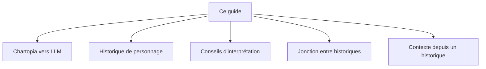

> 🗂️ **Section Diátaxis** : Guide pratique (recette orientée problème) · **Niveaux Bloom** : Appliquer → Analyser
> **Objectifs pédagogiques** : *générer* des historiques de PJ et PNJ, *appliquer* des conseils d'interprétation, *analyser* les jonctions entre personnages

> 📖 Extrait de l'article fondateur « Usage des LLM dans le JDR », refondu selon le framework Diátaxis. Licence [CC BY-NC-ND 4.0](https://creativecommons.org/licenses/by-nc-nd/4.0/).

# Guides — personnages et historiques

## Comment faire usage de Chartopia vers un LLM

### Objectif

Utiliser Chartopia pour créer des contextes complexes et dynamiques pendant les sessions de jeu de rôle. En combinant plusieurs tables aléatoires imbriquées, Chartopia permet de générer des éléments variés et riches que le Maître de Jeu peut intégrer en temps réel, enrichissant ainsi l'histoire.

### Fonctionnement

Pendant une session de jeu, le MJ peut se servir de Chartopia pour sélectionner aléatoirement des lieux, événements, objets, caractéristiques, avantages, défauts ou personnages non joueurs (PNJ). Ces éléments générés peuvent être immédiatement intégrés à l'histoire, rendant le jeu plus dynamique et imprévisible. Le MJ utilise ensuite ces contextes pour générer des textes détaillés via un modèle de langage (LLM).

### Étapes à suivre

Utiliser Chartopia pour générer des éléments :

* Créer et utiliser des formulaires combinant plusieurs tables aléatoires imbriquées pour générer des contextes variés.  
* Tirer au sort des éléments tels que lieux, événements, objets, caractéristiques, avantages, défauts ou PNJ en temps réel.

Intégrer les éléments générés dans le jeu :

* Copier les éléments générés vers le LLM pour demander la génération de textes détaillés et cohérents avec ces éléments.

### Résultat attendu

Une histoire enrichie en temps réel avec des éléments variés et dynamiques, créant une expérience de jeu plus immersive et imprévisible pour les joueurs.

## Génération d'histoires de personnage joueur ou non joueur

### Objectif

Utiliser un modèle de langage (LLM) pour générer une histoire détaillée pour un personnage en se basant sur le contexte fourni par sa fiche de personnage. Cela permet de créer un personnage riche et cohérent, intégrant ses caractéristiques spécifiques, avantages, défauts, et son background initial.

### Fonctionnement

En tant que Character Developer avec 10 ans d'expérience, vous allez rédiger l'historique d'un personnage pour le jeu de rôle \[Nom du jeu de rôle\]. Utilisez le contexte du personnage pour créer une description physique et morale concise, ainsi qu'une histoire détaillée.

### Étapes à suivre

* Utiliser le contexte du personnage : Basé sur la fiche de personnage fournie, intégrer les traits, talents, spécialisations, principes, et compétences dans une histoire cohérente.  
* Prompt engineering : Utiliser un prompt précis pour guider la création de l'historique du personnage.

### Résultat attendu

Une description physique et morale du personnage, ainsi qu'une histoire détaillée intégrant les traits, talents, spécialisations, principes, et compétences du personnage.

### Exemple de Prompt

------

En tant que Character Developer expérimenté (10 ans) 
Tu dois créer à l’aide du template un personnage
Utilise les informations fournies pour rédiger une description et son histoire (max. 50 lignes)
JDR : [Nom du jeu]
Système :

**Template**

**Histoire de fond**
- Origines : Où et quand est-il né ? Quelle est son histoire familiale ?  
- Événements marquants : Quels moments clés ont façonné ses motivations ?  
- Objectifs et motivations : Quels sont ses buts et pourquoi les poursuit-il ?  

**Personnalité**
- Traits de caractère : Principaux traits de personnalité.  
- Forces et faiblesses : Ses compétences et points faibles.  
- Évolution : Comment change-t-il au fil du temps ?  

**Apparence physique** 
- Description : Détaillez taille, corpulence, cheveux, yeux, et particularités.  
- Style vestimentaire : Type de vêtements et accessoires.  

**Relations**
- Alliés et ennemis : Qui sont ses 3 amis, 3 ennemis, et 3 mentors ?  
- Relations amoureuses : Y a-t-il une influence romantique sur l'histoire ?  

**Compétences**
- Talents : Quelles compétences ou pouvoirs possède-t-il ?  
- Formation : Quelle expertise a-t-il acquise ?  
- Limites : Quelles sont ses faiblesses ?  

**Conflits**
- Internes : Quels dilemmes moraux affronte-t-il ?  
- Externes : Quels obstacles doit-il surmonter ?  

**Originalité**
- Caractéristiques uniques : Qu’est-ce qui le rend unique ?  
- Voix distincte : A-t-il un comportement ou langage particulier ?  

**Contexte additionnel**
[Ajouter le contexte issu du JDR ou de Chartopia]

------

### Exemple de résultat du Prompt

Voir l’annexe pour découvrir un exemple de résultat.

## Conseils d’interprétation

### Objectif

Utiliser un modèle de langage (LLM) pour fournir des conseils d’interprétation aux joueurs, afin de les aider à mieux incarner leurs personnages dans un jeu de rôle. Cela est particulièrement utile pour des débutants découvrant le cadre du jeu et ayant besoin de repères.

### Fonctionnement

En tant que Character Developer avec 10 ans d'expérience, vous allez conseiller un joueur sur l'interprétation d’un personnage pour le jeu de rôle \[Nom du jeu de rôle\]. Utilisez le contexte, l’histoire, ainsi que la description morale et physique du personnage pour générer cinq conseils d’interprétation.

### Étapes à suivre

* **Analyser le contexte du personnage :** Recueillir et comprendre le contexte, l’histoire, et les descriptions morales et physiques du personnage.  
* **Générer des conseils d’interprétation :** Utiliser un prompt détaillé pour produire des conseils spécifiques pour l’interprétation du personnage.

### Résultat attendu

Cinq conseils pratiques et détaillés permettant au joueur de mieux incarner son personnage. Ces conseils doivent aider le joueur à saisir les nuances du personnage, à comprendre ses motivations profondes et à interpréter ses actions de manière cohérente avec son histoire, ses compétences et ses principes. Cela enrichit l'expérience de jeu en offrant une interprétation plus authentique et immersive.

### Exemple de Prompt

------

En tant que Character Developer expérimenté (10 ans)

Tu dois conseiller un joueur sur l'interprétation d’un personnage

JDR : [Nom du jeu]

Utilise le contexte, l’histoire, la description morale et physique du personnage pour générer 5 conseils d’interprétation :
- Conseil n°1 :
- Conseil n°2 :
- Conseil n°3 :
- Conseil n°4 :
- Conseil n°5 :

**Contexte du personnage**

*\[Insérer le contexte du personnage, comme par exemple celui générer avec le prompt précédant\]*

**Contexte additionnel**

*\[Ajouter le contexte issue du JDR ou de Chartopia\]*

------

### Exemple de résultat du Prompt

Voir l’annexe pour découvrir un exemple de résultat.

## Génération d’une jonction entre les historiques de personnages

### Objectif

Utiliser un modèle de langage (LLM) pour relier les histoires des personnages entre elles, augmentant ainsi la dynamique de jeu par le biais d’un contexte commun. Cela permet de renforcer les liens narratifs et les interactions entre les personnages.

### Fonctionnement

En tant que Character Developer avec 10 ans d'expérience, vous allez créer des événements communs entre deux personnages pour le jeu de rôle \[Nom du jeu de rôle\]. Utilisez les contextes des personnages pour générer cinq événements communs, en suivant un modèle structuré.

### Étapes à suivre

* Générer un second personnage : Créer ou récupérer les informations du second personnage à partir des prompts fournis.  
* Créer la jonction d’historique : Utiliser un prompt détaillé pour relier les histoires des personnages par le biais d’événements communs.

### Résultat attendu

Cinq événements communs bien définis qui lient les histoires de Valeria et Jarek, enrichissant ainsi le contexte et les interactions dans le jeu de rôle.

### Exemple de Prompt

------

En tant que Character Developer expérimenté (10 ans)

Tu dois créer une jonction d’histoires entre deux personnages

JDR : [Nom du jeu]

Utilises le contexte pour générer 5 événements communs (10 lignes max), en suivant le modèle ci-dessous : 

**Modèle d’événement**
- Libellé de l’événement :
- Lieu de l’événement :
- Description de l’événement :

Personnage 1 : [Coller les informations du premier personnage]

Personnage 2 : [Coller les informations du second personnage]

**Contexte additionnel**

*\[Ajouter le contexte issue du JDR ou de Chartopia\]*

------

### Exemple de résultat du Prompt

Voir l’annexe pour découvrir un exemple de résultat.

## Génération d’un contexte depuis l’historique d’un personnage

### Objectif

Étoffer l'univers de votre jeu de rôle en développant des éléments de contexte à partir de l'historique des personnages. Par exemple, si un personnage appartient à une faction ou une organisation sans détails disponibles, utilisez un modèle de langage (LLM) pour créer une histoire riche et détaillée pour cette entité.

### Fonctionnement

En tant que Game Designer avec 20 ans d'expérience, vous allez développer l'histoire d'une faction, organisation ou toute autre entité importante pour le jeu de rôle spécifié. Les personnages des joueurs sont issus de cette entité. Utilisez le contexte pour créer une histoire immersive et complète.

### Étapes à Suivre

* Définir le contexte de l'entité : Utiliser les éléments générés via des outils comme Chartopia pour créer un contexte détaillé pour l'entité.  
* Prompt engineering : Utiliser un prompt précis pour guider la création de l'histoire de l'entité.

### Résultat attendu

Une histoire complète et immersive pour l'entité, enrichissant l'univers du jeu et offrant des détails contextuels solides pour les personnages issus de cette entité. Cela inclut les origines, le développement, les compétences, les arts, les rivalités, et une description détaillée de leur monde natal.

Par exemple, si nous reprenons le personnage de Valeria générer plus haut ont voit qu'elle appartient à la maison Karath, sauf que nous n’avons pas d’élément sur cette maison dans le cadre de Dune : Adventures in the Imperium. Heureusement, Dune est bien pourvu en éléments utilisables dans une table aléatoire et à l’aide de Chartopia nous pouvons mettre en place un formulaire pour générer des Maisons. Nous allons donc via le formulaire générer les éléments de contexte qui vont donner naissance à la Maison Karath.

### Exemple de Prompt

------

En tant que Game Designer expérimenté (20 ans)

tu dois créer l’histoire d’une Maison noble

JDR : [Nom du jeu]

Les personnages des joueurs appartiendront à cette Maison. Utilise le modèle ci-dessous pour structurer l’histoire. 

**Informations sur la Maison**
- Nom de la Maison :
- Type de Maison :

**Histoire de la Maison**
- Origines et établissement :
- Développement et loyauté :
- Domaine de compétence :
- Arts et culture :
- Rivalité et ennemis :

**Monde natal de la Maison**
- Type de Monde :
- Description générale :
- Écologie et environnement :
- Culture et société :
- Ressources et économie :

**Contexte additionnel**

*\[Ajouter le contexte issue du JDR ou de Chartopia\]*

------

### Exemple de résultat du Prompt

**Informations sur la Maison**

Nom de la Maison : Karath
Type de Maison : Maison mineure

**Histoire de la Maison Karath**

- Origines et établissement : La Maison Karath, fondée il y a plusieurs siècles, a émergé sur un monde exploité et épuisé, habitable mais rude. Dès ses débuts, la Maison Karath s'est distinguée par son approche brutale et directe pour atteindre ses objectifs. Initialement des colons industrieux, les Karath ont rapidement compris que la force et l'intimidation étaient nécessaires pour survivre et prospérer dans un environnement aussi hostile.
- Développement et loyauté : La loyauté de la Maison Karath envers leur suzeraine, une Maison majeure puissante, est devenue légendaire. Cette dévotion sans faille, bien que parfois considérée comme écœurante par leurs rivaux, a permis aux Karath de s'établir fermement comme l'une des plus importantes Maisons vassales. Leur territoire, couvrant environ un tiers de leur planète d'origine, est un témoignage de leur capacité à s'imposer et à maintenir leur position grâce à des méthodes impitoyables.
- Domaine de compétence : Les Karath se sont spécialisés dans le domaine scientifique, particulièrement dans la recherche et le développement de nouvelles technologies. Bien que le Jihad Butlérien ait banni les machines pensantes, la Maison Karath a excellé dans l'exploration de nouvelles voies scientifiques respectant ces restrictions, créant des innovations qui leur ont permis de maintenir une longueur d'avance sur leurs concurrents. Leur expertise en conception technologique est reconnue et craint à travers l'Imperium.
- Arts et culture : En plus de leurs prouesses scientifiques, la Maison Karath a investi dans les arts, utilisant ce domaine non seulement pour gagner du respect et de la renommée mais aussi comme un outil stratégique. Leurs artistes, musiciens et acteurs itinérants servent souvent de couverture pour des opérations d'espionnage, infiltrant des cours ennemies et recueillant des informations cruciales. Les soirées musicales et les événements artistiques organisés par les Karath sont des occasions pour les intrigues politiques et les rencontres secrètes.
- Rivalité et ennemis : La Maison Karath a une rivalité particulièrement acerbe avec une autre Maison mineure qui cherche activement à les abattre. Cette maison ennemie, dégoûtée par la brutalité et la moralité des Karath, colporte mensonges et ragots à la cour, évitant cependant un conflit ouvert à moins d'y voir un avantage certain. Les Karath, conscients de cette haine, gardent toujours un œil vigilant sur les manœuvres de leurs rivaux.

**Monde natal de la Maison Karath**

- Type de monde : Monde exploité et épuisé habitable (Classe IV : survie possible sans protection). Le monde natal de la Maison Karath est une planète autrefois riche en ressources naturelles, mais aujourd'hui épuisée par des siècles d'exploitation intensive. La surface de la planète est marquée par des paysages désolés, des mines abandonnées et des zones industrielles en ruine. Les habitants vivent dans des cités fortifiées, construites pour résister aux tempêtes de sable fréquentes et aux conditions climatiques extrêmes.
- Écologie et environnement : L'écosystème de la planète a été gravement perturbé par l'exploitation minière, laissant peu de végétation et d'animaux sauvages. Les Karath ont dû développer des technologies avancées pour purifier l'air et l'eau, et pour cultiver des aliments dans des environnements contrôlés. Les scientifiques de la Maison ont fait de grandes avancées dans la biotechnologie et l'agriculture sous abri pour assurer la survie de la population.
- Culture et société : La société Karath est dure et disciplinée, reflétant les conditions difficiles de leur monde natal. La brutalité est souvent nécessaire pour maintenir l'ordre et la survie. Les valeurs de la Maison sont centrées sur la force, la loyauté et l'innovation scientifique. La culture artistique, bien que florissante, sert souvent à masquer des activités d'espionnage et à manipuler les perceptions extérieures de la Maison.
- Ressources et économie : Malgré l'épuisement des ressources naturelles, la Maison Karath a su diversifier son économie grâce à ses innovations technologiques. Les industries pharmaceutiques, les biotechnologies et les recherches scientifiques avancées sont désormais les piliers économiques de la planète. Les produits et services issus de leurs laboratoires sont prisés dans tout l'Imperium, assurant la prospérité continue de la Maison malgré les défis environnementaux.

