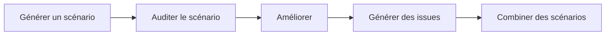
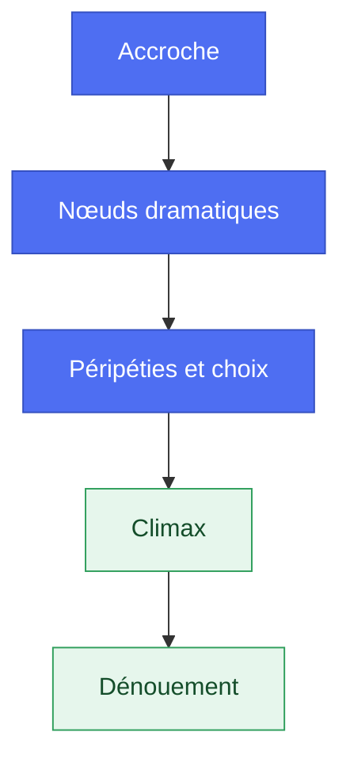
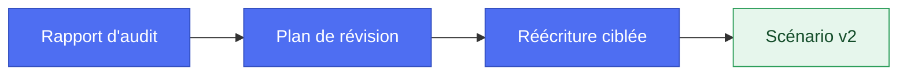
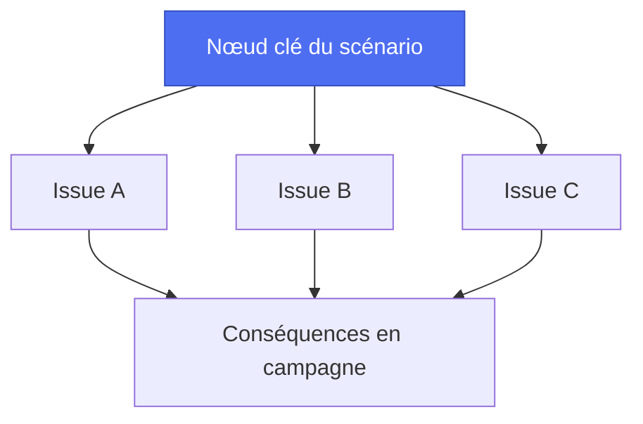
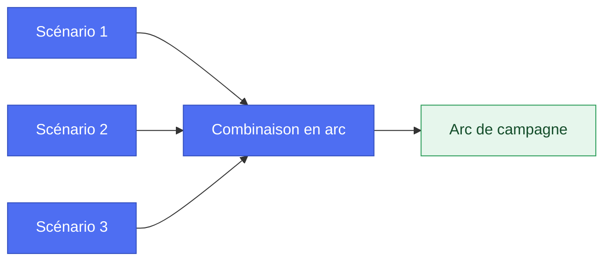

> 🗂️ **Section Diátaxis** : Guide pratique (recette orientée problème) · **Niveaux Bloom** : Créer → Évaluer
> **Objectifs pédagogiques** : *créer* un scénario de toutes pièces, *évaluer* sa qualité par un audit, *améliorer* et décliner les issues possibles

> 📖 Extrait de l'article fondateur « Usage des LLM dans le JDR », refondu selon le framework Diátaxis. Licence [CC BY-NC-ND 4.0](https://creativecommons.org/licenses/by-nc-nd/4.0/).

# Guides — scénarios

## Génération d’un scénario

> 🗂️ **Diátaxis** : Recette pratique (how-to) · **Bloom** : Créer
> 🎯 **Objectifs pédagogiques** : *créer* un scénario structuré (accroche, nœuds, climax), *calibrer* l'intensité dramatique

### Objectif

Créer un scénario de jeu de rôle détaillé et immersif, adapté à n'importe quel jeu de rôle, en utilisant une structure préétablie. Ce scénario doit inclure des descriptions riches, des personnages bien développés, et des défis variés pour maintenir l'intérêt des joueurs.

### Fonctionnement

En tant que créateur de jeu de rôle avec plus de 30 ans d'expérience, vous allez rédiger un scénario pour le jeu de rôle spécifié. Vous devrez vous assurer que le scénario est bien structuré et captivant, en utilisant un prompt spécialement conçu pour guider la création.

### Étapes à suivre

- Définir la structure du scénario : Utiliser une structure adaptable à tout jeu de rôle, comportant plusieurs actes et scènes détaillées.  
- Prompt engineering : Utiliser un prompt clair et détaillé pour guider la rédaction du scénario.

### Résultat attendu

Un scénario complet et bien structuré qui guide les joueurs à travers une aventure captivante, avec des personnages riches et des défis variés, tout en permettant une évolution cohérente de l'intrigue principale.

### Exemple de Prompt

------

En tant que créateur/scéanriste de jeu de rôle expérimenté (30 ans)

Rédige un scénario pour le JDR \[Nom du jeu de rôle\], avec des descriptions riches, des personnages développés et des défis variés pour capt
iver les joueurs.

Utilises le modèle pour structurer le scénario.

**Template Scénario**

- Titre (en majuscules) :
- Sous-titre : Indique pour quel jeu le scénario est conçu
- Nombre de joueurs : Complexité (1 = Débutant / 2 = Confirmé / 3 = Expert)
- Système : Indique quel système motorise le jeu/scénario

**Pitch du scénario (Max. 10 lignes)** :

**Acte 1**
- Pitch de l'acte 1 (Max. 10 lignes) :
  - Scène 1 : (10 à 20 lignes)
    - Lieu et description (Max. 3 lignes) :
    - 3 protagonistes principaux (alliés/antagonistes) :
  - Scène 2 : (10 à 20 lignes)
    - Lieu et description (Max. 3 lignes) :
    - 3 protagonistes principaux (alliés/antagonistes) :
  - Scène 3 : (10 à 20 lignes)
    - Lieu et description (Max. 3 lignes) :
    - 3 protagonistes principaux (alliés/antagonistes) :

**Acte 2**
- Pitch de l'acte 2 (Max. 10 lignes) :
  - Scène 1 : (10 à 20 lignes) :
    - Lieu et description (Max. 3 lignes) :
    - 3 protagonistes principaux (alliés/antagonistes) :
  - Scène 2 : (10 à 20 lignes)
    - Lieu et description (Max. 3 lignes)
    - 3 protagonistes principaux (alliés/antagonistes) :
  - Scène 3 : (10 à 20 lignes)
    - Lieu et description (Max. 3 lignes)
    - 3 protagonistes principaux (alliés/antagonistes) :

**Acte 3**
- Pitch de l'acte 3 (Max. 10 lignes) :
  - Scène 1 : (10 à 20 lignes)
    - Lieu et description (Max. 3 lignes)
    - 3 protagonistes principaux
  - Scène 2 : (10 à 20 lignes)
    - Lieu et description (Max. 3 lignes)
    - 3 protagonistes principaux
  - Scène 3 : (10 à 20 lignes)
    - Lieu et description (Max. 3 lignes)
    - 3 protagonistes principaux

Conclusion (Max. 10 lignes) :

**Conséquences**
- Succès :
- Succès mitigé :
- Échec :

En cas de succès 3 pitchs de scénario de suites possibles : 
- Pitch 1 (Max. 10 lignes) :
- Pitch 2 (Max. 10 lignes) :
- Pitch 3 (Max. 10 lignes) :

En d’échec 3 pitchs de scénario de suites possibles : 
- Pitch 1 (Max. 10 lignes) :
- Pitch 2 (Max. 10 lignes) :
- Pitch 3 (Max. 10 lignes) :

**Résu
mé des principaux antagonistes** (Motivations, méthodes, ressources, et filiation/allégeance)
- Antagoniste 1
- Antagoniste 2
- Antagoniste 3 

**Résumé des principaux alliés** (Motivations, méthodes, ressources, et filiation/allégeance)
- Allié 1
- Allié 2
- Allié 3 

**Contexte additionnel**
*\[Ajouter le contexte issue du JDR ou de Chartopia\]*

------

### Exemple de résultat du Prompt

Voir l’annexe pour découvrir l’exemple de scénario proposé pour le jeu de rôle *Dune : Aventures dans l'Imperium*. Il s’agit d’un premier jet qui utilise un contexte restreint mais qui pourrait être complété avec les différents prompt évoqué dans cet e-book.

A la lecture vous allez certainement trouver cela un peu léger ou bancal, mais l’intérêt réside dans le fait d’éviter de partir d’une feuille blanche.

Si par exemple vous disposez du compte rendu de votre dernière partie il pourrait servir de point de départ pour ce nouveau scénario généré en quelques secondes.

## Génération d’un audit de scénario

> 🗂️ **Diátaxis** : Recette pratique (how-to) · **Bloom** : Évaluer
> 🎯 **Objectifs pédagogiques** : *évaluer* la cohérence et la jouabilité d'un scénario, *identifier* ses points faibles

### Objectif

Utiliser un modèle de langage (LLM) pour auditer un scénario de jeu de rôle et identifier les éléments pouvant poser des difficultés aux joueurs, ainsi que les incohérences potentielles. L'objectif est de proposer des solutions et des recommandations pour améliorer la jouabilité et la cohérence du scénario.

### Fonctionnement

En tant qu’auditeur de scénario de jeu de rôle avec 20 ans d’expérience, vous allez analyser un scénario de jeu de rôle pour identifier les défis potentiels et les incohérences. Vous devrez fournir des suggestions pour atténuer ou surmonter ces défis et corriger les incohérences, en recommandant les rôles/métiers appropriés pour chaque tâche.

### Résultat attendu

Deux tableaux complets, l'un répertoriant les défis potentiels avec des suggestions pour les surmonter et les rôles/métiers recommandés, et l'autre répertoriant les incohérences avec des suggestions pour les corriger et les rôles/métiers recommandés. Ces tableaux permettront d'amé
liorer la jouabilité et la cohérence du scénario, offrant ainsi une expérience de jeu plus fluide et immersive.

### Exemple de Prompt

------

En tant qu’auditeur de scénario de jeu de rôle expérimenté (20 ans)

Identifie les éléments susceptibles de poser des difficultés aux joueurs

Suit les étapes ci-dessous :

**Étapes d'audit**
- Identifier les défis potentiels : Analyser chaque élément du scénario pour repérer les défis ou obstacles que les joueurs pourraient rencontrer.
- Identifier les incohérences : Repérer les erreurs potentielles de cohérence dans la trame du scénario.
- Créer deux tableaux markdown :
  - Tableau des défis : Indiquer chaque défi, sa nature, des suggestions pour le surmonter, et le rôle/métier recommandé.
  - Tableau des incohérences : Indiquer chaque incohérence, des suggestions pour les corriger, et le rôle/métier recommandé.

**Rôles/Métiers**
- Maître de jeu expérimenté (20 ans)
- Scénariste expérimenté (20 ans)
- Joueur expérimenté (20 ans)

------

### Exemple de résultat du Prompt

Voir l’annexe pour découvrir l’exemple d’audit réalisé sur le scénario généré avec le prompt précédent.

## Amélioration des scénarios

> 🗂️ **Diátaxis** : Recette pratique (how-to) · **Bloom** : Évaluer → Créer
> 🎯 **Objectifs pédagogiques** : *évaluer* les retours d'audit, *réécrire* les sections faibles du scénario

### Objectif

Utiliser les retours d’un modèle de langage (LLM) pour ajuster les éléments problématiques d'un scénario de jeu de rôle. Cela inclut la simplification des énigmes, le rééquilibrage des combats, et la proposition d'alternatives aux situations nécessitant des compétences rares, afin de rendre le jeu plus fluide et accessible.

### Fonctionnement

En tant que concepteur de scénario avec 10 ans d’expérience en jeu de rôle, vous améliorez un scénario pour le rendre plus fluide et accessible en utilisant le contexte d’audit : 

### Étapes à suivre

* Collecte des retours de l'audit : Recueillir les retours du prompt d’audit concernant les aspects du scénario jugés trop difficiles, déséquilibrés ou frustrants.  
* Ajustements du scénario : Modifier le scénario pour simplifier les énigmes complexes, rééquilibrer le
s combats, et proposer des alternatives aux situations nécessitant des compétences rares, en utilisant les suggestions du LLM.

### Remarques

L'utilisation d'un LLM permet de bénéficier d'une analyse approfondie et rapide des scénarios de jeu de rôle. Cela peut non seulement améliorer la jouabilité, mais aussi enrichir l'expérience de jeu en rendant les défis plus accessibles et équilibrés pour tous les joueurs.

### Résultat attendu

À la fin de ce processus, le scénario devrait être plus équilibré, accessible et agréable pour les joueurs. Les énigmes seront plus compréhensibles, les combats plus équitables, et les situations nécessitant des compétences rares auront des alternatives viables. L'expérience de jeu globale sera améliorée, permettant aux joueurs de se concentrer sur l'immersion et le plaisir de jeu sans être bloqués par des éléments frustrants ou déséquilibrés.

### Exemple de Prompt

------

En tant que concepteur de scénario de jeu de rôle avec 10 ans d'expérience

tu as pour mission d'améliorer un scénario existant pour le rendre plus fluide et accessible. 

Cette tâche inclue :
- La simplification des énigmes : pour les rendre plus compréhensibles sans perdre leur intérêt.
- Le rééquilibrage des combats : en ajustant les caractéristiques des ennemis et les ressources disponibles.
- La proposition d'alternatives : afin que tous les types de personnages puissent réussir.

**Contexte :**
*\[Ajouter le contexte issue de l'audit\]*

------

### Exemple de résultat du Prompt

Voir l’annexe pour découvrir des propositions d’amélioration sur un scénario généré et audité avec les prompts précédents.

## Génération d'issues scénaristiques

> 🗂️ **Diátaxis** : Recette pratique (how-to) · **Bloom** : Créer
> 🎯 **Objectifs pédagogiques** : *décliner* plusieurs fins possibles, *anticiper* les choix des joueurs

### Objectif

Proposer plusieurs pitchs d'issues scénaristiques afin de poursuivre l'aventure après une quête initiale, en utilisant un modèle de langage (LLM).

### Fonctionnement

Après avoir généré un scénario initial, utilisez un modèle de langage pour générer plusieurs développements possibles. Par exemple, après une 
aventure dans "La Forêt des Murmures", demandez au LLM de proposer des suites potentielles.

### Étapes à suivre

* Génération du Scénario Initial : Créez un scénario de base pour lancer l'aventure, comme une quête dans "La Forêt des Murmures".  
* Demande au LLM : Utilisez un LLM pour générer plusieurs pitchs d'issues scénaristiques en formulant une demande claire.  
* Sélection des Pitchs : Analysez les propositions du LLM et sélectionnez celles qui sont les plus cohérentes et engageantes pour poursuivre l'aventure.  
* Développement des Pitchs Sélectionnés : Développez davantage les pitchs sélectionnés pour les intégrer dans l'histoire globale.

### Résultat attendu

Obtention de plusieurs propositions de pitchs scénaristiques permettant de prolonger et enrichir l'aventure initiale.

### Exemple de Prompt

-------

En tant que concepteur de scénario de jeu de rôle

Prolonge une aventure initiale dans Dune: Aventures dans l’Imperium en générant plusieurs pitchs scénaristiques pour continuer l’histoire après la quête initiale. 

Proposes 3 suites possibles en tenant compte des éléments ci-dessous : 

**Élément à prendre en compte**

- Découverte de nouveaux secrets :
- Implication de nouvelles factions ou personnages influents :
- Expansion du cadre narratif et géographique :
- Développement des arcs personnels des personnages : 
- Incorporation d’une nouvelle menace ou antagoniste : 
- Mise en place d’enjeux politiques ou sociaux : 
- Évolution des thèmes et des tonalités : 

Contexte initial du scénario *\[Coller ici le contexte de votre scénario dans Dune: Aventures dans l’Imperium\]*

------

### Exemple de résultat du Prompt

Voir l’annexe pour découvrir des propositions de pitch sur un scénario généré avec les prompts précédents.

## Génération de combinaison de scénarios

> 🗂️ **Diátaxis** : Recette pratique (how-to) · **Bloom** : Créer
> 🎯 **Objectifs pédagogiques** : *synthétiser* plusieurs scénarios en un arc de campagne cohérent

### Objectif

Créer des arcs narratifs cohérents en fusionnant des contextes de scénarios variés générés par Chartopia.

### Fonctionnement

Utiliser un Large Language Model (LLM) pour comb
iner plusieurs contextes de scénarios générés par Chartopia. Par exemple, si Chartopia propose un scénario de "Tempête de Magie" et un autre de "Fête de la Moisson", le LLM sera chargé de les intégrer dans une histoire fluide et cohérente.

### Étapes à suivre

**Collecte des scénarios** :

* Utilisez Chartopia pour générer plusieurs contextes de scénarios.  
* Sélectionnez au moins deux scénarios à combiner.

**Demande de fusion** :

* Soumettez les contextes sélectionnés au LLM.  
* Spécifiez le besoin d'un arc narratif cohérent reliant les deux scénarios.

**Création de la jonction narrative** :

* Le LLM génère une histoire intégrant les éléments des deux scénarios. Par exemple, il pourrait créer une histoire où une "Tempête de Magie" perturbe la "Fête de la Moisson".

**Validation et ajustement** :

* Relisez le scénario généré.  
* Faites des ajustements si nécessaire pour assurer la cohérence et l'engagement narratif.

### Résultat attendu

Un arc narratif cohérent où des éléments de différents scénarios se rejoignent harmonieusement. 

### Exemple de Prompt

------

En tant que concepteur de scénario de jeu de rôle

Tu dois créer un arc narratif cohérent reliant deux scénarios.

Intégrer les éléments de contexte du scénario \[A\] et du scénario \[B\], pour former une histoire fluide et cohérente. 

**Scénario A :**  \[Contexte\]

**Scénario B :**  \[Contexte\]

------

