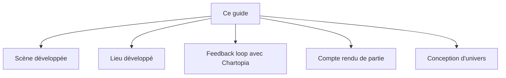

> 🗂️ **Section Diátaxis** : Guide pratique (recette orientée problème) · **Niveaux Bloom** : Appliquer → Créer
> **Objectifs pédagogiques** : *développer* des scènes et des lieux, *automatiser* la boucle avec Chartopia, *résumer* une séance en compte rendu, *créer* un univers de campagne

> 📖 Extrait de l'article fondateur « Usage des LLM dans le JDR », refondu selon le framework Diátaxis. Licence [CC BY-NC-ND 4.0](https://creativecommons.org/licenses/by-nc-nd/4.0/).

# Guides — table et univers

## Génération d’une scène développé

### Objectif

Créer une scène immersive et dynamique pour un scénario de jeu de rôle, en utilisant un modèle de langage pour générer des détails et des descriptions riches.

### Fonctionnement

Le modèle de langage analyse le contexte et les éléments fournis pour générer une scène détaillée, en intégrant des aspects narratifs, visuels, auditifs, olfactifs et tactiles.

### Étapes à suivre

* Définir le contexte général et les objectifs de la scène.  
* Fournir des détails spécifiques sur l'environnement, les personnages et l'intrigue.  
* Utiliser le modèle de langage pour générer des descriptions et des événements dynamiques.  
* Réviser et ajuster la scène générée pour qu'elle s'intègre parfaitement dans le scénario global.  
* Intégrer les compétences et traits nécessaires pour les joueurs.

### Résultat attendu

Une scène complète et immersive, prête à être utilisée dans une session de jeu de rôle, avec des détails visuels, auditifs, olfactifs et tactiles, ainsi que des événements dynamiques et des interactions possibles.

### Exemple de Prompt

------

En tant que Game Designer avec 20 ans d’expérience

Tu dois détailler une scène pour le jeu de rôle \[Nom du jeu de rôle\] en respectant le format suivant :

**Scène**

**Système** :

**Contexte et environnement**
- Durée estimée : \[15 / 30 / 45 / 60 minutes\]
- Type de scène : \[Action / Dialogue / Témoin\]
- Type d’environnement : \[Urbain / Rural / Hostile\]
- Type de lieu : \[Intérieur / Extérieur / Virtuel / Métaplan\]
- Ambiance : \[Sonore / Visuelle / Olfactive / Tactile\]

**Personnages Non Joueurs (PNJ)**
- Nom du PNJ 1 : (Description, rôle, motivations)
- Nom du PNJ 2 : (Description, rôle, motivations)

**Intrigue et Objectif principal de la scène**
- Conflit : Obstacles ou conflits à surmonter
- Développement : Comment la scène fait progresser l'intrigue

Détails Sensoriels**
- Visuel : \[Détails visuels marquants\]
- Auditif : \[Sons présents\]
- Olfactif : \[Odeurs perceptibles\]
- Tactile : \[Textures ou sensations ressenties\]

**Événements dynamiques**
- Actions des PJ : \[Actions possibles des PJ et conséquences\]
- Événements aléatoires : \[Événements inattendus\]

**Récompenses et conséquences**
- Récompenses : \[Récompenses potentielles pour les PJ\]
- Conséquences : \[Conséquences possibles des actions des PJ\]

**Type de rencontre**
- Nature de la rencontre : \[Ennemie / Contact / Allié / Neutre\]
- Niveau d’opposition : \[Antagoniste générique / mineur / majeur / supérieur\]

**Indice de danger**
- Indice de danger : \[Nul / Faible / Normal / Fort / Létal\]

**Compétences clefs**
- Compétence 1
- Compétence 2
- Compétence 3

**Traits/Avantages clés**
- Trait/Avantage 1
- Trait/Avantage 2
- Trait/Avantage 3

**Défauts clefs**
- Défaut 1
- Défaut 2
- Défaut 3

**Protagoniste clé Protagoniste clé** 
- Prénom & Nom, Surnom
- Description

**Points d’entrée de la scène**
- Point 1
- Point 2
- Point 3

**Éléments clefs de la scène**
- Élément 1
- Élément 2
- Élément 3
- Élément 4
- Élément 5
- Élément 6

**Chronologie de la scène**
- Pré-requis 1 : \[Scène n°X\]
- Pré-requis 2 : \[Scène n°X\]
- Pré-requis 3 : \[Scène n°X\]

**Points de sortie de la scène**
- Point 1
- Point 2
- Point 3

Indiquez moi lorsque vous avez pris connaissance de ma demande pour que je vous communique la trame du scénario contenant les actes et les scènes.

------

## Génération d’un lieu développé

### Objectif

Créer une description détaillée et immersive d'un lieu pour un jeu de rôle, en fournissant des informations sur son ambiance, son histoire, ses caractéristiques et ses éléments d'intrigue.

### Fonctionnement

Utiliser l'expertise d'un Game designer expérimenté pour élaborer une description structurée et complète d'un lieu, en suivant un format prédéfini qui couvre divers aspects du lieu.

### Étapes à suivre

* Définir le nom et le type de lieu  
* Décrire l'atmosphère et l'ambiance (sons, odeurs, éléments visuels)  
* Détailler les décorations et la clientèle habituelle  
* Ajouter des éléments optionnels comme l'histoire, la sécurité, les relations et les intrigues  
* S'assurer que tous les éléments sont cohérents avec l'univers du jeu de rôle spécifié

### Résultat attendu

Une description détaillée et structurée d'un lieu pour un jeu de rôle, comprenant des informations sur ses caractéristiques physiques, son ambiance, son histoire, ses relations et ses potentiels éléments d'intrigue, le tout adapté à l'univers du jeu spécifié.

### Exemple de Prompt

------

En tant que Game Designer avec 20 ans d’expérience

Tu dois détailler un lieu pour le jeu de rôle \[Nom du jeu de rôle\] en suivant le format ci-dessous

**Lieu**
- Nom du lieu :
- Type de lieu :
- Taille :

**Atmosphère et ambiance**
- Sons ambiants :
- Odeurs ambiantes :
- Éléments visuels :
- Décorations :
- Habitués/Clientèle habituelle :
- Éléments optionnels

**Histoire et contexte**
- Origine :
- Événements importants :
- Rumeurs :
- Sécurité et défense
- Forces de sécurité :
- Systèmes de défense :
- Menaces :
- Relations et alliances
- Alliés et rivaux :
- Influence :
- Intrigues et Opportunités :
- Personnages clés :
- Conflits :

------

## Feedback Loop entre le LLM et Chartopia

### Objectif

Optimiser l'intégration des résultats des tables de Chartopia pour générer des contextes dynamiques et pertinents via le LLM.

### Fonctionnement

Les résultats obtenus des tables de Chartopia sont utilisés pour enrichir et préciser les demandes adressées au LLM. Par exemple, si la table de Chartopia indique que les joueurs se trouvent dans "La Forêt des Murmures", cette information est utilisée pour solliciter des événements spécifiques à ce lieu.

### Étapes à suivre

* Utiliser Chartopia pour générer un contexte initial ou une situation.  
* Identifier le contexte ou l'événement fourni par Chartopia (par exemple, "La Forêt des Murmures").  
* Formuler une demande précise au LLM en utilisant ce contexte (par exemple, "Décrire une rencontre aléatoire dans La Forêt des Murmures").  
* Utiliser la réponse du LLM pour enrichir l'expérience de jeu ou pour informer de nouvelles demandes.

### Résultat attendu

La génération de contextes riches et spécifiques par le LLM, en réponse aux indications fournies par Chartopia, créant ainsi un flux d'interactions dynamique et pertinent pour les joueurs.

### Exemple de Prompt

------

En tant que Maître du Jeu avec 10 ans d’expérience

Tu dois générer une rencontre aléatoire pour un groupe d'aventuriers dans (indiquez un lieu)

Utilise les informations suivantes pour créer une scène immersive et pertinente : 

Contexte : Le lieu est connue pour ses arbres anciens et ses bruits étranges.
Heure de la journée : Crépuscule (information obtenue de Chartopia)
Météo : Brouillard léger (information obtenue de Chartopia)

**Description de l'environnement immédiat**
- Sons ambiants
- Odeurs
- Éléments visuels particuliers

**Événement ou créature rencontrée**
- Description :
- Comportement ou action initiale :
- Défi ou opportunité pour les joueurs : Nature du défi/opportunité
- Conséquences potentielles : Positives et négatives
- Indices ou éléments de mystère liés au lieu : Un détail intrigantou une possible connexion avec l'histoire plus large
- Options d'interaction pour les joueurs : 2-3 choix possibles pour réagir à la situation

-------

## Génération de comptes rendus de partie

### Objectif

Après chaque session de jeu de rôle, utilisez un modèle de langage (LLM) pour transformer les notes prises par les participants en un compte rendu cohérent et détaillé. Ce processus consiste à combiner les notes des joueurs avec les éléments du scénario pour produire un résumé exhaustif et captivant de la session.

### Fonctionnement

En tant que Maître de Jeu (MJ) expérimenté avec 10 ans de pratique, vous avez terminé une session de jeu de rôle. Les participants ont pris des notes détaillant les événements, les décisions et les actions entreprises durant la partie. Votre objectif est de convertir ces notes en un compte rendu structuré et immersif.

### Étapes à suivre

**Collecte et lecture des notes :**

* Récupérez toutes les notes fournies par les participants.  
* Lisez attentivement ces notes pour comprendre les points clés de la session.

**Intégration des éléments du scénario :**

* Combinez les informations des notes avec les éléments prévus du scénario.  
* Assurez-vous que chaque événement, décision et action est correctement contextualisé par rapport au scénario.

**Rédaction du compte rendu :**

* Rédigez un compte rendu détaillé, structuré de manière logique et chronologique.  
* Incluez les événements majeurs, les décisions critiques, les actions des personnages, ainsi que tout détail pertinent qui enrichit le récit.  
* Veillez à ce que le texte soit clair, agréable à lire et reflète fidèlement l’atmosphère de la session.

### Résultat attendu

Un compte rendu complet et immersif qui capture l’essence de la session de jeu, aidant les joueurs à revivre l’expérience et à préparer les futures aventures.

### Exemple de Prompt

------

En tant que Maître de jeu (MJ) expérimenté (10 ans)

Tu viens de terminer une session du JDR \[Nom du jeu de rôle\]

Les participants ont pris des notes sur les événements, décisions et actions effectuées

Utilises ces notes ainsi que le scénario de la session pour rédiger un compte rendu structuré et détaillé.

Étapes à suivre pour combiner les notes :
- Intégrez les informations des notes des joueurs avec les éléments du scénario
- Rédiger un compte rendu détaillé : Inclure les événements clés. Mettre en avant les décisions importantes et les actions des personnages.
- Ajouter tout autre détail pertinent pour enrichir le récit.
- Structuration : Assure toi que le compte rendu soit clair, bien structuré et agréable à lire.
- Questions et actions en suspens : Lister les points non résolus ou en attente pour la prochaine session.

**Contexte**
*(Coller ici le contexte du scénario et les notes des joueurs)*

------

Note : Ce Prompt peut avoir un contexte très important, plus que ce que la fenêtre de dialogue est en mesure de recevoir. Dans ce cas, il vous faudra procéder par étape en découpant votre demande et en précisant ceci dans votre Prompt initial avec l’ajout d’une information/instruction à destination du modèle.

Dans ce cas il nécessaire d'inviter le LLM à nous demander de séquencer la transmission des informations en ajoutant au prompt une instruction complémentaire :

### Exemple de Prompt

------

En tant que Maître de jeu (MJ) expérimenté (10 ans)

Tu viens de terminer une session du JDR \[Nom du jeu de rôle\]

Les participants ont pris des notes sur les événements, décisions et actions effectuées

Utilises ces notes ainsi que le scénario de la session pour rédiger un compte rendu structuré et détaillé.

**Étapes à suivre pour combiner les notes**

- Intégrez les informations des notes des joueurs avec les éléments du scénario
- Rédiger un compte rendu détaillé : Inclure les événements clés. Mettre en avant les décisions importantes et les actions des personnages.
- Ajouter tout autre détail pertinent pour enrichir le récit.
- Structuration : Assure toi que le compte rendu soit clair, bien structuré et agréable à lire.
- Questions et actions en suspens : Lister les points non résolus ou en attente pour la prochaine session.

**Demande de partage**

Prend connaissance de la demande et indique moi quand je peux te partager les éléments suivants :
- Le scénario
- Note du joueur A
- Note du joueur B
- Note du joueur C
- Note du joueur D
- Note du MJ

Un fois en possession de l’ensemble (scénario \+ notes), réalisees le compte rendu de la partie.

------

## Conception d’univers

### Objectif

Créer un univers cohérent, immersif et riche en possibilités narratives pour un jeu de rôle, en définissant ses aspects géographiques, historiques, culturels, politiques et fantastiques.

### Fonctionnement

Utilisation d'un template structuré pour guider la création de l'univers, en abordant systématiquement différents aspects clés. Le créateur répond à une série de questions prédéfinies pour définir les éléments essentiels de l'univers, en veillant à leur cohérence et à leur potentiel ludique.

### Étapes à suivre

* Définir le contexte général (nom du monde, genre, niveau technologique)  
* Décrire la géographie et le climat  
* Établir l'histoire et la mythologie  
* Concevoir les sociétés et cultures  
* Détailler l'économie et le commerce  
* Élaborer la structure politique et les dynamiques de pouvoir  
* Définir le système de magie et/ou de technologie  
* Créer les religions et croyances  
* Identifier les menaces et dangers  
* Proposer des pistes de quêtes et d'aventures  
* Développer un arc narratif global et une structure de campagne

### Résultat attendu

Un univers de jeu de rôle détaillé et cohérent, offrant un cadre riche pour des aventures variées, avec des éléments géographiques, historiques, culturels et fantastiques bien définis, ainsi qu'une trame narrative globale permettant de structurer une campagne à long terme.

### Exemple de Prompt

------

En tant que concepteur de jeux de rôle expérimenté (30 ans), vous devez m'aider à créer un univers de jeu de rôle unique et immersif. Utilisez ce guide structuré pour définir avec précision chaque aspect de mon monde, en veillant à l'harmonie et au potentiel ludique de ses éléments. Répondez aux questions pour dessiner un cadre riche en possibilités narratives.

Interrogez-moi sur les éléments manquants pour clarifier certains aspects ou proposer des alternatives.

## Contexte Général
1. Quel est le nom du monde ?
2. Quel genre de fiction prédomine ? (fantasy, science-fiction, steampunk, etc.)
3. Quel est le niveau technologique de cet univers ?

## Proposition de Jeu
1. Quel type de thématique de jeu l'univers cherche-t-il à proposer ? (ex. : survie, lutte contre l’adversité, intrigues politiques, déclin des civilisations, lutte contre la fatalité)
2. Quelle est la dynamique principale du jeu ? (ex. : exploration dangereuse, interactions tendues entre factions, gestion des ressources, prise de décisions morales, interactions avec un environnement sauvage et impitoyable)
3. Quels types de scénarios sont privilégiés par cet univers ? (ex. : missions de survie, quête de ressources, complots de cour)
4. Quelle est l’atmosphère générale du monde ? (ex. : sombre et réaliste, brutale, ou teintée de mélancolie)
5. Quels sont les conflits internes ou psychologiques qui affectent les habitants ? (ex. : peur de l'inconnu, perte de repères, doute existentiel)
6. Y a-t-il des leçons ou des réflexions philosophiques que l'univers cherche à évoquer ? (ex. : nature humaine, sacrifices, fragilité de la paix)

## Géographie et Climat
1. Décrivez les caractéristiques géographiques principales : continents, océans, reliefs.
2. Quels types de climats trouve-t-on à travers le monde ?

## Histoire et Mythologie
1. Relatez les grands événements historiques qui ont façonné ce monde.
2. Quels mythes ou légendes sont racontés par les habitants ?

## Sociétés et Cultures
1. Quelles sont les principales sociétés et cultures ? Décrivez leurs coutumes, langues et traditions.
2. Comment ces cultures interagissent-elles les unes avec les autres ?

## Philosophie et Valeurs du Monde
1. Quelles valeurs sont dominantes dans ce monde (ex. : honneur, liberté, force) ?
2. Le monde est-il manichéen ou rempli de zones grises ? Y a-t-il des dilemmes moraux ?

## Ressources Naturelles et Environnement
1. Quels écosystèmes uniques ou créatures sont intégrés à l’environnement naturel ?
2. Les ressources sont-elles exploitées sans limite ou en harmonie avec l’environnement ?

## Interactions Sociales et Dynamiques de Pouvoir au Quotidien
1. Existe-t-il une structure de classes sociales (nobles, marchands, artisans, paysans) ? Comment interagissent-elles ?
2. Comment les lois et la justice sont-elles appliquées ? Des systèmes de châtiments ou rituels existent-ils ?

## Économie et Commerce
1. Décrivez le système économique : troc, monnaie, technologies de production.
2. Quels sont les produits ou ressources essentiels au commerce ?

## Politique et Dynamiques de Pouvoir
1. Quelle est la structure politique dominante ? (monarchie, république, etc.)
2. Qui détient le pouvoir, et quels conflits de pouvoir existent-ils ?

## Exploration et Mystères du Monde
1. Y a-t-il des zones inexplorées ou mystérieuses (îles perdues, forêts anciennes, ruines enfouies) ?
2. Quels artefacts, reliques ou énigmes pourraient être découverts par les personnages ?

## Communication et Transmission de Connaissances
1. Comment les habitants communiquent-ils à longue distance (messagers, magie, pigeons) ?
2. Comment les connaissances et compétences sont-elles transmises (académies, mentors, guildes) ?

## Système de Magie et/ou de Technologie
1. Quels sont les principes ou règles sous-jacentes à la magie ou à la technologie ?
2. Comment ces éléments influencent-ils la vie quotidienne des habitants ?

## Vie Quotidienne et Habitudes des Habitants
1. Quelles formes de divertissement, d’art ou de musique sont populaires ? Y a-t-il des fêtes ou carnavals ?
2. Y a-t-il des rituels saisonniers ou des traditions associées aux étapes de la vie (naissance, mariage, mort) ?

## Technologie et Inventions Locales
1. Y a-t-il des inventions marquantes (moyens de transport uniques, armes spéciales) ?
2. Les avancées technologiques sont-elles accessibles à tous ou réservées à une élite ?

## Religions et Croyances
1. Quelles sont les principales religions ou croyances ?
2. Comment influencent-elles la société et les relations interpersonnelles ?

## Menaces et Dangers
1. Quels sont les principaux dangers naturels ou surnaturels ?
2. Quelles factions ou créatures représentent une menace tangible ?

## Conflits Internes et Relations Internationales
1. Y a-t-il des factions internes avec des valeurs ou visions différentes au sein des cultures ?
2. Quelles alliances ou rivalités existent entre les nations ou peuples ?

## Quêtes et Aventures
1. Proposez des idées de quêtes ou missions pour les joueurs.
2. Comment ces aventures s'intègrent-elles dans l'ensemble de votre univers ?

## Arc Narratif Global et Structure de Campagne
1. Quel est l'arc narratif principal de votre univers ?
2. Comment structurez-vous les campagnes pour offrir une progression enrichissante ?

## Psychologie et Influence des Personnages Joueurs
1. Les personnages incarnés sont-ils des héros, des élus, des mercenaires, ou des voyageurs ? Ont-ils un rôle spécifique dans la société ?
2. Les actions des joueurs ont-elles des répercussions sur le monde (rumeurs, influence sur des factions) ?

En te basant sur mes réponses, compile les éléments pour former un univers consistant et plein de vie, capable d'accueillir des aventures épiques et variées. Assure toi que chaque composant de mon monde contribue à son histoire globale et offre aux joueurs des expériences immersives et mémorables.

**Contexte**
*(Coller ici le contexte intial du cadre et vos notes)*

------

