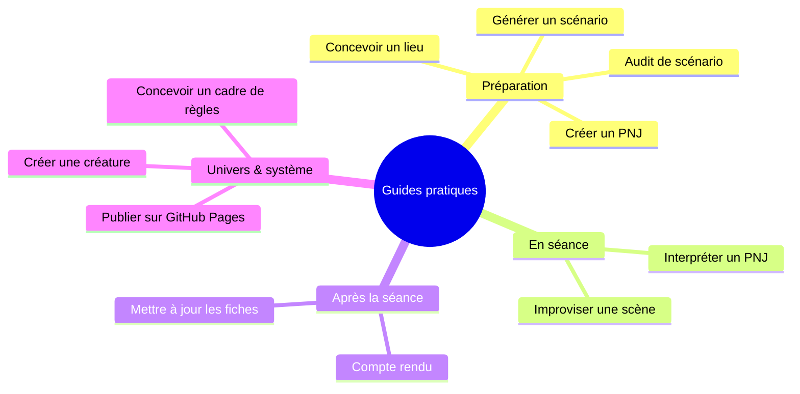

> 🗂️ **Section Diátaxis** : Guides pratiques (recettes orientées problème) · **Niveau Bloom** : Appliquer → Créer
> **Objectifs pédagogiques** : *appliquer* des procédures concrètes pour un besoin de jeu précis, *créer* des contenus de campagne à la demande.

# Guides pratiques pour le MJ

Chaque guide répond à une question du type « Comment faire X ? » et contient la procédure complète : objectif, rôle à donner au modèle, prompt type et format de sortie. Pour comprendre *pourquoi* ces méthodes fonctionnent (fenêtre contextuelle, ingénierie du prompt, variables de contexte), reportez-vous à [Fondamentaux des LLM pour le JDR](../30-explication/Fondamentaux%20des%20LLM%20pour%20le%20JDR.md).

## Carte des guides

## Préparation de partie

> 🗂️ **Diátaxis** : Index de recettes pratiques (how-to guides) · **Bloom** : Appliquer → Créer

| Guide | Question | Niveau Bloom | Où le trouver |
|---|---|---|---|
| Générer un scénario | Comment obtenir un scénario structuré et jouable ? | Créer | [Cas d'usages — scénario](Guides%20-%20scénarios.md#génération-dun-scénario) |
| Auditer un scénario | Comment évaluer les faiblesses avant de jouer ? | Évaluer | [Cas d'usages — audit](Guides%20-%20scénarios.md#génération-dun-audit-de-scénario) |
| Générer un lieu | Comment détailler une auberge, un temple, un donjon ? | Créer | [Cas d'usages — lieu](Guides%20-%20table%20et%20univers.md#génération-dun-lieu-développé) |
| Créer un PNJ | Comment générer histoire et personnalité d'un personnage ? | Créer | [Cas d'usages — historique](Guides%20-%20personnages%20et%20historiques.md#génération-dhistoires-de-personnage-joueur-ou-non-joueur) |
| Tisser les historiques | Comment lier les 
passés des PJ entre eux ? | Analyser | [Cas d'usages — jonction](Guides%20-%20personnages%20et%20historiqu
es.md#génération-dune-jonction-entre-les-historiques-de-personnages) |

## Pendant et après la séance

> 🗂️ **Diátaxis** : Index de recettes pratiques (how-to guides) · **Bloom** : Appliquer → Créer

| Guide | Question | Niveau Bloom | Où le trouver |
|---|---|---|---|
| Interpréter un PNJ | Comment obtenir des conseils de jeu d'acteur ? | Appliquer | [Cas d'usages — interprétation](Guides%20-%20personnages%20et%20historiques.md#conseils-dinterprétation) |
| Compte rendu de partie | Comment transformer ses notes en journal de campagne ? | Analyser | [Cas d'usages — compte rendu](Guides%20-%20table%20et%20univers.md#génération-de-comptes-rendus-de-partie) |
| Versionner sa campagne | Comment utiliser GitHub pour suivre ses documents ? | Appliquer | [GitHub et GitLab](../30-explication/%C3%89cosyst%C3%A8me%20d'outils%20IA%20pour%20le%20JDR.md#github-et-gitlab--versionner-sa-campagne) |
| Boucle avec Chartopia | Comment combiner tables aléatoires et LLM ? | Analyser | [Cas d'usages — feedback loop](Guides%20-%20table%20et%20univers.md#feedback-loop-entre-le-llm-et-chartopia) |

## Conception de système et d'univers

> 🗂️ **Diátaxis** : Index de recettes pratiques (how-to guides) · **Bloom** : Créer → Évaluer

| Guide | Question | Niveau Bloom | Où le trouver |
|---|---|---|---|
| Créer un univers | Comment construire un cadre de campagne cohérent ? | Créer | [Cas d'usages — univers](Guides%20-%20table%20et%20univers.md#conception-dunivers) |
| Cadre de règles | Comment concevoir attributs, compétences, sorts ? | Créer | [Cas d'usages — cadre de règle](Guides%20-%20conception%20de%20r%C3%A8gles.md#conception-dun-cadre-de-règle) |
| Créer une créature | Comment équilibrer un monstre pour ma table ? | Créer | [Cas d'usages — créature](Guides%20-%20conception%20de%20r%C3%A8gles.md#création-dune-créaturemonstre) |

> 💡 Ces guides supposent que vous savez déjà dialoguer avec un LLM. Si ce n'est pas le cas, commencez par le [Tutoriel premiers pas](../00-tutoriels/Tutoriel%20premiers%20pas.md).
