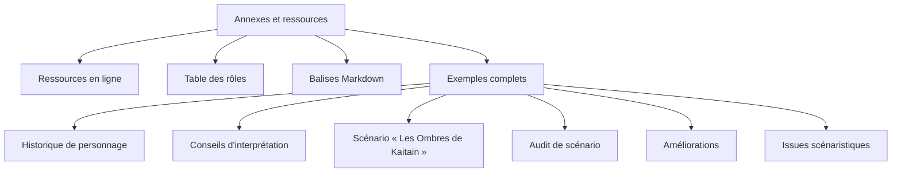

> 🗂️ **Section Diátaxis** : Référence (consultation) · **Niveaux Bloom** : Se souvenir → Appliquer
> **Objectifs pédagogiques** : *consulter* la table des rôles et les balises Markdown, *réutiliser* les gabarits et exemples de prompts

> 📖 Extrait de l'article fondateur « Usage des LLM dans le JDR », refondu selon le framework Diátaxis. Licence [CC BY-NC-ND 4.0](https://creativecommons.org/licenses/by-nc-nd/4.0/).

# Annexes et ressources

Ce document regroupe tout ce que l'on consulte ponctuellement : liens utiles, table des rôles à donner au modèle, syntaxe Markdown, et les exemples complets issus de l'article fondateur (historique, interprétation, scénario, audit, améliorations, issues).



## Ressources

* **Chartopia** : https://chartopia.d12dev.com/
* **ChatGPT** : https://openai.com/
* **Claude** : https://www.anthropic.com/
* **Mistral** : https://mistral.ai/
* **LM Studio** : https://lmstudio.ai/download

Chaque outil est présenté en détail dans l'[Écosystème d'outils IA pour le JDR](../30-explication/%C3%89cosyst%C3%A8me%20d'outils%20IA%20pour%20le%20JDR.md).

## Table des rôles

Le « rôle » est la première dimension d'un prompt qualitatif (voir [l'ingénierie du prompt](../30-explication/Fondamentaux%20des%20LLM%20pour%20le%20JDR.md#quel-rôle-adopter-pour-améliorer-ses-prompts-)). Voici les rôles les plus utiles au MJ, avec leurs forces et leurs limites :

| Rôle | Forces | Faiblesses |
| ----- | ----- | ----- |
| **Auteur de JDR** | Création d'histoires, développement de personnages et de mondes, enrichissement du lore | Peut nécessiter une collaboration avec un designer pour équilibrer les aspects mécaniques |
| **Game Designer (JDR)** | Compréhension des mécaniques de jeu, équilibrage, innovation, intégration dans le système de jeu | Peut manquer de profondeur narrative si focalisé uniquement sur les mécaniques |
| **Maître de jeu (MJ)** | Connaissance pratique de la dynamique de groupe, adaptabilité, expérience des besoins des joueurs | Peut manquer de structure formelle et de théorie de game design |
| **Scénariste** | Capacité à créer des arcs narratifs captivants, dialogues réalistes, développement de scénario | Peut manquer de connaissances spécifiques aux mécaniques de jeu de rôle |
| **Character Designer (JDR)** | Création visuelle des personnages, lieux et objets, amélioration de l'immersion visuelle | Ne contribue pas directement aux aspects narratifs ou mécaniques |
| **Character Developer (JDR)** | Développement détaillé de la personnalité, de l'histoire et de la motivation des personnages | Peut nécessiter une collaboration avec d'autres rôles pour assurer l'intégration harmonieuse dans l'univers de jeu |
| **Éditeur de contenu** | Révision et amélioration des textes, cohérence et correction des erreurs | Peut ne pas contribuer directement à la création de contenu original |
| **Consultant en folklore** | Expertise en mythes, légendes et cultures, enrichissement du background et du lore | Peut manquer de compétences pratiques en game design ou en narration contemporaine |
| **Spécialiste en mécanique de jeu** | Expertise en conception de systèmes de jeu équilibrés et engageants | Peut manquer de compétences narratives et de développement de personnages |
| **Testeur de jeu** | Feedback sur l'expérience de jeu, identification des bugs et des problèmes d'équilibrage | Rôle souvent limité à l'étape de test, ne contribue pas à la création initiale du contenu |
| **Narrateur vocal** | Donne vie aux personnages et aux scènes par la voix, améliore l'immersion audio | Ne contribue pas à la création du contenu écrit ou mécanique |
| **Consultant en psychologie** | Compréhension des motivations des joueurs, développement de personnages psychologiquement réalistes | Peut manquer de compétences spécifiques en game design ou en narration |
| **Créateur de musique/effets sonores** | Ajoute une dimension sonore immersive, création de thèmes musicaux et d'ambiances sonores | Ne contribue pas à la création de contenu écrit ou mécanique |
| **Community Manager** | Interaction avec la communauté des joueurs, feedback des joueurs, gestion des relations publiques | Ne contribue pas directement à la création du contenu de jeu |
| **Traducteur** | Traduction des textes de jeu dans différentes langues, localisation culturelle | Peut manquer de compétences narratives et de développement de jeu |

## Balises Markdown

Le format de sortie demandé à un LLM est presque toujours du Markdown (voir [Quelle mise en forme ?](../30-explication/Fondamentaux%20des%20LLM%20pour%20le%20JDR.md#quelle-mise-en-forme-)) :

| Balise | Description |
| ----- | ----- |
| `\# Titre` | Titre de niveau 1 (jusqu'à `\#\#\#\#\#\#` pour un titre de niveau 6) |
| `\*texte\*` ou `\_texte\_` | Mettre le texte en *italique* |
| `\*\*texte\*\*` ou `\_\_texte\_\_` | Mettre le texte en **gras** |
| `\*\*\*texte\*\*\*` | Mettre le texte en ***italique et en gras*** |
| `\-` ou `\*` | Créer une liste à puces |
| `1.`, `2.` | Créer une liste numérotée |
| `\[texte\](lien)` | Créer un lien hypertexte |
| `\!\[alt\](url image)` | Insérer une image avec une description |
| `\> citation` | Créer une citation ou un encadré |
| `\---` ou `\*\*\*` | Insérer une ligne horizontale pour séparer des sections |
| `\| a \| b \|` | Insérer un tableau ; `\|:---\|` aligne à gauche, `\|:---:\|` centre, `\|---:\|` aligne à droite |
| ````mermaid` | Insérer un diagramme Mermaid (flowchart, timeline, mindmap…) rendu par GitHub |

## Exemple d'usage de Chartopia vers un LLM

Le prompt type pour générer une table aléatoire avec un LLM puis l'intégrer dans Chartopia (procédure complète dans le guide [Chartopia avec un LLM](../10-guides/Chartopia%20avec%20un%20LLM.md)) :

```text
En tant que créateur de jeu de rôle expérimenté (30 ans),
génère une table aléatoire Chartopia pour un centre de formation
avec pour colonnes : Salle de cours, Gymnase, Laboratoire,
Salle de conférence, Bureau des formateurs.
Format de sortie : tableau Markdown, une entrée par ligne.
```

Résultat obtenu (une ligne = une entrée de la table Chartopia) :

| Centre de formation |
| :---- |
| Salle de cours |
| Gymnase |
| Laboratoire |
| Salle de conférence |
| Bureau des formateurs |

## Exemple d'historique de personnage

Résultat typique d'une génération d'historique (procédure dans le guide [Guides — personnages et historiques](../10-guides/Guides%20-%20personnages%20et%20historiques.md#génération-dhistoires-de-personnage-joueur-ou-non-joueur)).

> ### Valeria Karath
>
> **Histoire de fond — Origines :** Valeria Karath est née en 10 158 AG au sein de la prestigieuse Maison Karath, une maison noble mineure alliée à plusieurs grandes familles. Élevée dans le luxe, elle a grandi au cœur des intrigues impériales et des traditions anciennes. Son père, un conseiller influent, lui a enseigné les rouages de la politique dès son plus jeune âge, tandis que sa mère, une musicienne renommée, a nourri son goût pour les arts.
>
> **Événements marquants :** Enfant, Valeria a assisté à l'assassinat de son frère aîné lors d'un coup d'État manqué contre leur maison. Cet événement traumatisant l'a marquée profondément et a solidifié sa haine pour les conspirations non fondées et les trahisons injustifiées. À 20 ans, elle a déjoué une tentative d'assassinat contre son père, prouvant son acuité politique et tactique.
>
> **Objectifs et motivations :** Valeria cherche à garantir la survie et la prospérité de sa famille tout en imposant ses idéaux de justice dans l'Empire. Elle se bat pour que les petites maisons, souvent négligées, aient une voix face aux grandes puissances. Son objectif ultime est de réformer l'Impérium de l'intérieur, sans perdre ses racines ou se compromettre avec des technologies qu'elle considère déshumanisantes.
>
> **Personnalité — Traits de caractère :** Valeria est charismatique, méthodique et dotée d'une grande intelligence émotionnelle. Sa passion pour la justice et son sens aigu de la responsabilité l'incitent à agir avec pragmatisme tout en restant fidèle à ses convictions. Elle est aussi résiliente, capable de maintenir son calme même face aux trahisons et aux manigances.
>
> **Forces et faiblesses :** Sa maîtrise des arts oratoires et de la manipulation des apparences est son plus grand atout, mais son dégoût profond pour les machines et la technologie peut limiter ses alliances et mettre en péril certaines initiatives stratégiques. Son sens rigide de la justice la pousse parfois à des décisions moralement discutables.
>
> **Évolution :** Au fil du temps, Valeria apprend à tempérer son idéalisme avec un pragmatisme calculé, comprenant que la justice ne peut être imposée sans compromis. Son dégoût pour les technologies évolue également, voyant en elles un outil potentiellement bénéfique lorsqu'encadré par une éthique stricte.
>
> **Apparence physique :** Valeria est une femme de taille moyenne, avec une silhouette élancée. Ses cheveux noirs de jais sont souvent tressés de manière complexe, accentuant son visage aux traits fins. Ses yeux bleu clair sont pénétrants, souvent perçus comme capables de lire dans l'âme des autres. Elle porte des robes somptueuses et élégantes, souvent dans des tons sombres, ornées de motifs subtils évoquant les valeurs de sa maison.
>
> **Relations — Alliés :** Duc Rovan Karath (père, mentor), sa principale figure d'inspiration ; Lady Kalina Sulten (alliée politique), une amie de confiance issue d'une autre maison mineure ; Helio Drask (ancien amant), un conseiller rusé avec qui elle a gardé de bonnes relations.
>
> **Ennemis :** Lorn Valek (prétendant rival), un noble ambitieux qui cherche à miner sa position ; Cyra Moritani (rivale politique), une intrigante de la maison Moritani, ennemie farouche de Karath ; Icarus Richese (technologue), un expert en innovations technologiques, qu'elle méprise.
>
> **Compétences :** Talents — maîtrise des arts oratoires, tacticienne en diplomatie, assassin discrète. Formation — politique, musique (luth), rhétorique. Limites — dégoût pour la technologie, difficultés à déléguer les responsabilités.
>
> **Conflits — Internes :** Valeria lutte pour concilier son idéalisme avec la nécessité de compromis moralement discutables. Externes : elle doit naviguer entre les ambitions de la maison Karath et ses adversaires impitoyables tout en faisant face à l'ascension des technologies qu'elle considère comme corruptrices.
>
> **Originalité :** Son mépris profond pour les technologies dans un univers où elles sont omniprésentes la rend à contre-courant des autres nobles. Elle parle toujours avec une assurance calme, pesant soigneusement chaque mot comme une note dans une symphonie.

## Exemple de conseil d'interprétation d'un personnage

Résultat typique d'une demande de conseils de jeu d'acteur (procédure dans le guide [Guides — personnages et historiques](../10-guides/Guides%20-%20personnages%20et%20historiques.md#conseils-dinterprétation)).

> Pour t'aider à interpréter Valeria Karath dans *Dune : Aventures dans l'Imperium*, voici cinq conseils d'interprétation basés sur ses traits de caractère, son histoire et ses motivations :
>
> 1. **Parler avec assurance calme.** Valeria maîtrise l'art oratoire. En jeu, elle devrait toujours prendre le temps de réfléchir avant de parler, comme si chaque mot était choisi avec soin pour maximiser son impact. Utilise un ton posé, sans précipitation, et exprime-toi de manière mesurée, même dans les moments de tension.
> 2. **Exposer un idéal de justice rigide mais nuancé.** Le sens aigu de la justice de Valeria peut parfois la conduire à des décisions dures, voire cruelles. Lors des dilemmes moraux, fais en sorte que Valeria soit prête à prendre des décisions difficiles au nom d'un bien supérieur, tout en montrant son malaise face aux compromis qu'elle doit faire.
> 3. **Éviter et mépriser les technologies.** Valeria a un profond dégoût pour la technologie. Lorsqu'elle est confrontée à des machines ou à des innovations technologiques, montre de la réticence, voire un rejet visible. Exprime son mépris par des remarques subtiles ou des critiques acerbes envers ceux qui s'y fient trop.
> 4. **Montrer une loyauté complexe envers la famille.** Bien que Valeria soit profondément attachée à sa famille, les intrigues de pouvoir et les trahisons l'ont marquée. En jouant, laisse transparaître une vigilance constante, même avec ses alliés les plus proches. Elle devrait toujours anticiper la possibilité d'une nouvelle trahison, ce qui affecte sa manière d'interagir avec son père, ses alliés et ses rivaux.
> 5. **Incarner le poids de la responsabilité.** Valeria est constamment tiraillée entre ses responsabilités envers sa maison et ses idéaux personnels. Montre ce poids dans sa posture et ses décisions : elle ne se laisse pas submerger par les émotions, mais ses choix doivent toujours révéler cette tension interne entre pragmatisme et conviction morale.

## Exemple de scénario

Résultat typique d'une génération de scénario structuré (procédure dans le guide [Guides — scénarios](../10-guides/Guides%20-%20scénarios.md#génération-dun-scénario)).

> ### LES OMBRES DE KAITAIN
>
> *Scénario pour Dune : Aventures dans l'Imperium* · Joueurs : 4 à 6 · Complexité : 3 (intrigues politiques complexes et défis stratégiques).
>
> **Pitch :** Les joueurs sont des agents d'une Maison mineure en plein essor, envoyés sur Kaitain, le cœur de l'Imperium. Leur mission est de négocier la libération d'un prisonnier politique, capturé pour avoir défié la Maison Corrino. Ce prisonnier pourrait devenir un allié crucial pour garantir à leur Maison une promotion militaire stratégique. Toutefois, l'influence de puissantes factions et une guerre souterraine risquent de compromettre leur mission. Les joueurs devront naviguer dans les eaux troubles de la diplomatie, de l'espionnage et des luttes d'influence, tout en déjouant les complots de deux Maisons mineures rivales.
>
> #### Acte 1
>
> **Pitch :** Les joueurs arrivent sur Kaitain et rencontrent un conseiller influent du Bene Gesserit, qui leur offre des informations clés sur l'emplacement du prisonnier. Cependant, leur mission attire l'attention de deux factions rivales ayant des intérêts contraires à leur succès. Le piège se resserre alors qu'ils découvrent la véritable portée de l'intrigue.
>
> * **Scène 1 — Le Palais de l'Empereur :** un immense bâtiment orné de colonnes dorées et de jardins suspendus, reflet du pouvoir impérial. Protagonistes : Conseiller Kaela Norn (Bene Gesserit), femme énigmatique, calme et calculatrice, qui révèle la mission aux joueurs ; Duc Harlan Wansir (Maison mineure), politicien flamboyant sous l'apparence d'un allié ; Capitaine Terech Orlus (Garde de l'Empereur), loyal à la Maison Corrino, il surveille attentivement les joueurs.
> * **Scène 2 — Les bas-fonds de Kaitain :** un marché clandestin rempli de contrebandiers, de mercenaires et d'espions. Protagonistes : Jor Tannes (contrebandier), figure influente du marché noir, il propose des informations sur l'endroit où est détenu le prisonnier ; Gaius Lorim (informateur de la Maison Corrino), homme rusé et calculateur, prêt à vendre des informations contre de l'argent ; Rasha Korvin (mercenaire), soldat à louer, engagé par une Maison rivale pour surveiller les joueurs.
> * **Scène 3 — Un banquet diplomatique chez les Corrino :** où la politique et les trahisons se mêlent. Protagonistes : Baroness Letha Norvia (Maison Corrino), organisatrice de l'événement, une femme manipulatrice ; Émissaire Arkad Narm (Maison mineure alliée), opposé à la libération du prisonnier ; Ingénieur Horlas Tavir (Maison mineure alliée), dévoué à sa cause, il complote en secret pour saboter les efforts des joueurs.
>
> #### Acte 2
>
> **Pitch :** Les joueurs découvrent que leur mission est plus complexe que prévu : le prisonnier détient des informations dangereuses sur plusieurs Maisons, ce qui attire l'attention de nombreuses factions. Alors que les tensions montent, ils doivent déjouer des attaques clandestines et découvrir les véritables alliances qui se tissent dans l'ombre.
>
> * **Scène 1 — Une villa secrète :** résidence dissimulée du prisonnier. Protagonistes : Prisonnier Aric Valan (ancien politicien), stratège qui cherche à manipuler les joueurs pour ses propres intérêts ; Hector Laros (espion d'une Maison rivale), déterminé à empêcher la libération ; Solana Virek (mercenaire), chargée de protéger la villa mais ayant ses propres intérêts en jeu.
> * **Scène 2 — Les catacombes sous Kaitain :** un réseau labyrinthique de tunnels souterrains. Protagonistes : Rava Morlan (ingénieur en chef, Maison rivale), expert en sabotage qui tend des pièges mortels ; Kal Ustar (assassin), spécialiste de la guerre des Assassins, prêt à tout pour éliminer les joueurs ; Skaris Novar (Bene Gesserit infiltrée), mystérieuse alliée qui détient des informations vitales sur les complots rivaux.
> * **Scène 3 — Une salle secrète du Palais de l'Empereur :** utilisée pour des négociations secrètes. Protagonistes : Maître Ordan Valis (Maison Corrino), diplomate rigide qui cherche à maintenir la mainmise de l'Empereur ; Sira Velan (ambassadrice d'une Maison rivale), aux intentions ambiguës, elle pourrait être une alliée temporaire ; Isen Torric (prêtre du culte Orange-Catholique), observateur des négociations gardant une influence subtile.
>
> #### Acte 3
>
> **Pitch :** Les joueurs se retrouvent au cœur d'une bataille politique qui les dépasse. Avec la Maison Corrino et plusieurs Maisons mineures en guerre clandestine, ils doivent conclure la libération du prisonnier tout en évitant une guerre totale. Les alliances changent et la vérité sur les motivations du prisonnier éclate enfin.
>
> * **Scène 1 — Les salons privés de la Maison Corrino :** un décor d'opulence et de tension. Protagonistes : Duc Harlan Wansir (de retour, mais cette fois en tant que traître) ; Baroness Letha Norvia (jouant un double jeu) ; Aric Valan (manipulateur, jouant sa dernière carte).
> * **Scène 2 — Le spatioport de Kaitain :** dans une tentative de fuite désespérée. Protagonistes : Rasha Korvin (le mercenaire, devenu allié potentiel) ; Kal Ustar (l'assassin, prêt à tout pour tuer Aric) ; Sira Velan (dernière chance de négociation).
> * **Scène 3 — Les jardins impériaux :** sous les étoiles, lors d'une confrontation finale. Protagonistes : Capitaine Terech Orlus (dernière chance pour la Maison Corrino de prendre l'avantage) ; Conseiller Kaela Norn (elle révèle ses vraies intentions) ; Prisonnier Aric Valan (manipulant une ultime fois la situation).
>
> **Conclusion :** Les joueurs pourront réussir à libérer Aric Valan, mais sa libération provoque de nouvelles tensions au sein de l'Imperium. Les Maisons mineures se rapprochent du bord du conflit total, tandis que les intrigues du Bene Gesserit laissent présager une instabilité croissante.
>
> **Conséquences — Succès :** la Maison des joueurs obtient une promotion militaire et des ressources importantes ; cependant, les alliances qu'ils ont formées sont fragiles, et la Maison Corrino ne les oubliera pas. **Échec :** la Maison des joueurs est discréditée, voire détruite ; leur échec ouvre la voie à une guerre civile entre les Maisons mineures.
>
> **Suites possibles — En cas de succès :** Pitch 1 : défendre leur Maison contre les représailles de la Maison Corrino. Pitch 2 : une nouvelle mission les envoie dans les ruines d'une planète ancienne pour découvrir un secret oublié. Pitch 3 : leur alliance avec le Bene Gesserit les conduit à infiltrer une faction rebelle au sein de l'Imperium. **En cas d'échec :** Pitch 1 : les joueurs sont exilés et doivent reconstruire leur influence depuis l'ombre. Pitch 2 : un mystérieux allié leur propose une mission désespérée pour sauver ce qui reste de leur Maison. Pitch 3 : une guerre éclate entre les Maisons mineures, et les joueurs doivent choisir leur camp.
>
> **Antagonistes :** Arkad Narm — motivations : sauver l'Empire de ce qu'il voit comme une corruption interne ; méthodes : mobiliser des forces clandestines pour saboter les joueurs ; ressources : un réseau d'espions et de mercenaires. Horlas Tavir — motivations : faire tomber la Maison des joueurs pour ses propres intérêts ; méthodes : attaques ciblées, sabotage et guérilla ; ressources : expertise technique et accès à des armes sophistiquées. Ordan Valis — motivations : préserver la domination de la Maison Corrino ; méthodes : diplomatie, chantage et espionnage ; ressources : l'appareil impérial et ses agents.
>
> **Alliés :** Kaela Norn (Bene Gesserit) — motivations : manipuler les Maisons pour les objectifs du Bene Gesserit ; méthodes : diplomatie, subterfuges et manipulation mentale. Rasha Korvin — motivations : argent et opportunités politiques ; méthodes : force brute, mais pragmatique. Sira Velan — motivations : préserver la paix entre les Maisons, mais avec ses propres ambitions ; méthodes : négociations habiles et utilisation des réseaux d'information.

### Gabarit de prompt pour générer un scénario

La génération ci-dessus s'obtient avec un prompt type, dont voici le gabarit (décliné ici pour *Vaesen*, puis pour *Shade* — voir aussi [Guides — scénarios](../10-guides/Guides%20-%20scénarios.md#génération-dun-scénario)) :

```text
En tant que créateur de jeu de rôle expérimenté (30 ans),
rédige un scénario pour le JDR Vaesen, avec des descriptions riches,
des personnages développés et des défis variés pour captiver les joueurs,
en utilisant le modèle de structuration ci-dessous.

Template Scénario
Titre (en majuscules) :
Sous-titre : scénario pour le jeu de rôle Vaesen
Système : Year Zero Engine
Époque : XIXe siècle
Zone géographique : Europe, [Pays], [Ville/Village] + [Autres éléments : Forêt]
Nombre de joueurs : (1 à 6)
Complexité : (1 à 3)

Contexte
OUVERTURE :
ET PUIS :
L'INTRIGUE VISE À :
POUR :
INFLUENCE SECRÈTE :
ANTAGONISTES :
VAESEN :

Pitch du scénario (Max. 10 lignes) :

Acte 1
Pitch de l'acte 1 (Max. 10 lignes) :
Scène 1 (10 à 20 lignes) : Lieu et description (Max. 3 lignes) :
  Protagonistes principaux (alliés ou antagonistes) : * * *
Scène 2 : Lieu et description : Protagonistes principaux : * * *
Scène 3 : Lieu et description : Protagonistes principaux : * * *

Acte 2 — même structure (pitch + 3 scènes)
Acte 3 — même structure (pitch + 3 scènes)

Conclusion (Max. 10 lignes) :
Conséquences (Max. 10 lignes) — Succès : Ambigu : Échec :

Suite possible : 3 pitchs en cas de succès, 3 pitchs en cas d'échec
(Max. 10 lignes chacun)

Liste des antagonistes : motivations, méthodes, ressources, filiation/allégeance.
Liste des alliés : motivations, méthodes, ressources, filiation/allégeance.

Contexte additionnel
```

Variante pour *Shade* : Système laissé au choix ; Époque : Renaissance italienne avec de la fantasy ; Zone géographique : Clémence ; le champ « VAESEN » devient le champ propre au jeu (dans Shade : l'entité/figure qui porte l'ombre).

## Exemple de résultat d'audit de scénario

Résultat typique d'un audit du scénario ci-dessus (procédure dans le guide [Guides — scénarios](../10-guides/Guides%20-%20scénarios.md#génération-dun-audit-de-scénario)).

**Tableau des défis**

| Défi | Nature | Suggestions pour surmonter | Rôle/Métier recommandé |
| :--- | :--- | :--- | :--- |
| Multiples factions antagonistes | Risque de confusion avec les motivations croisées et les alliances changeantes | Simplifier les motivations de certaines factions ou clarifier leur position via des indices ou dialogues clairs | MJ |
| Intrigues politiques complexes | Les joueurs pourraient se perdre dans les nombreuses manigances diplomatiques | Introduire des résumés clairs et périodiques de l'état des factions et leurs objectifs pour aider à suivre | MJ |
| Décisions stratégiques non évidentes | Les choix des joueurs pourraient sembler trop incertains avec peu de visibilité sur les conséquences | Offrir des informations plus explicites ou des indices pour éclairer les décisions critiques | MJ |
| Combat en milieu politique (banquet) | Difficulté à équilibrer les interactions sociales et potentielles confrontations violentes | Prévoir des issues non violentes (intimidation, persuasion) ou un recours aux alliés pour éviter le chaos | MJ, Joueur sénior |
| Le rôle ambigu du prisonnier Aric Valan | Risque que les joueurs ne sachent pas s'il faut le considérer comme un allié ou un antagoniste | Utiliser des dialogues subtils pour donner des indices sur ses véritables intentions sans tout révéler | MJ, Joueur sénior |
| Gestion des scènes multiples (villa, catacombes, spatioport) | La diversité des lieux et des situations peut rendre la progression trop dispersée | Structurer les scènes avec des transitions claires et logiques, en veillant à ce que chaque scène ait un objectif défini | Scénariste, MJ |
| Influence du Bene Gesserit | Risque que les joueurs sous-estiment l'influence de cette faction importante | Introduire des actions du Bene Gesserit pour montrer leur pouvoir et influence subtilement | MJ |

**Tableau des incohérences**

| Incohérence | Suggestion pour correction | Rôle/Métier recommandé |
| :--- | :--- | :--- |
| Le rôle du Conseiller Kaela Norn semble trop passif malgré son appartenance au Bene Gesserit | Donner à Kaela un rôle plus actif, notamment via des interventions directes dans les moments critiques pour orienter l'intrigue | Scénariste |
| Le lien entre les Maisons mineures et la Maison Corrino manque de clarté concernant les motivations d'Arkad Narm et Horlas Tavir | Clarifier l'allégeance et les motivations de ces personnages en reliant leurs actions à des objectifs plus compréhensibles par les joueurs | Scénariste |
| L'introduction du marché clandestin semble trop rapide, sans exposition du rôle des contrebandiers | Insérer une brève explication de l'importance du marché noir sur Kaitain et de l'influence des contrebandiers pour ancrer la scène | Scénariste |
| Le prisonnier Aric Valan est présenté comme un politicien, mais ses compétences ou son utilité future sont floues | Développer son rôle en expliquant ce qu'il peut réellement offrir aux joueurs une fois libéré (informations, alliance, influence) | Scénariste |
| Trop d'antagonistes peuvent surcharger les joueurs, en particulier avec des méthodes similaires (sabotage, espionnage) | Réduire le nombre d'antagonistes ou rendre leurs approches plus distinctes pour éviter la redondance | Scénariste |

## Exemple de résultat de proposition d'améliorations de scénario

Résultat typique d'une demande d'améliorations à partir des défis et incohérences identifiés ci-dessus (procédure dans le guide [Guides — scénarios](../10-guides/Guides%20-%20scénarios.md)).

> **Simplification des énigmes complexes**
>
> 1. *Énigme liée aux motivations politiques* — Problème : les joueurs pourraient se perdre dans la complexité des motivations des factions. Solution : remplacer les intrigues trop alambiquées par des énigmes plus directes basées sur des objectifs clairs — indices visuels (lettres ou messages codés trouvés au banquet ou au marché clandestin qui révèlent explicitement qui soutient ou s'oppose aux joueurs), PNJ révélateurs (informations critiques sous forme de « rumeurs » faciles à interpréter, accessibles via des jets sociaux simples), objectif unique (réduire à deux objectifs principaux que les joueurs doivent clarifier et choisir).
> 2. *Énigme de libération du prisonnier* — Problème : la complexité des catacombes et les pièges tendus par l'ingénieur peuvent perdre les joueurs. Solution : plan simplifié (réduire le nombre de chemins, créer une carte simple, indices audio ou visuels sur les pièges — bruits mécaniques, marques anciennes sur les murs) et raccourcis via compétences (jet social avec un PNJ captif donnant des indications pour éviter les pièges).
>
> **Rééquilibrage des combats**
>
> 1. *Combat lors du banquet diplomatique* — Problème : risque de déséquilibre entre personnages sociaux et combattants. Solution : limiter les confrontations violentes (gardes trop nombreux et imposants, incitant à la fuite ou à l'usage d'un gadget — fumigène, hologramme de diversion) et introduire un PNJ ou un objet tactique (dispositif de brouillage temporaire).
> 2. *Combat contre les mercenaires* — Problème : combats potentiellement déséquilibrés sans compétences martiales. Solution : adoucir les adversaires (réduire dégâts/armure, introduire des éléments environnementaux stratégiques — l'obscurité des catacombes pour des attaques furtives, des équipements pour piéger les ennemis) et donner des ressources (bombes fumigènes, drones de distraction, boucliers personnels temporaires).
> 3. *Combat dans les catacombes* — Problème : pièges et saboteurs potentiellement trop difficiles. Solution : donner des chances de désamorcer (moments de reconnaissance basés sur la perception ou l'ingéniosité, pour impliquer les personnages non-combattants) et des combats en plusieurs phases (possibilité de se retirer ou de préparer une embuscade en exploitant le terrain).
>
> **Alternatives pour les compétences rares**
>
> 1. *Négociations* — Problème : certains joueurs n'ont pas de compétences sociales élevées. Solution : alternatives avec objets ou astuces (gadgets, documents, preuves compromettantes collectées pour convaincre sans jet de persuasion) et partage des responsabilités (les joueurs techniques ou martiaux apportent des informations, donnant à chacun un rôle actif).
> 2. *Désamorçage de pièges* — Problème : compétences technologiques rares dans certains groupes. Solution : simplification des interactions (objet clé, énigme simple — code à décoder, système d'interrupteurs logique) et aide contextuelle (collaboration avec un PNJ — mercenaire ou espion convaincu via compétences sociales ou ressources).
> 3. *Reconnaissance ou espionnage* — Problème : compétences furtives ou de perception absentes. Solution : aide d'un compagnon (PNJ allié ou drone pour surveiller à distance) et actions en groupe (distraction, déguisement — des alternatives aux actions furtives classiques).

## Exemple de résultat de proposition d'issues scénaristiques

Résultat typique d'une génération d'issues à partir du scénario ci-dessus (procédure dans le guide [Guides — scénarios](../10-guides/Guides%20-%20scénarios.md#génération-dissues-scénaristiques)).

> **Pitch 1 — La Toile des Conspirateurs** *(Conspiration au sein du Landsraad)*
> Après la libération d'Aric Valan, les joueurs découvrent que celui-ci est impliqué dans une conspiration visant à renverser plusieurs Maisons du Landsraad. Le réseau de conspirateurs, composé de nobles influents, agit dans l'ombre pour déstabiliser les forces politiques en place. Les joueurs doivent infiltrer ce réseau, en démasquant ses membres, tout en naviguant dans les trahisons et les jeux d'alliances. La Maison Corrino elle-même pourrait être impliquée, ce qui soulèverait la question de la loyauté des joueurs vis-à-vis de l'Empereur. Nouveaux personnages : espions du Landsraad, agents doubles, membres influents du complot. Nouveaux lieux : un palais secret sur une planète mineure, les chambres cachées d'un Sénat du Landsraad. Impact : les révélations bouleversent la hiérarchie du Landsraad et provoquent une lutte pour la survie des Maisons mineures.
>
> **Pitch 2 — Les Reliques Interdites** *(Découverte d'anciennes technologies dangereuses)*
> Aric Valan révèle des informations secrètes sur un ancien artefact technologique caché depuis des millénaires ; les joueurs se lancent dans une quête pour retrouver cette relique interdite par l'Imperium. Ce qui semblait être un simple artefact est en réalité une arme de destruction massive développée avant l'Ère des Machines Pensantes. L'enjeu : détruire cette technologie ou l'utiliser à leur avantage. Nouveaux personnages : agents du Bene Tleilax, scientifiques corrompus, un ancien archiviste détenant les secrets de l'artefact. Nouveaux lieux : une planète abandonnée aux ruines anciennes, un laboratoire secret souterrain. Impact : si les joueurs échouent, l'artefact menace tout l'Imperium, notamment la production d'épice.
>
> **Pitch 3 — Les Voies du Traître** *(Trahison et répercussions politiques)*
> Un allié des joueurs, Rasha Korvin, est révélé comme un traître, ayant vendu des informations cruciales sur la libération d'Aric Valan à une Maison rivale. Ce coup de poignard dans le dos met la Maison des joueurs en grand danger, avec une série d'assassinats et de sabotages orchestrés contre eux. Les joueurs devront naviguer dans une guerre des ombres pour trouver le traître, protéger leur Maison, et peut-être même l'éliminer. Nouveaux personnages : un maître espion, des assassins du Bene Gesserit, un seigneur rival influent. Nouveaux lieux : quartiers dissimulés dans la capitale d'une Maison rivale, une prison secrète sur Kaitain. Impact : la trahison bouleverse les alliances et pourrait mener à un conflit ouvert.
>
> **Pitch 4 — Le Prix de l'Épice** *(Tensions autour de la production d'épice)*
> Les tensions montent autour de la production d'épice : une Maison mineure rivale tente d'établir son propre monopole sur une planète secondaire possédant des gisements inattendus. Les joueurs sont envoyés pour négocier ou saboter les opérations de cette Maison rivale, alors que la Guilde Spatiale et le Bene Gesserit s'impliquent également. Nouveaux personnages : un négociateur de la Guilde Spatiale, une Révérende Mère du Bene Gesserit, un seigneur mineur avide de pouvoir. Nouveaux lieux : un désert toxique abritant les gisements d'épice, un spatioport en orbite. Impact : si les joueurs échouent, la Maison rivale obtient un avantage décisif, menaçant l'équilibre économique de l'Imperium.
>
> **Pitch 5 — Les Ombres du Bene Tleilax** *(Manipulations génétiques et guerre clandestine)*
> Des rumeurs circulent sur des expériences menées par le Bene Tleilax, impliquant des clones d'importants dirigeants du Landsraad ; l'un d'eux aurait pris la place d'un membre influent. Les joueurs sont engagés pour infiltrer un laboratoire secret du Bene Tleilax et découvrir la vérité — créatures génétiquement modifiées, troupes d'élite et secrets sur l'immortalité interdite — au prix de dilemmes moraux : révéler ces clones risque de plonger l'Empire dans une guerre civile. Nouveaux personnages : un Maître Tleilaxu, un clone infiltré dans le Landsraad, un espion Bene Gesserit en mission secrète. Nouveaux lieux : un laboratoire caché au sein d'un astéroïde, des installations médicales clandestines. Impact : les révélations bouleversent la politique impériale, mettant en péril l'intégrité du Landsraad.
>
> **Pitch 6 — Les Cendres du Soulèvement** *(Révolution sociale et conflit ouvert)*
> Suite aux répercussions de la libération d'Aric Valan, des soulèvements sociaux éclatent dans plusieurs systèmes contrôlés par des Maisons mineures, alimentés par des promesses de justice et d'égalité, et soutenus en secret par une faction rebelle. Les joueurs doivent intervenir pour rétablir l'ordre, mais découvrent que cette révolution est orchestrée par une force extérieure — peut-être la Maison Harkonnen. Ils sont pris dans un choix moral : écraser la rébellion pour préserver l'ordre impérial, ou soutenir les idéaux de changement. Nouveaux personnages : un chef révolutionnaire charismatique, un agent infiltré de la Maison Harkonnen, un gouverneur loyaliste. Nouveaux lieux : les rues dévastées d'une planète en révolte, un quartier général secret des rebelles. Impact : si les joueurs échouent, la révolte s'étend, menaçant la stabilité de l'Imperium.
