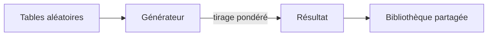
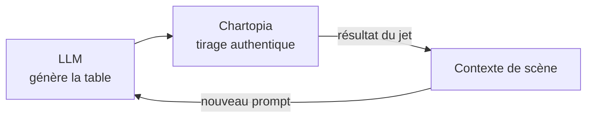

> 🗂️ **Section Diátaxis** : Explication (comprendre la théorie) · **Niveau Bloom** : Comprendre
> **Objectifs pédagogiques** : *décrire* ce qu'est Chartopia et *expliquer* son fonctionnement de tables aléatoires

> 📖 Extrait de l'article fondateur « Usage des LLM dans le JDR », refondu selon le framework Diátaxis. Licence [CC BY-NC-ND 4.0](https://creativecommons.org/licenses/by-nc-nd/4.0/).

# Optimiser le contexte avec Chartopia

> 🧭 **Navigation** : pour *créer* vos propres tables avec un LLM, suivez la recette pas à pas du guide [Chartopia avec un LLM](../10-guides/Chartopia%20avec%20un%20LLM.md). Le présent document explique *ce qu'est* Chartopia et *pourquoi* il s'accorde si bien avec un LLM.

## Qu'est-ce que Chartopia

Chartopia est une plateforme en ligne destinée à créer, partager et trouver des tableaux aléatoires et des générateurs pour les jeux de rôle. Elle offre une vaste bibliothèque de tableaux pour aider les maîtres de jeu à générer des rencontres, du butin, des noms de personnages non-joueurs (PNJ), et bien d'autres éléments essentiels pour les sessions de JDR. Les utilisateurs peuvent créer leurs propres tableaux et les partager avec la communauté, ce qui enrichit continuellement la collection disponible.

L'une des fonctionnalités principales de Chartopia est la possibilité de réaliser des jets de dés aléatoires en un clic, ce qui simplifie grandement la préparation et la gestion des sessions de jeu. Les tableaux peuvent être aussi simples ou complexes que nécessaire, intégrant des formules pour des résultats dynamiques. Par exemple, un tableau peut déterminer non seulement les créatures rencontrées mais aussi leur nombre et leur disposition.

En plus de la création de tableaux, Chartopia propose des options avancées comme les sous-tableaux et les variables d'entrée, permettant de créer des générateurs très sophistiqués adaptés à divers besoins narratifs et mécaniques des JDR.

Pour plus d'informations et pour découvrir les différentes fonctionnalités offertes par Chartopia, vous pouvez visiter le site officiel : [Chartopia](https://chartopia.d12dev.com).

## Comment fonctionne Chartopia ?

Chartopia fonctionne en permettant aux utilisateurs de créer, partager et utiliser des tableaux aléatoires et des générateurs pour les jeux de rôle via une interface en ligne intuitive. Voici comment ça fonctionne :

### Création de tableaux

Les utilisateurs peuvent créer des tableaux en entrant des données dans des colonnes et des lignes. Chaque cellule de tableau peut contenir du texte, des formules, ou des instructions pour des jets de dés.

Il est possible d'ajouter des sous-tableaux et de configurer des variables d'entrée pour des résultats plus complexes. Par exemple, un tableau peut inclure des instructions pour générer des rencontres de monstres avec des variations dans le nombre et le type de monstres rencontrés.

### Utilisation de générateurs

Les utilisateurs peuvent effectuer des jets de dés en un clic pour obtenir des résultats aléatoires basés sur les tableaux créés. Cela permet de gagner du temps pendant les sessions de jeu en évitant les calculs manuels.

Les générateurs peuvent être configurés pour utiliser des formules mathématiques et des opérateurs logiques, offrant une grande flexibilité dans la création de scénarios complexes.

### Partage et bibliothèque de ressources

Chartopia dispose d'une bibliothèque de tableaux publics que les utilisateurs peuvent parcourir et utiliser. Les tableaux couvrent une large gamme de besoins, comme la génération de rencontres, de butin, de noms de PNJ, etc.

Les utilisateurs peuvent également partager leurs créations avec la communauté, contribuant ainsi à une base de données en constante expansion de ressources pour les maîtres de jeu.

### Interface utilisateur

L'interface de Chartopia est conçue pour être intuitive, avec des options comme le mode éditeur de texte enrichi. Les utilisateurs peuvent facilement ajouter, modifier et organiser les entrées de leurs tableaux.

## Pourquoi combiner Chartopia et un LLM ?

La force de la combinaison vient d'une **boucle de rétroaction** : le LLM génère des tables contextualisées que Chartopia tire *réellement* au dé ; le résultat du tirage redevient un contexte à donner au LLM pour la scène suivante. Le hasard reste authentique (tirage, pas génération), tandis que le LLM apporte l'interprétation narrative.

Le détail de la boucle et des prompts à utiliser se trouve dans le guide [Chartopia avec un LLM](../10-guides/Chartopia%20avec%20un%20LLM.md) ; la théorie du contexte et de la fenêtre contextuelle est traitée dans [Fondamentaux des LLM pour le JDR](Fondamentaux%20des%20LLM%20pour%20le%20JDR.md#mémoire-dun-llm-ou-fenêtre-contextuelle).
