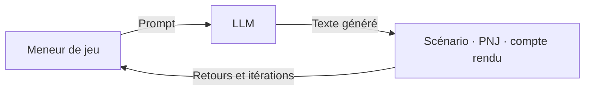
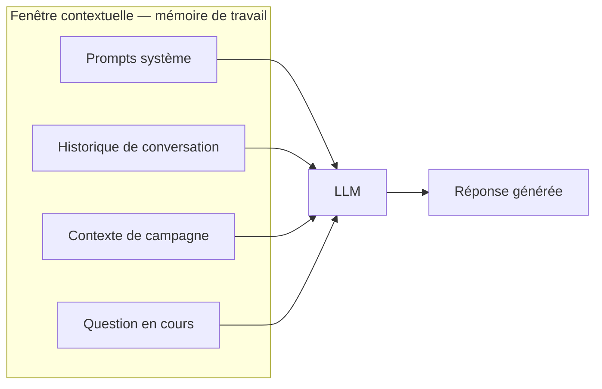
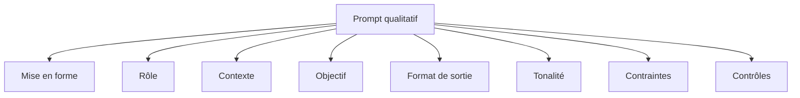

> 🗂️ **Section Diátaxis** : Explication (comprendre la théorie) · **Niveaux Bloom** : Se souvenir → Comprendre → Appliquer
> **Objectifs pédagogiques** : *définir* les concepts (Gen AI, NLP, NER, LLM, fenêtre contextuelle), *décrire* le fonctionnement d'un LLM, *appliquer* l'ingénierie du prompt au JDR

> 📖 Extrait de l'article fondateur « Usage des LLM dans le JDR », refondu selon le framework Diátaxis. Licence [CC BY-NC-ND 4.0](https://creativecommons.org/licenses/by-nc-nd/4.0/).

# Fondamentaux des LLM pour le JDR

> 🧭 **Navigation** : vous débutez ? Commencez par le [Tutoriel premiers pas](../00-tutoriels/Tutoriel%20premiers%20pas.md). Vous cherchez une recette précise (scénario, PNJ, compte rendu…) ? Allez dans les [Guides pratiques](../10-guides/Guides%20pratiques%20pour%20le%20MJ.md). Un terme inconnu ? Consultez le [Glossaire](../20-reference/Glossaire.md).

## Présentation

Bienvenue dans **Fondamentaux des LLM pour le JDR**, le document fondateur de ce dépôt. Il est conçu pour les maîtres de jeu (MJ), les joueurs et joueuses (PJ), les créateurs de contenu, et tous les passionnés de *jeux de rôle* (JDR) qui souhaitent exploiter les *modèles de langage large* (LLM) pour enrichir leurs parties. Que vous soyez un MJ expérimenté cherchant à introduire de nouvelles dynamiques dans vos sessions ou un novice curieux des possibilités offertes par l'intelligence artificielle, ce document vous fournira les outils et les techniques nécessaires pour faire usage d’un prompting efficace.

## Objectifs et public cible

L'objectif principal de ce document est de vous fournir une compréhension des modèles génératifs textuels et de leur application dans le contexte des JDR. Comment utiliser ces modèles pour créer des scénarios, développer des personnages, et gérer vos parties de manière plus fluide et créative. Ce guide est destiné aux MJ de tous niveaux, aux rédacteurs de JDR, et à toute personne intéressée par l'intégration de technologies avancées dans les loisirs créatifs. En combinant ces outils avec Chartopia, une plateforme dédiée à la création de tables aléatoires, les MJ peuvent générer des contextes riches et dynamiques pour leurs aventures et réutiliser ces contextes pour enrichir les futures interactions avec un LLM. Nous examinerons également l'utilisation d’un LLM pour auditer des scénarios et identifier les éléments potentiellement problématiques pour les joueurs.

## L'IA et les LLM dans le JDR

L'introduction de l'intelligence artificielle dans les jeux de rôle représente un apport significatif comme outils de support. Les LLM, tels que GPT, Claude ou Mistral, permettent de générer des dialogues, des descriptions, et des actions de manière dynamique et interactive, rendant les sessions de JDR plus engageantes et imprévisibles. En utilisant des prompts soigneusement conçus, les MJ peuvent s'adapter aux actions des joueurs en quasi temps réel, offrant une expérience de jeu plus riche et plus immersive. L'utilisation de l'intelligence artificielle et des LLM change la manière dont les maîtres de jeu vont pouvoir créer et gérer leurs campagnes de jeux de rôle.

## Quelques fondamentaux

### Vie privée et propriété intellectuelle

La réutilisation des contenus pour l'entraînement des modèles d'IA est une pratique courante qui présente des avantages significatifs pour améliorer la précision et la performance de ces technologies à moindre coût. Cependant, il est essentiel que vous soyez sensibilisé à la protection de vos données personnelles.

Les conversations tenues avec des modèles de langage peuvent contenir des informations sensibles ou privées. Pour garantir que ces échanges ne soient pas exploités à des fins d'entraînement sans consentement explicite, il est crucial de vérifier et de paramétrer les options de confidentialité dans les paramètres de votre compte.

Nous vous recommandons de réaliser régulièrement un contrôle du respect de vos choix dans les paramètres des différentes solutions technologiques que vous utilisez. En effet, certains acteurs technologiques ayant pour habitude, à chaque mise à jour majeure de leur solution, de faire un “reset” de vos choix.

En prenant ces précautions, vous pouvez bénéficier des avancées de l'IA tout en protégeant votre vie privée et vos données personnelles. De plus, il est important de considérer les aspects de la propriété intellectuelle.

En tant qu’utilisateur vous devez être conscients que vos créations et idées partagées dans ces conversations peuvent être utilisées pour entraîner des modèles, ce qui pourrait poser des questions sur les droits d'auteur et la propriété de ces contenus. Ainsi, s'assurer que ces données ne sont pas utilisées sans permission contribue également à protéger les droits intellectuels des utilisateurs.

### Références et sources

**Articles académiques et publications :** De nombreuses études académiques analysent les impacts de l'IA sur la vie privée et la propriété intellectuelle. Recherchez des articles sur Google Scholar ou dans des revues spécialisées. Vous pouvez d’ailleurs demander à un modèle génératif de vous orienter vers ces publications en demandant la source de ses informations. La solution Perplexity est particulièrement “carrées” sur ce point.

**Ressources juridiques :** Consultez des sites web juridiques ou des cabinets spécialisés en propriété intellectuelle pour comprendre les droits et les protections disponibles pour vos créations.

**Blogs et forums de développeurs :** Les discussions et les articles de blog sur des sites comme Stack Overflow, GitHub, et Medium peuvent offrir des perspectives pratiques, ainsi que des conseils sur la gestion de la confidentialité et des droits d'auteur lors de l'utilisation des LLM.

**Consultation d'experts :** Il est également important de noter que l'usage d'IA générative, tel que les LLM, ne dispense pas de faire appel à des références ou à des experts du domaine sur lequel on intervient. L'IA peut fournir des informations et des suggestions précieuses, mais elle ne remplace pas l'expertise humaine nécessaire pour contextualiser et interpréter correctement les données, prendre des décisions éclairées et garantir la précision et la fiabilité des informations utilisées.

### Qu’est-ce que la Gen AI ou Intelligence Artificielle Générative ?

L'intelligence artificielle générative (Gen AI) est une branche de l'IA qui utilise des modèles de machine learning pour générer de nouveaux contenus à partir de données existantes. Ces modèles peuvent produire du texte, des images, de l'audio et des vidéos. Dans le contexte des jeux de rôle, la Gen AI peut être un outil utile pour enrichir les scénarios, les personnages et l'expérience globale de jeu.

| Catégorie | Description | Exemples d’usages |
| ----- | ----- | ----- |
| **Texte** | La génération de texte par l'IA permet de produire des descriptions détaillées, dialogues réalistes, intrigues complexes, etc. | Lieux : Une taverne animée, une forêt mystérieuse. Événements : Une fête locale, une tempête de magie. Objets : Un anneau magique, une boussole enchantée. Caractéristiques : Force, intelligence. Avantages : Vision nocturne, chanceux. Défauts : Maladroit, phobie de l'eau. |
| **Image** | Utilisation de la Gen AI pour générer des images, offrant une aide visuelle précieuse. | Illustrations : Taverne, forêts mystérieuses, créatures fantastiques. Portraits : Personnages, PNJ. Cartes : Régions, villes, donjons. |
| **Audio** | Production d'éléments audio pour ajouter une dimension sonore immersive aux JdR. | Ambiances sonores : Bruits de forêt, ambiance de taverne. Effets sonores : Bruits de combat, sorts magiques. Voix de personnages : Voix de créatures, discours de personnages importants. |
| **Vidéo** | Génération vidéo pour une couche supplémentaire de narration et d'immersion. | Séquences cinématiques : Introduction d'une nouvelle campagne, conclusion épique. Reconstitutions de scènes : Bataille finale, découverte d'un trésor. |
| **Traduction** | Utilisation de l'IA pour traduire des textes, facilitant l'accessibilité des campagnes de JdR à un public plus large. | Traduction de scénarios complets pour des joueurs de différentes langues. Adaptation de dialogues de PNJ pour correspondre à des contextes culturels divers. Traduction instantanée lors des sessions de jeu en temps réel. |

### Qu’est-ce que le NLP ?

Le NLP (Natural Language Processing, ou traitement automatique du langage naturel en français (TAL)) est une discipline de l'intelligence artificielle (IA) qui se concentre sur l'interaction entre les ordinateurs et les langues humaines. Le but du NLP est de permettre aux machines d’interpréter et de répondre au langage humain de manière à être utile.

#### Objectifs du NLP

* **Compréhension :** Permettre aux machines de “comprendre” le contenu et le contexte du langage humain.
* **Génération :** Faire en sorte que les machines puissent produire du langage naturel qui soit compréhensible et pertinent pour les humains.
* **Traduction :** Traduire automatiquement le texte d'une langue à une autre.
* **Analyse de sentiments :** Identifier et extraire les opinions ou sentiments exprimés dans un texte.
* **Résumé automatique :** Condenser de grands volumes de texte en résumés courts et informatifs.

#### Applications du NLP

* **Traduction automatique :** Google Translate.
* **Analyse de texte :** Analyse des sentiments, analyse de polarité, analyse d’opinion, classification des textes.
* **Recherche d'information :** Moteurs de recherche comme Google.
* **Chatbots :** Services clients automatisés.
* **Synthèse vocale et reconnaissance vocale :** Text-to-speech et speech-to-text technologies.

#### Techniques du NLP

* **Tokenisation :** Diviser le texte en unités de base appelées tokens (mots, phrases).
* **Analyse syntaxique (parsing) :** Analyser la structure grammaticale d'une phrase.
* **Analyse sémantique :** Comprendre le sens des mots et des phrases.
* **Stemming et lemmatisation :** Réduire les mots à leurs racines ou formes de base.
* **Modélisation de sujets :** Identifier les thèmes principaux dans un ensemble de documents.
* **Reconnaissance d’entités nommées :** Identifier et classifier les entités nommées dans un texte.
* **Réseaux de neurones :** Utilisation de modèles de deep learning pour des tâches comme la traduction ou la génération de texte.

#### Problématique du NLP

* **Ambiguïté :** Les mots et les phrases peuvent avoir plusieurs significations.
* **Contextualisation :** Comprendre le contexte dans lequel une phrase est utilisée.
* **Pragmatique :** Comprendre les intentions et les significations implicites.
* **Variabilité linguistique :** La diversité des langues, des dialectes et des styles de langage.

#### Exemple d'utilisation du NLP

Imaginons un jeu de rôle où les joueurs interagissent avec un monde virtuel à travers des commandes vocales. Voici comment le NLP peut être utilisé dans ce contexte :

* Un joueur dit "Je veux parler au marchand pour vendre mes potions."
  * Convertir la parole en texte (speech-to-text).
  * Analyser la syntaxe et la sémantique pour comprendre l'intention du joueur (ici, parler au marchand pour vendre les potions).
  * Identifier les entités pertinentes (le marchand, les potions) et l'action à accomplir (vendre).
  * Générer une réponse appropriée de la part du jeu, par exemple : "Le marchand vous salue et demande combien de potions vous voulez vendre." et convertir cette réponse en parole (text-to-speech).

### Qu’est-ce que le NER ?

Le NER (Named Entity Recognition, ou Reconnaissance d'Entités Nommées en français (REN)) est une technique de traitement automatique du langage naturel (NLP) qui consiste à identifier et classifier les entités nommées dans un texte. Les entités nommées sont des éléments spécifiques qui se réfèrent à des noms propres, tels que les personnes, les organisations, les lieux, les dates, les montants monétaires, etc.

#### Objectifs du NER

* **Identification des entités** : Repérer les entités nommées dans le texte.
* **Classification des entités** : Attribuer une catégorie spécifique à chaque entité identifiée (par exemple, personne, lieu, organisation).

#### Applications du NER

* **Extraction d'information** : Extraire des informations pertinentes à partir de grands volumes de texte.
* **Analyse de textes** : Aider à la compréhension des relations et des contextes dans les textes.
* **Moteurs de recherche** : Améliorer la pertinence des résultats de recherche en comprenant mieux les requêtes des utilisateurs.
* **Bioinformatique** : Identifier les gènes, les protéines et d'autres entités biologiques dans des textes scientifiques.
* **Finance** : Extraire les noms d'entreprises, les montants financiers, les dates et d'autres informations dans les rapports financiers.

#### Techniques du NER

* **Règles heuristiques** : Utilisation de règles manuelles basées sur des motifs linguistiques (par exemple, les mots en majuscule suivis d'un mot commun peuvent être des noms de personnes).
* **Modèles statistiques** : Utilisation de modèles probabilistes comme les HMM (Hidden Markov Models) et les CRF (Conditional Random Fields) pour apprendre à partir de données annotées.
* **Apprentissage profond** : Utilisation de réseaux de neurones, y compris les architectures LSTM (Long Short-Term Memory) et les Transformers, pour capturer les relations complexes dans les données textuelles.

#### Exemple de NER

"Le chevalier Arthus a combattu le dragon Smaug dans les montagnes d'Erebor le 12ème jour du mois de Solstice."

##### Processus de NER

Le processus de NER identifie et classe les entités nommées de la manière suivante :

* **Arthus :** Personnage
* **Smaug :** Créature
* **Montagnes d'Erebor :** Lieu
* **12ème jour du mois de Solstice :** Date

##### Explication

* Arthus est identifié comme un personnage, car c'est un nom propre de personne dans le contexte du JDR.
* Smaug est identifié comme une créature, car c'est le nom d'une créature dans de nombreux contextes de fantasy.
* Montagnes d'Erebor est identifié comme un lieu, car il s'agit d'un nom propre de lieu fictif précédé du mot montagne.
* 12ème jour du mois de Solstice est identifié comme une date, bien que fictive, elle suit le format d'une date dans ce contexte.

#### Importance du NER

Le NER est essentiel pour diverses applications de NLP car il permet de structurer des données non structurées et d'extraire des informations clés. Il facilite la tâche des systèmes automatisés en leur permettant de “comprendre” et de manipuler les informations textuelles de manière plus efficace et précise.

#### Problématique du NER

* Ambiguïté : Les mêmes mots peuvent représenter différentes entités dans des contextes différents (par exemple, "Apple" peut se référer à l'entreprise ou au fruit).
* Nouveaux noms : L'apparition de nouvelles entités non présentes dans les données d'entraînement.
* Complexité linguistique : Les différences et les variations dans les langues et les styles d'écriture.

### Qu’est-ce qu’un LLM ?

Les Large Language Model (LLM) sont des systèmes d'intelligence artificielle entraînés sur de vastes corpus de texte pour comprendre et générer du langage humain. Ils fonctionnent en analysant des milliers de textes pour apprendre les structures grammaticales, les contextes et les significations des mots et des phrases. Lorsqu'on leur fournit un "**Prompt**" ou une entrée, ces modèles génèrent des réponses basées sur les données et les patterns qu'ils ont appris, en cherchant à prédire une suite logique de mots.

Les premières applications des LLM étaient principalement axées sur la traduction et la rédaction de texte. Cependant, avec l'arrivée de modèles plus puissants leurs capacités se sont étendues à des domaines créatifs tels que les jeux de rôle. Ces modèles peuvent maintenant créer des dialogues de personnages, des descriptions de lieux, et même des intrigues complètes, transformant ainsi la manière dont les JDR peuvent être conçus et joués. En intégrant les LLM dans vos sessions de JDR, vous bénéficiez non seulement d'une assistance créative mais aussi d'un partenaire capable de répondre aux moindres imprévus sortis de l'imagination des joueurs.

#### Mémoire d’un LLM ou Fenêtre contextuelle

La fenêtre contextuelle est un concept clé dans l'utilisation des modèles de langage tels que GPT, Claude, Mistral ou Gémini. Elle se réfère à la quantité maximale de texte que le modèle peut traiter et "se souvenir" à un moment donné. Comprendre et optimiser l'utilisation de cette fenêtre est crucial pour tirer le meilleur parti des capacités des LLM dans les jeux de rôle (JDR).

#### Fonctionnement de la fenêtre contextuelle

La fenêtre contextuelle, parfois appelée "contexte", désigne le nombre de tokens (unités de texte comprenant des mots, des ponctuations et des espaces) que le modèle peut analyser simultanément. Par exemple, si la fenêtre contextuelle est de 4096 tokens, le modèle peut traiter cette quantité de texte en une seule fois avant que les informations les plus anciennes ne soient oubliées ou remplacées par de nouvelles.

#### Comparaison des fenêtres contextuelles

Voici les informations sur les modèles de langage, leurs capacités de fenêtre contextuelle, et le calcul du nombre de mots et de pages correspondant pour chaque modèle :

| Modèle | Organisation | Fenêtre contextuelle (tokens) | Nombre approximatif de mots | Nombre approximatif de pages |
| ----- | ----- | ----- | ----- | ----- |
| GPT-3.5 | OpenAI | 2 048 | Environ 1 500 mots | Environ 3 pages |
| GPT-3.5 turbo | OpenAI | 16 385 | Environ 12 300 mots | Environ 25 pages |
| GPT-4 | OpenAI | 32 768 | Environ 24 600 mots | Environ 50 pages |
| GPT-4 turbo | OpenAI | 131 072 | Environ 98 300 mots | Environ 200 pages |
| Claude 2 | Anthropic | 100 000 | Environ 75 000 mots | Environ 150 pages |
| Claude 3 | Anthropic | 200 000 | Environ 150 000 | Environ 300 pages |
| PaLM 2 | Google | 32 000 | Environ 24 000 mots | Environ 48 pages |
| Gemini 1.5 Pro | Google | 1 000 000 | Environ 750 000 mots | Environ 1 500 pages |
| LLaMA 2 | Meta | 4 096 | Environ 3 100 mots | Environ 6 pages |
| LLaMA 3 | Meta | 32 768 | Environ 24 600 mots | Environ 50 pages |
| Mistral 7B | Mistral | 8 192 | Environ 6 100 mots | Environ 12 pages |
| Mixtral 8x7B | Mistral | 32 000 | Environ 24 000 mots | Environ 48 pages |
| Mixtral 8x22B | Mistral | 64 000 | Environ 48 000 mots | Environ 96 pages |
| Codestral | Mistral | 32 000 | Environ 24 000 mots | Environ 48 pages |

Les estimations sont faites en considérant qu'un token équivaut généralement à environ 0,75 mot en anglais, et en supposant qu'une page typique de texte contient environ 500 mots. De plus, le contexte initial peut être amputé par des instructions préalablement positionnées dans le contexte par l’organisation porteuse de la solution (par exemple en indiquant au LLM qu’il doit être bienveillant dans la formulation de ses réponses en évitant les discriminations).

##### Estimation des tokens

Vous pouvez trouver sur Internet des estimateurs de Tokens ou vous pouvez en développer un vous même dans un environnement Google Collab. Si vous ne savez pas coder, rien de grave c’est un script en langage python relativement simple qu’un LLM est en mesure de coder pour vous. Il existe également des plugins Chrome qui réalisent cette estimation. L’estimateur vous donne une idée en temps réel de l’occupation de votre fenêtre de contexte.

#### Importance de la fenêtre contextuelle dans les JDR

* **Continuité narrative :** Une fenêtre contextuelle plus large permet de maintenir une continuité narrative sur de plus longues périodes, ce qui est essentiel pour la rédaction de scénario ou de campagnes de JDR. Le modèle est en mesure de se souvenir d'un plus grand nombre de détails importants et de les réutiliser pour garantir une cohérence dans l'histoire.
* **Complexité des scénarios :** Avec une fenêtre contextuelle plus grande, il est possible d'inclure des éléments plus complexes dans les prompts, comme des descriptions détaillées, des dialogues prolongés, et des choix de décisions multiples, sans perdre le fil de l'intrigue.

#### Stratégies pour optimiser l'utilisation de la fenêtre contextuelle

* **Synthèse :** Pour maximiser l'efficacité de la fenêtre contextuelle, il est utile de synthétiser régulièrement les événements passés dans des résumés concis. Cela permet de garder les informations essentielles accessibles sans dépasser la limite de tokens.
* **Prompting :** Lors de la rédaction de prompts, il est important de prioriser les informations cruciales et de les placer au début du prompt. Les détails moins pertinents peuvent être omis ou résumés pour économiser des tokens.
* **Segment :** Diviser les scénarios en segments gérables qui peuvent être traités indépendamment mais reliés par des résumés ou des transitions fluides. Cela aide à maintenir la cohérence sans saturer la fenêtre contextuelle.

### Qu’est-ce que l’ingénierie du Prompt

Le prompt engineering (ou ingénierie de prompt) est un processus visant à concevoir, affiner et optimiser les entrées textuelles (ou prompts) fournies à un modèle de langage artificiel, comme GPT, pour obtenir des réponses ou des résultats plus précis, utiles ou pertinents. Cette pratique est particulièrement importante dans le contexte de l'utilisation de modèles de traitement du langage naturel (NLP) car elle permet de maximiser la performance du modèle en fonction de l'application spécifique.

#### Objectifs du prompt engineering

* **Amélioration de la précision :** En formulant soigneusement les prompts, on peut guider le modèle pour qu'il génère des réponses plus exactes.
* **Réduction des ambiguïtés :** Des prompts bien conçus peuvent réduire les réponses ambiguës ou hors sujet.
* **Efficacité :** Des prompts clairs et concis peuvent réduire le temps nécessaire pour obtenir des réponses satisfaisantes.
* **Contrôle des réponses :** En ajustant les prompts, on peut influencer la tonalité, la longueur et le style des réponses.

#### Qu’est-ce qu’un prompt ?

Un prompt est une instruction ou un ensemble d'instructions donné à un modèle d'intelligence artificielle pour générer une réponse ou effectuer une tâche spécifique. Dans le contexte des modèles de langage comme GPT-3.5, GPT-4 ou GPT4-O, un prompt peut être une phrase, une question, ou un paragraphe qui guide le modèle pour produire un texte cohérent et pertinent en réponse.

#### Comment faire pour qu'un prompt soit qualitatif ?

Pour qu'un prompt soit de qualité et génère les meilleurs résultats possibles, il doit être bien structuré, clair et précis. Voici quelques conseils par catégorie pour créer un prompt qualitatif :

| Catégorie | Caractéristiques d'un Prompt qualitatif | Exemple de Prompt générique |
| ----- | ----- | ----- |
| **Texte** | Clarté, précision, détails, contexte, objectif clair, langage naturel, exemples, format spécifique | "Rédige un essai de 500 mots sur l'impact de la révolution industrielle sur la société européenne, en abordant à la fois les aspects positifs et négatifs." |
| **Image** | Description détaillée, contexte visuel, spécifications techniques (style, couleur, composition) | "Imagine une forêt mystérieuse avec une lumière douce du matin filtrant à travers les arbres, et un chemin sinueux recouvert de mousse. \--ar 16:9 \--style raw" |
| **Audio** | Contexte sonore, spécificité des éléments audio, ambiance désirée | "Crée une ambiance sonore pour une taverne animée, avec des bruits de conversation, de la musique de fond et des cliquetis de verres." |
| **Vidéo** | Scénario détaillé, séquences spécifiques, éléments visuels et audio requis | "Produit une vidéo d'introduction pour une campagne de JdR, montrant une carte ancienne s'animant pour révéler un royaume mystérieux avec une musique épique." |
| **Modèles de Traduction** | Langues cibles, contexte culturel, ton et style de traduction | "Traduis ce scénario de JdR du français vers l'anglais, en conservant le ton médiéval et les nuances culturelles spécifiques." |

#### Quelle mise en forme ?

Il est recommandé de structurer un prompt sous forme de Markdown pour améliorer la clarté et optimiser la qualité des réponses fournies par le modèle. En utilisant Markdown, il devient plus facile de hiérarchiser l'information, d'organiser les sections, et de distinguer les éléments essentiels. Par exemple, les titres et sous-titres permettent de décomposer les questions complexes, tandis que les listes ordonnées ou à puces facilitent la lecture des instructions. En outre, les blocs de code, les citations, et les autres balises Markdown apportent une précision contextuelle, ce qui aide le modèle à mieux comprendre les attentes et à fournir des réponses plus pertinentes et précises.

##### Qu'est-ce que Markdown ?

Markdown est un langage de balisage léger et simple qui permet de formater du texte de manière claire et structurée. Il est utilisé pour convertir du texte brut en HTML, tout en restant lisible sans avoir besoin de balises complexes. Grâce à sa syntaxe intuitive, Markdown permet de créer des titres, des listes, des liens, des tableaux, des blocs de code, et plus encore, en utilisant des caractères de ponctuation et des symboles simples. Ce format est très populaire pour la rédaction de documents, la gestion de contenu sur le web, ainsi que dans les fichiers README et autres documents techniques, car il favorise la lisibilité et la facilité de modification. Vous pouvez retrouver en annexe un tableau comportant les balises Markdown.

#### Quel rôle adopter pour améliorer ses Prompts ?

Pour obtenir un résultat plus qualitatif avec une IA générative textuelle, il est recommandé de lui affecter un rôle, par exemple un métier, qui va lui permettre de cadrer son horizon de travail.

##### La notion d’expérience dans un rôle

Il est également recommandé d’ajouter une notion d'expérience dans le rôle occupé sous forme d’année. Notre recommandation est de prendre des valeurs standards : 10/20/30 ans d’expérience. Le jeu de rôle ayant 50 ans de vie officiel et les archives d’Internet étant alimentées sur le jeu de rôle de manière quantitative et qualitative depuis moins de 30 ans, un LLM disposera dans son apprentissage d’une profondeur plus ou moins équivalente.

##### Exemple de rôles appliqués aux Jeu de Rôle

Voici un tableau listant quelques rôles qui peuvent être utilisés pour aider un grand modèle de langage (LLM) à travailler sur la thématique du jeu de rôle, avec leurs forces et faiblesses respectives. Nous utiliserons certains de ces rôles dans le cadre de cet article. Vous pouvez retrouver en annexe une liste plus complète.

| Rôle | Forces | Faiblesses |
| ----- | ----- | ----- |
| **Auteur de JDR** | Création d'histoires, développement de personnages et de mondes, enrichissement du lore | Peut nécessiter une collaboration avec un designer pour équilibrer les aspects mécaniques |
| **Game Designer (JDR)** | Compréhension des mécaniques de jeu, équilibrage, innovation, intégration dans le système de jeu | Peut manquer de profondeur narrative si focalisé uniquement sur les mécaniques |
| **Maître de jeu (MJ)** | Connaissance pratique de la dynamique de groupe, adaptabilité, expérience des besoins des joueurs | Peut manquer de structure formelle et de théorie de game design |

#### Quel contexte ?

Fournir du contexte lors de la rédaction d'un prompt est essentiel car il améliore la clarté et la précision, assure la pertinence des réponses, enrichit le contenu, maintient la cohérence, augmente l'engagement et l'immersion, et définit des limites claires. Cela permet au modèle de mieux comprendre les attentes, de générer des réponses alignées sur le sujet spécifique, et de créer une expérience plus riche et immersive pour l'utilisateur, tout en évitant les digressions et en maintenant le propos sur le sujet principal. Voici un tableau décrivant divers contextes qu’un modèle génératif peut utiliser pour générer du texte, avec leurs descriptions et exemples d'utilisation.

| Contexte | Description | Exemple de Prompt |
| ----- | ----- | ----- |
| **Académique** | Utilisé pour des travaux universitaires, des articles scientifiques, des rapports de recherche. | "Rédige une introduction pour une thèse sur l'impact des réseaux sociaux sur la santé mentale des adolescents." |
| **Professionnel** | Utilisé pour des documents d'affaires, des courriels professionnels, des rapports de projet. | "Rédige un rapport mensuel sur les performances de l'équipe de vente pour le mois de juin." |
| **Social et Familial** | Utilisé pour des communications personnelles, des invitations, des messages informels. | "Écris un message de félicitations pour un mariage." |
| **Marketing** | Utilisé pour des contenus publicitaires, des campagnes de marketing, des messages promotionnels. | "Rédige une annonce publicitaire pour le lancement d'un nouveau produit de soins de la peau." |
| **Juridique** | Utilisé pour des documents légaux, des contrats, des avis juridiques. | "Rédige une clause de non-divulgation pour un contrat de travail." |
| **Médical** | Utilisé pour des documents médicaux, des rapports de santé, des articles de recherche médicale. | "Rédige un résumé de recherche sur les effets secondaires des vaccins contre la grippe." |
| **Technologique** | Utilisé pour des manuels techniques, des guides d'utilisation, des articles sur les technologies. | "Rédige un guide d'utilisateur pour un logiciel de gestion de projet." |
| **Littéraire** | Utilisé pour des œuvres de fiction, des poèmes, des récits narratifs. | "Rédige un début de nouvelle sur une découverte archéologique mystérieuse." |
| **Éducatif** | Utilisé pour des supports pédagogiques, des plans de cours, des articles éducatifs. | "Rédige un plan de cours pour enseigner les bases de la programmation en Python." |
| **Divertissement** | Utilisé pour des scénarios de films, des scripts de jeux, des critiques de films ou de livres. | "Écrive une critique de film pour le dernier blockbuster d'action." |

#### Quel objectif ?

Définir des objectifs clairs lors de la rédaction d'un prompt pour un modèle de langage est crucial car cela permet de guider la génération de contenu vers un but précis. Un objectif bien défini aide à informer, persuader, divertir, éduquer, instruire, inspirer, émouvoir, décrire, critiquer ou raconter, en fonction des besoins spécifiques de l'utilisateur. Cela assure que les réponses générées sont alignées avec les attentes, améliorent la pertinence du contenu, et permettent au modèle de produire des réponses plus cohérentes et ciblées. En établissant des objectifs clairs, on peut mieux contrôler le résultat et maximiser l'efficacité du modèle dans le contexte donné. Voici un tableau décrivant divers objectifs qu’un modèle génératif peut utiliser pour générer du texte, avec leurs descriptions et exemples d'utilisation.

| Objectif | Description | Exemple de Prompt |
| ----- | ----- | ----- |
| **Informer** | Fournir des informations précises et factuelles sur un sujet spécifique. | "Rédigez un article informatif sur les avantages de l'énergie solaire." |
| **Persuader** | Convaincre le lecteur d'adopter un point de vue ou de prendre une action particulière. | "Rédigez un argumentaire pour encourager les gens à voter aux prochaines élections." |
| **Divertir** | Amuser ou divertir le lecteur par le biais d'histoires, de blagues, ou de récits captivants. | "Écrivez une blague amusante sur les technologies modernes." |
| **Éduquer** | Enseigner ou expliquer des concepts, des procédures ou des connaissances spécifiques. | "Rédigez un tutoriel étape par étape sur la façon de créer un site web." |
| **Instruire** | Donner des instructions claires et précises pour accomplir une tâche. | "Rédigez des instructions pour monter un meuble IKEA." |
| **Inspirez** | Motiver et encourager les lecteurs à agir ou à penser positivement. | "Écrivez un message inspirant pour motiver une équipe à atteindre ses objectifs de vente." |
| **Émouvoir** | Provoquer des émotions fortes chez le lecteur, comme la joie, la tristesse ou la nostalgie. | "Rédigez une lettre émouvante à un ami de longue date." |
| **Décrire** | Fournir des descriptions détaillées et vivantes de personnes, de lieux ou d'événements. | "Décrivez un paysage de montagne au lever du soleil." |
| **Critiquer** | Évaluer et donner un avis sur des œuvres, des événements ou des produits. | "Rédigez une critique de livre pour un roman récemment publié." |
| **Raconter** | Narration d'histoires ou d'événements, réels ou fictifs. | "Racontez une histoire courte sur une aventure en forêt." |

#### Quel format de sortie ?

Voici un tableau répertoriant divers formats de sortie possibles pour un modèle de langage (LLM) avec leurs descriptions et exemples d'utilisation. Ils peuvent vous permettre de générer des éléments contextuels imprimable ou affichable sur écran pour renforcer la vraisemblance de vos scénarios.

| Format de sortie | Description | Exemples d'utilisation |
| ----- | ----- | ----- |
| **Article de presse** | Texte informatif et formel couvrant des événements récents ou des sujets d'actualité | Rapports de nouvelles, communiqués de presse |
| **Article de blog** | Contenu informel ou semi-formel souvent personnel et subjectif, couvrant divers sujets | Conseils de voyage, tutoriels, avis de produits |
| **Message de réseau social** | Texte court et engageant adapté aux plateformes de médias sociaux | Tweets, posts Facebook, légendes Instagram |
| **Guide/Mode d'emploi** | Instructions détaillées expliquant comment réaliser une tâche ou utiliser un produit | Manuels d'instructions, guides de démarrage rapide |
| **Description de produit** | Texte promotionnel décrivant les caractéristiques et avantages d'un produit | Pages de vente, fiches produit sur les sites e-commerce |
| **E-mail** | Message électronique pouvant être formel ou informel | E-mails de marketing, communications internes |
| **Résumé** | Brève synthèse d'un document plus long, soulignant les points clés | Résumés de recherches académiques, abstracts d'articles scientifiques |
| **Histoire courte** | Narration fictionnelle ou factuelle de longueur limitée | Contes, anecdotes, nouvelles |
| **Essai académique** | Texte formel et structuré présentant une argumentation sur un sujet spécifique | Articles de revues scientifiques, dissertations |
| **Rapport** | Document détaillé présentant des analyses, des conclusions et des recommandations | Rapports financiers, rapports de recherche |
| **Présentation** | Série de diapositives ou de pages de contenu structuré pour une communication visuelle | Présentations PowerPoint, keynotes |
| **Scénario** | Texte décrivant les dialogues et les actions d'une œuvre de fiction, telle qu'un film ou une pièce | Scripts de films, pièces de théâtre |
| **Dialogue** | Échange structuré entre deux ou plusieurs personnages ou entités | Scènes de films, interactions dans les jeux vidéo |
| **Poème** | Texte littéraire utilisant le langage de manière artistique et souvent rythmée | Poèmes lyriques, haïkus |
| **Avis/critique** | Évaluation subjective d'un produit, service ou œuvre d'art | Critiques de films, avis sur les restaurants |
| **Débat** | Présentation de points de vue opposés sur un sujet donné | Débats politiques, discussions académiques |
| **Biographie** | Récit détaillé de la vie d'une personne | Biographies d'hommes célèbres, histoires de vie |
| **Annonce** | Message publicitaire ou informatif destiné à attirer l'attention | Annonces publicitaires, publicités |
| **Transcription** | Conversion de l'audio en texte, capturant fidèlement les paroles prononcées | Transcriptions d'interviews, discours politiques |

En complément d’un LLM, un MJ ou un PJ a souvent besoin d’une représentation visuelle pour aider à l’immersion. Midjourney est un outil idéal pour ce cas d’usage puisqu’il permet de générer des images. Toutefois il ne sera pas traité dans ce document car l’outil comprend à lui seul un certain nombre de paramètres et fonctionnalités qui demandent des explications plus poussées.

Si vous souhaitez en savoir plus sur Midjourney : [https://www.youtube.com/@lestutosmidjourney](https://www.youtube.com/@lestutosmidjourney)

#### Quelle tonalité ?

Vous avez la possibilité dans vos Prompts de spécifier une tonalité de restitution. Voici un tableau décrivant divers styles de tonalité qu’un modèle de langage peut utiliser pour générer du texte, avec leurs descriptions et exemples d'utilisation. Notez qu’il est possible de combiner les tonalités (Exemple : Amical mais urgent). Toutefois, éviter l’empilage de couches qui pourraient au final dégrader la génération.

| Ton | Description | Exemple de Prompt |
| ----- | ----- | ----- |
| **Formel** | Tonalité professionnelle et polie, souvent utilisée dans des contextes officiels ou académiques. | "Rédigez une lettre formelle de demande de partenariat avec une entreprise." |
| **Amical** | Tonalité chaleureuse et accessible, souvent utilisée pour des communications informelles. | "Écrivez un email amical invitant un ami à une fête d'anniversaire." |
| **Urgent** | Tonalité pressante et insistante, destinée à capter rapidement l'attention du lecteur. | "Rédigez un message urgent avertissant les résidents d'une coupure de courant imminente." |
| **Inspirant** | Tonalité motivante et encourageante, souvent utilisée dans des discours ou des messages positifs. | "Écrivez un discours inspirant pour motiver une équipe avant une grande compétition." |
| **Humoristique** | Tonalité légère et drôle, utilisée pour divertir et amuser. | "Rédigez une courte histoire humoristique sur les aventures d'un chat espiègle." |
| **Sérieux** | Tonalité grave et réfléchie, souvent utilisée pour aborder des sujets importants ou sensibles. | "Écrivez un article sur l'importance de la santé mentale dans le milieu de travail." |
| **Narratif** | Tonalité descriptive et engageante, souvent utilisée pour raconter des histoires ou des anecdotes. | "Racontez une histoire courte sur une découverte inattendue lors d'une randonnée en montagne." |
| **Didactique** | Tonalité instructive et éducative, utilisée pour expliquer des concepts ou donner des instructions. | "Rédigez un tutoriel étape par étape sur la façon de configurer un réseau domestique." |
| **Persuasif** | Tonalité convaincante et influente, utilisée pour persuader ou encourager une action. | "Rédigez un argumentaire de vente pour promouvoir un nouveau produit écologique." |
| **Poétique** | Tonalité artistique et lyrique, souvent utilisée dans la poésie ou les textes littéraires. | "Écrivez un poème sur la beauté de la nature au lever du soleil." |
| **Sarcastique** | Tonalité ironique et mordante, souvent utilisée pour critiquer ou se moquer. | "Rédigez un commentaire sarcastique sur les retards fréquents des transports en commun." |
| **Optimiste** | Tonalité positive et enthousiaste, utilisée pour transmettre de l'espoir et de la positivité. | "Écrivez un message optimiste pour célébrer les réussites de l'année écoulée." |
| **Pessimiste** | Tonalité sombre et négative, souvent utilisée pour exprimer des inquiétudes ou des critiques. | "Rédigez un article pessimiste sur les impacts environnementaux du changement climatique." |
| **Romantique** | Tonalité douce et passionnée, utilisée pour exprimer des sentiments d'amour et d'affection. | "Écrivez une lettre d'amour passionnée pour une occasion spéciale." |
| **Neutre** | Tonalité impartiale et factuelle, souvent utilisée pour des rapports ou des analyses objectives. | "Rédigez un rapport neutre sur les statistiques de vente trimestrielles de l'entreprise." |

#### Quelle contrainte ?

Fournir des contraintes lors de la rédaction d'un prompt est important car elles assurent la clarté et la précision, alignent les résultats avec les objectifs spécifiques, maintiennent la pertinence et la cohérence du contenu, enrichissent la qualité et la richesse des réponses, optimisent la gestion du temps et des ressources, et réduisent les risques d'erreurs. En définissant des limites claires, les contraintes permettent de guider le modèle de manière efficace pour produire des textes précis, pertinents et bien structurés, répondant ainsi aux attentes spécifiques et maximisant l'efficacité du processus de génération de contenu.

Note : D\&D étant le poids lourd dans le domaine du JDR, il est fortement présent dans les connaissances des LLM et peut influencer significativement le résultat d’un prompt si vous ne donnez pas une instruction claire en imposant des contraintes au modèles.

Voici un tableau décrivant quelques contraintes applicables dans un prompt pour le domaine du jeu de rôle :

| Contrainte | Description | Exemple de Prompt |
| ----- | ----- | ----- |
| **Contexte** | Définir l'univers, l'époque et l'état du monde où se déroule l'histoire. | "Rédigez un scénario de JDR se déroulant dans un monde médiéval fantastique en pleine guerre civile." |
| **Personnages** | Spécifier les rôles, le développement des personnages et assurer la diversité. | "Incluez un héros, un antagoniste et plusieurs PNJ avec des motivations complexes et diversifiées." |
| **Intrigue** | Décrire la structure narrative, le conflit principal et les quêtes secondaires. | "Élaborez une campagne en trois actes avec un conflit central sur la recherche d'un artefact perdu." |
| **Ton et Style** | Déterminer la tonalité générale et le style de narration. | "Adoptez un ton épique et mystérieux avec un style narratif riche en descriptions." |
| **Mécaniques de Jeu** | Intégrer des règles spécifiques et assurer l'équilibrage des défis. | "Utilisez un système de magie basé sur les éléments avec des règles spécifiques pour les combats." |
| **Objectif du Scénario** | Définir les buts des personnages et l'impact de leurs décisions. | "Les joueurs doivent empêcher la résurrection d'un dragon antique, leurs choix affectant le résultat final." |
| **Limites Techniques** | Spécifiez une limite de mots et le format de sortie attendu. | "Rédigez le scénario en 3000 mots maximum, au format PDF." |
| **Immersion** | Créer une ambiance immersive avec des descriptions détaillées et des éléments visuels/auditifs. | "Décrivez un château abandonné avec des torches vacillantes et des bruits de chaînes résonnant dans l'ombre." |
| **Accessibilité** | Utiliser un langage clair et assurer l'adaptabilité pour différents niveaux de joueurs. | "Écrivez des descriptions claires et ajustez les défis pour des joueurs débutants et expérimentés." |

#### Quels contrôles ?

De même, gardez en tête que le modèle va générer un texte avec le style, la tonalité ou les contraintes demandées, mais qu'en fonction de votre prompt et de la taille du texte de sortie en résultant cette tonalité sera plus ou moins présente. Il peut être utile de faire appel à des outils tiers pour auditer le texte généré afin de vous assurer de la conformité de la génération.

Vous pouvez par exemple utiliser le service de https://aittia.org qui dispose d'un GPT's pour auditer votre génération.

## Utiliser des LLM dans le Jeu de Rôle

Voici les huit dimensions d'un prompt complet, détaillées ci-dessous :

### Apports pour la table

| Avantages | Détails |
| ----- | ----- |
| **Créativité** | Les LLM peuvent vous aider à générer une quantité d'idées nouvelles et originales, enrichissant ainsi les scénarios de JDR. |
| **Réactivité instantanée** | Les LLM permettent de répondre rapidement aux actions imprévues des joueurs. |
| **Cohérence narrative** | Avec des prompts bien conçus, les LLM peuvent maintenir une cohérence narrative sur de longues périodes, ce qui est essentiel pour des campagnes de JDR prolongées. |
| **Économie de temps** | En automatisant certaines tâches de création, les MJ peuvent se concentrer sur la gestion de jeu et l'interaction avec les joueurs. |
| **Assistant** | L’usage d’un LLM par le MJ vient “rééquilibrer” la position de celui qui se trouve en général devoir gérer les interactions et les idées de plusieurs joueurs. |

### Limites et points de vigilance

| Inconvénients | Détails |
| ----- | ----- |
| **Dépendance technologique** | Une forte dépendance aux LLM peut réduire la capacité du MJ à improviser sans assistance technologique. |
| **Risque d'incohérences** | Les LLM peuvent parfois générer des réponses incohérentes ou non pertinentes, nécessitant une supervision humaine. |
| **Manque de nuance émotionnelle** | Les LLM peuvent avoir du mal à saisir et à reproduire des nuances émotionnelles complexes, ce qui peut affecter la profondeur des interactions de personnages. |
| **Coûts et accessibilité** | L'utilisation de LLM avancés peut être coûteuse et nécessiter un accès à des ressources informatiques puissantes. |

### Concrètement ça donne quoi un prompt de JDR ?

Pour illustrer ce que nous venons de voir, voici un tableau avec des Prompts adaptés à 2 jeux de rôle de fantasy. La structure du Prompt conserve la même base et certains éléments vont évoluer en fonction du jeu.

| Jeu de rôle | Exemple de Prompt adapté |
| ----- | ----- |
| **Donjons et Dragons (D\&D)** | En tant que créateur de jeu de rôle avec plus de 10 ans d'expérience, vous devez rédiger un scénario de campagne pour Donjons et Dragons se déroulant dans un monde médiéval fantastique. La campagne doit comporter trois actes distincts, chacun avec des intrigues politiques complexes et des éléments de haute magie. Le ton général de l'histoire doit être épique et mystérieux, captivant les joueurs du début à la fin. Limitez le scénario à 3000 mots, en veillant à ce que chaque acte soit bien structuré et contribue à l'évolution de l'intrigue principale. Assurez-vous d'inclure des descriptions riches, des personnages bien développés, et des défis variés pour maintenir l'intérêt des joueurs. |
| **Warhammer Fantasy Roleplay** | En tant que créateur de jeu de rôle avec plus de 10 ans d'expérience, vous devez rédiger un scénario de campagne pour Warhammer Fantasy Roleplay se déroulant dans l'Empire du Vieux Monde. La campagne doit comporter trois actes distincts, chacun avec des intrigues politiques complexes et des éléments de haute magie. Les joueurs commenceront comme des aventuriers modestes et devront naviguer dans un monde sombre et périlleux, confrontés à la corruption, aux forces du Chaos et aux complots aristocratiques. Le ton général de l'histoire doit être épique et mystérieux, reflétant le style gritty et brutal propre à Warhammer. Limitez le scénario à 3000 mots, en veillant à ce que chaque acte soit bien structuré et contribue à l'évolution de l'intrigue principale. Assurez-vous d'inclure des descriptions riches, des personnages bien développés, et des défis variés pour maintenir l'intérêt des joueurs. |

On voit qu'il est possible de mettre en place des patterns de Prompt pour structurer la génération du texte. Ces patterns peuvent être ajustés avec des variables de contexte.

Il est recommandé, pour gagner du temps, de vous constituer une bibliothèque de Prompt dès lors que vous avez identifié un pattern qui fonctionne et qui est réutilisable sur plusieurs cadres de jeux de rôles.

### Qu'est-ce qu'une variable de contexte ?

Une variable de contexte est un élément d'information que l'on peut modifier pour adapter un contenu ou une structure prédéfinie (un pattern) à un contexte ou à une situation particulière. En d'autres termes, ce sont des paramètres qui changent en fonction de l'objectif ou du cadre spécifique, tout en respectant une structure générale constante.

#### Application aux prompts de JDR

Dans les exemples donnés ci-dessus pour D\&D et Warhammer, le pattern général du prompt reste le même :
- Demander à un créateur de JDR d'écrire un scénario en 3000 mots.
- Structurer le scénario en trois actes avec des intrigues politiques complexes et des éléments de magie.
- Maintenir une description riche, des personnages bien développés et des défis variés.

Cependant, certains éléments du prompt changent en fonction du jeu de rôle. Ces éléments variables sont les variables de contexte, et elles permettent d'adapter le contenu aux spécificités du jeu :

| Variable de contexte | Donjons & Dragons | Warhammer Fantasy Roleplay |
| ----- | ----- | ----- |
| Univers | Monde médiéval fantastique | Empire du Vieux Monde |
| Ton | Épique et mystérieux | Gritty et brutal |
| Thématiques | Haute magie et intrigues politiques | Forces du Chaos, corruption et complots |
| Point de départ des joueurs | Héros dans un monde médiéval | Aventuriers modestes dans un monde sombre |

#### Pourquoi sont-elles importantes ?

- Flexibilité : Les variables de contexte permettent de réutiliser une structure de base pour générer des contenus différents et adaptés à des besoins variés.
- Cohérence : En changeant uniquement les variables, on maintient une ligne directrice tout en adaptant le contenu aux spécificités du contexte.
- Personnalisation : Elles permettent de répondre aux attentes spécifiques des utilisateurs ou joueurs, en personnalisant le contenu en fonction de leur univers de référence.

#### Comment reconnaître une variable de contexte ?

Dans l'exemple, voici des questions à poser pour identifier les variables :
- Qu'est-ce qui change selon le jeu ? (ex. : l'univers, le ton, les thèmes spécifiques)
- Qu'est-ce qui reste constant ? (ex. : la structure en trois actes, la limite de mots, la richesse des descriptions)
- Ces éléments qui changent sont précisément les variables de contexte. Elles ajoutent de la spécificité sans bouleverser la structure globale du contenu.

## Conclusion

En utilisant un LLM pour générer des tables aléatoires et en les intégrant dans Chartopia, les maîtres de jeu peuvent créer des contextes riches et dynamiques pour leurs campagnes de jeux de rôle.

La combinaison des contextes de scénarios permet de créer des arcs narratifs complexes et engageants.

L'utilisation de LLM pour auditer et ajuster les scénarios assure que les défis proposés sont équilibrés et accessibles, améliorant ainsi l'expérience globale des joueurs.

De plus, ces techniques peuvent être adaptées pour des applications professionnelles et éducatives, offrant des simulations de risques, des échanges clients réalistes et des scénarios pédagogiques.

Enfin, la génération de pitchs d'issues scénaristiques permet de prolonger et d'enrichir les aventures, la création d'histoires de personnage basées sur leurs fiches ajoute une profondeur supplémentaire à la narration, et la réalisation de comptes rendus de partie assure une documentation détaillée des sessions de jeu.

Cette approche permet une grande flexibilité et une créativité sans limites, tout en maintenant une cohérence narrative grâce à la boucle de rétroaction continue entre les deux outils. Les MJ peuvent ainsi offrir à leurs joueurs des aventures uniques et immersives, où chaque session de jeu est une nouvelle exploration pleine de surprises, en se focalisant sur l’Histoire et le jeu sans perte de temps.

Toutefois, gardez en tête que les LLM sont des modèles mathématiques sans intelligence qui se “contentent” d’aligner une suite logique de caractères mais ayant une capacité combinatoire très importante, ce qui renforce l’illusion qu’ils soient dotés d’une capacité de réflexion.

La production d’un LLM ne doit pas vous dispenser de travailler vos personnages, votre scénario, votre campagne, votre univers ou votre histoire. Bien au contraire, les LLM sont uniquement un moyen d’aller au-delà de ce que vous auriez pu explorer, analyser et rédiger dans une même fenêtre de temps. Ils sont là pour vous assister en vous questionnant sur votre création, en auditant votre rédaction, en mettant en lumière des incohérences narratives, en ajustant votre style ou votre tonalité.
