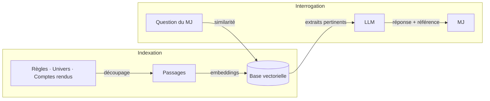
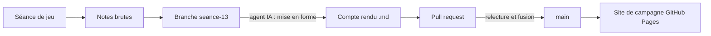
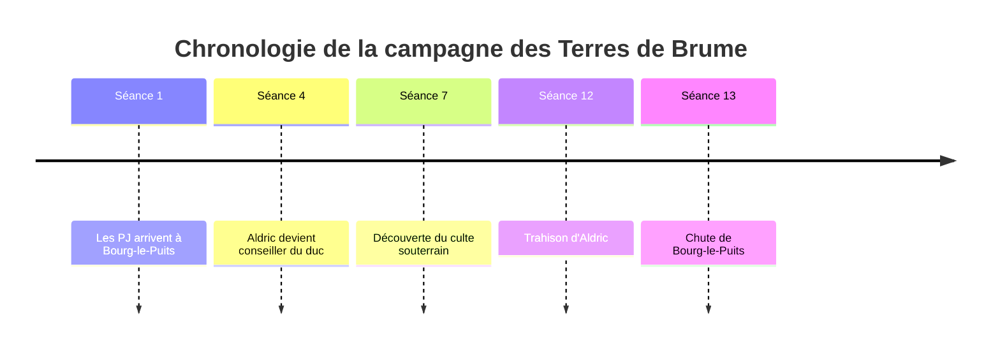
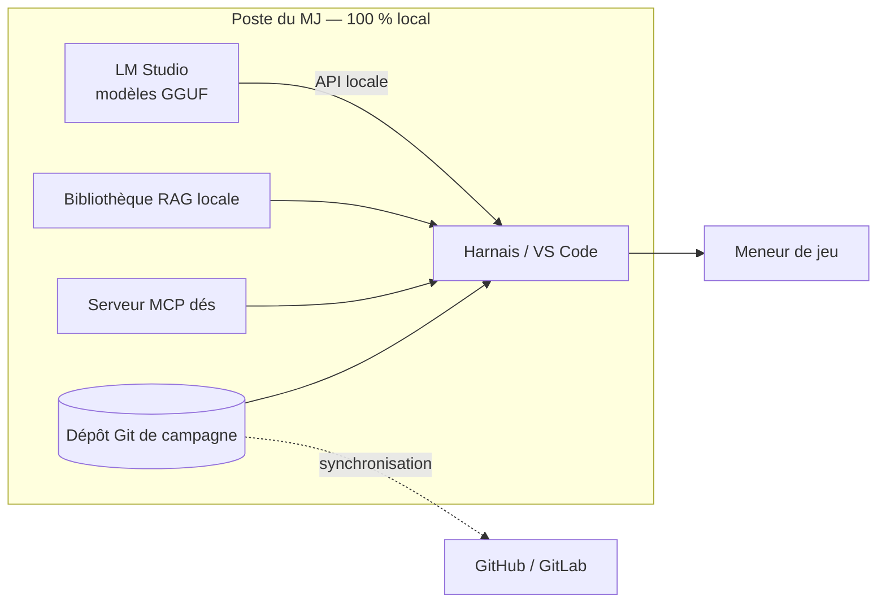
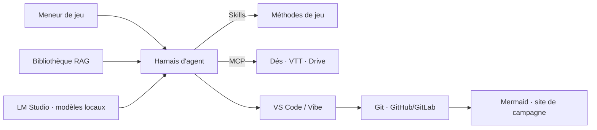

> 🗂️ **Section Diátaxis** : Explication · **Niveau Bloom** : Comprendre → Analyser
> **Objectifs pédagogiques** : *expliquer* le rôle de chaque brique (RAG, harnais, IDE, Git, Mermaid, LM Studio) et *organiser* leur adoption en trajectoire progressive

# Écosystème d'outils IA pour le JDR

Ce document prolonge [Usage des LLM dans le JDR](../Usage%20des%20LLM%20dans%20le%20JDR.md) et [Skills et MCP dans le JDR](../30-explication/Skills%20et%20MCP%20dans%20le%20JDR.md). Il présente six briques complémentaires qui, ensemble, constituent le poste de travail du meneur de jeu augmenté : le **RAG** (que nous nommerons ici *bibliothèque*), les **harnais** d'agents, les **IDE** (VS Code, Mistral Vibe), **GitHub / GitLab**, **Mermaid** et **LM Studio** pour les modèles locaux. Pour chaque brique, une *branche d'évolution* décrit la trajectoire recommandée pour un joueur ou un meneur de jeu.

***

## Le RAG, ou la bibliothèque du meneur de jeu

Le **RAG** (*Retrieval-Augmented Generation*, génération augmentée par récupération) consiste à coupler un moteur de recherche à un LLM : avant de répondre, le modèle va chercher dans une **bibliothèque** de documents les passages pertinents, puis s'appuie dessus pour rédiger sa réponse.

Pour le JDR, c'est la solution au problème de la fenêtre contextuelle : impossible de coller 400 pages de règles dans un prompt, mais un système RAG permet de poser « quelle est la portée du sort Boule de feu ? » et d'obtenir la réponse exacte *avec la référence à la page*.

### Comment ça marche ?

1. **Indexation** : les documents (livre de règles, univers, scénarios, fiches, comptes rendus) sont découpés en passages et transformés en vecteurs (embeddings) stockés dans une base vectorielle.
2. **Récupération** : à chaque question, les passages les plus similaires sont recherchés.
3. **Génération** : le LLM rédige sa réponse en s'appuyant sur ces extraits, avec moins d'hallucinations et des sources citables.

Le pipeline RAG en trois temps :

### Usages au jeu

* Interroger les règles pendant la séance sans interrompre le rythme.
* Demander « résume tout ce qu'on sait sur le PNJ Aldric » en puisant dans les comptes rendus.
* Vérifier la cohérence d'un scénario avec l'univers déjà établi.

### Branche d'évolution

Commencez par une bibliothèque simple (u
n dossier de fiches Markdown interrogé via un client RAG grand public ou une bibliothèque utilisateur type Le Chat), puis évoluez vers :
* une base dédiée par campagne, versionnée en Git ;
* des métadonnées par document (système de règles, chronologie, fiabilité) pour affiner la récupération ;
* à terme, une bibliothèque hybride combinant recherche sémantique et index classique, servie à l'agent via MCP.

***

## Les harnais d'agents

Un **harnais** (*agent harness*) est la couche logicielle qui encaisse un LLM pour en faire un **agent** : il gère la boucle de raisonnement, l'appel d'outils (via MCP), la mémoire de travail, les permissions et l'exécution de scripts. Le modèle est le moteur ; le harnais est le châssis, la boîte de vitesse et le tableau de bord.

Les environnements agentiques modernes (Vibe de Mistral, Claude Code, etc.) sont des harnais : ils donnent au modèle la capacité de lire/écrire des fichiers, chercher sur le web, appeler des connecteurs, et surtout de **charger des Skills** et des instructions personnalisées.

### Pourquoi c'est structurant pour le JDR

* Le MJ ne « discute » plus avec le modèle : il **délègue des missions** (« prépare le compte rendu de la séance 12 et mets à jour la fiche d'Aldric »).
* Le harnais conserve un **contexte de travail** (fichiers de campagne) au-delà de la fenêtre contextuelle.
* Les **permissions** protègent les documents : lecture seule sur les règles, écriture dans le journal de campagne.

### Branche d'évolution

* Niveau 1 : utiliser un agent conversationnel avec un bon prompt système de MJ.
* Niveau 2 : ajouter des Skills dédiées (scénario, compte rendu, créature) et un dépôt de campagne structuré.
* Niveau 3 : connecter des serveurs MCP (bibliothèque, dés, stockage) et laisser l'agent orchestrer des chaînes complètes : notes de séance → compte rendu → mise à jour des fiches → accroches de la prochaine séance.

***

## IDE et environnements : VS Code et Mistral Vibe

Un **IDE** (*Integrated Development En
vironment*) n'est plus réservé aux développeurs : c'est devenu un poste de pilotage de l'IA. Deux familles concernent le MJ :

### VS Code (et ses dérivés)

Éditeur libre extensible, VS Code accueille des assistants IA (Copilot, Cline, Continue…) capables de lire un dossier entier, d'éditer plusieurs fichiers, de lancer des commandes et de discuter avec des serveurs MCP locaux. Pour un MJ qui gère sa campagne comme un projet de fichiers Markdown — règles, univers, scénarios, fiches — c'est un atelier complet :

* édition structurée des documents de campagne ;
* prévisualisation des fiches et diagrammes Mermaid ;
* agents IA opérant directement dans le dépôt.

### Mistral Vibe

Vibe (Mistral AI) est un environnement de travail agentique conçu autour des mêmes briques : harnais d'agent, Skills personnelles, connecteurs (GitHub, Drive, agenda…), canvas de rendu. Là où VS Code demande un profil technique, Vibe vise l'usage guidé : on y construit des Skills « génération de scénario » ou « mémoire de campagne » sans écrire de code.

### Branche d'évolution

* Niveau 1 : dans VS Code, organiser sa campagne en dépôt de fichiers Markdown et se faire assister pour les relectures.
* Niveau 2 : installer un serveur MCP local dans VS Code (lancers de dés, bibliothèque) et utiliser les agents en mode éditeur multi-fichiers.
* Niveau 3 : dans Vibe, créer ses Skills métier de MJ et brancher les connecteurs documentaires ; synchroniser les deux mondes via un dépôt Git partagé.

***

## GitHub et GitLab : versionner sa campagne

**Git** est le système de versionnement distribué ; **GitHub** et **GitLab** sont les plateformes qui l'hébergent avec une couche collaborative (problèmes/issues, pull requests/fusions, wikis, pages web, CI/CD).

Pour le MJ, un dépôt Git transforme la campagne en projet vivant :

* **historique** : retrouver l'état des fiches à la séance 3, voir ce qui a changé entre deux séances ;
* **sauvegarde** : la campagne vit dans le cloud, indépendante du disque dur ;

* **collaboration** : co-MJ et joueurs peuvent proposer des ajouts via pull requests (avec relecture avant intégration) ;
* ** publication** : GitHub Pages peut servir le livre des règles maison ou la gazette de la campagne en site statique.

GitLab offre en plus l'auto-hébergement (utile pour une assoc ou un club qui veut garder la main sur ses données) et une intégration continue qui peut, par exemple, valider automatiquement la cohérence des fiches à chaque modification.

Cycle de vie type d'un compte rendu de séance :

### Branche d'évolution

* Niveau 1 : un dépôt `ma-campagne` avec un dossier par brique (univers, scénarios, PNJ, comptes rendus).
* Niveau 2 : un **générateur de site statique** (GitHub Pages + MkDocs ou Hugo) pour publier la bibliothèque de campagne aux joueurs.
* Niveau 3 : des **workflows automatisés** — à chaque compte rendu poussé, un agent IA génère le résumé, met à jour l'index et le sommaire du site. La campagne devient un projet logiciel vivant, co-écrit par le MJ et ses agents.

***

## Mermaid : des diagrammes pour l'univers et les scénarios

**Mermaid** est un langage de diagrammes en texte : on décrit le schéma dans une syntaxe simple, il est rendu graphiquement (sur GitHub, GitLab, Obsidian, VS Code, dans Le Chat…). C'est le compagnon naturel d'une campagne écrite en Markdown.

### Ce que Mermaid apporte au MJ

* **Chronologie** (`timeline`) : la frise des événements de l'univers et des séances.
* **Graphe de relations** (`graph` / `flowchart`) : qui connaît qui, alliances et secrets entre PNJ.
* **Diagramme d'état** (`stateDiagram`)** : quêtes, réputation, évolution d'une intrigue.
* **Organigramme** (`flowchart`) : structure d'un scénario ramifié, issues possibles.
* **Carte mentale** (`mindmap`) : exploration d'un univers en préparation de séance.
* **Gantt** (`gantt`) : calendrier de préparation du MJ entre deux parties.

Exemple concret — la frise des événements d'une campagne :

Le texte étant la source, un **LLM génère et met à jour ces diagrammes** à la demande : « mets à jour le graphe des relations après la trahison d'Aldric ».

### Branche d'évolution

* Niveau 1 : ajouter un `timeline` et un `flowchart` de scénario au dépôt de campagne (rendus nativement par GitHub).
* Niveau 2 : demander à l'agent IA de maintenir les diagrammes à jour à chaque compte rendu — les schémas deviennent la vue « cockpit » de la campagne.
* Niveau 3 : des diagrammes générés par les Skills (état des quêtes, carte des factions) et publiés automatiquement sur le site statique du dépôt, donnant aux joueurs une vue vivante de l'état du monde.

***

## LM Studio : des modèles locaux à la table

**LM Studio** est une application de bureau qui fait tourner des LLM **en local** sur sa propre machine (ou une machine de la table de jeu) : on télécharge des modèles ouverts (Mistral, Llama, Qwen…) au format GGUF, on discute dans une interface dédiée, et surtout on peut exposer un **serveur local compatible API** — y compris MCP — utilisable par d'autres outils (VS Code, Obsidian, agents).

### Pourquoi du local pour le JDR ?

* **Confidentialité** : les univers maison et les données des joueurs ne quittent pas la table — point sensible abordé dans l'article principal.
* **Hors ligne** : jeu en cabane, convention sans réseau, dépendance zéro.
* **Coût** : aucune consommation d'API payante pour les tâches répétitives.
* **Héritage** : un modèle figé en version ne « change pas d'humeur » en cours de campagne.

La contrepartie : qualité et fenêtre contextuelle moindres que les grands modèles hébergés, et nécessité d'une machine correcte.
La « station de table » locale :

### Branche d'évolution

* Niveau 1 : tester un petit modèle ouvert dans LM Studio pour les tâches anonymes (noms, descriptions, rebuts de génération).
* Niveau 2 : exposer le serveur local et l'exploiter dans VS Code ou via un harnais pour le travail sur les données sensibles de la campagne.
* Niveau 3 : une **station locale de table** — LM Studio + bibliothèque RAG locale + lancers de dés MCP — offrant un assistant de jeu totalement autonome, couplée au dépôt Git de la campagne pour l'histo
rique.

***

## Vue d'ensemble : le poste de MJ augmenté

Chaque brique répond à un besoin précis : la **bibliothèque** (RAG) apporte la mémoire documentaire, le **harnais** l'autonomie, l'**IDE** le poste de pilotage, **Git** la pérennité, **Mermaid** la visualisation, **LM Studio** la souveraineté. Combinées aux Skills et au MCP, elles dessinent un environnement de jeu complet où le MJ garde l'initiative et les agents exécutent.

***

## Références et sources

* RAG — présentation de Mistral AI : https://mistral.ai/news/building-an-effective-rag-pipeline
* Spécification MCP : https://modelcontextprotocol.io
* VS Code : https://code.visualstudio.com
* GitHub : https://github.com · GitLab : https://gitlab.com
* Mermaid : https://mermaid.js.org
* LM Studio : https://lmstudio.ai

***

## Conclusion

RAG, harnais, IDE, GitHub/GitLab, Mermaid et LM Studio sont les six directions dans lesquelles le JDR assisté par IA se déploie : mémoire, autonomie, atelier, pérennité, lisibilité et souveraineté. La démarche recommandée est progressive : une brique à la fois, en commençant par la bibliothèque et le dépôt Git, puis en laissant le harnais relier l'ensemble. La table de jeu reste un lieu humain ; tout cet outillage ne sert qu'une chose : donner au meneur de jeu plus de temps pour ce qui compte — l'histoire et les joueurs.