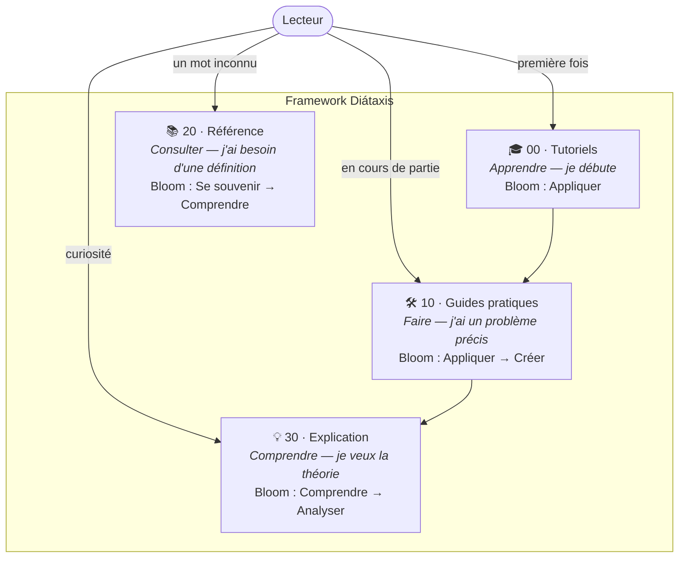
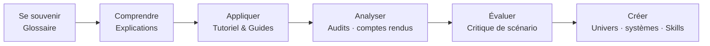
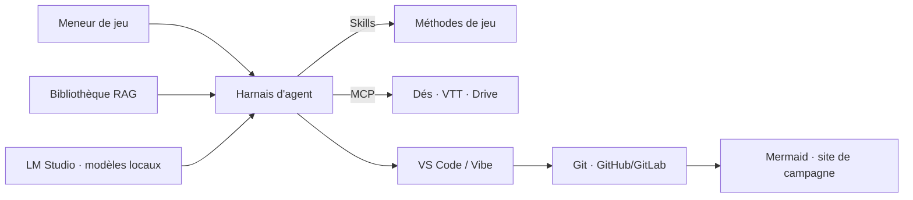

## Licence

Cet article est sous licence [Creative Commons Attribution - Pas d'utilisation commerciale - Pas de modification (CC BY-NC-ND)](https://creativecommons.org/licenses/by-nc-nd/4.0/). Vous êtes libre de partager cet article avec attribution, mais aucune utilisation commerciale ou modification n'est autorisée.

# Usage des LLM et de l'IA dans le Jeu de Rôle

Ce dépôt documente l'usage des LLM et de l'écosystème d'outils IA pour le jeu de rôle sur table. Il est organisé selon le framework **[Diátaxis](https://diataxis.fr)** — quatre sections qui répondent à quatre besoins différents — et chaque document affiche ses objectifs selon la **taxonomie de Bloom** (Se souvenir → Comprendre → Appliquer → Analyser → Évaluer → Créer).

## Comment naviguer ?

## Le parcours d'apprentissage en niveau Bloom

## Sommaire du dépôt

### 🎓 Tutoriels — apprendre en faisant

* [Tutoriel : premiers pas avec un LLM pour le JDR](00-tutoriels/Tutoriel%20premiers%20pas.md) — produire votre premier scénario en 15 minutes.

### 🛠️ Guides pratiques — résoudre un problème précis

* [Guides pratiques pour le MJ](10-guides/Guides%20pratiques%20pour%20le%20MJ.md) — carte de tous les « Comment faire X ? » (scénario, PNJ, audit, compte rendu, univers…).

### 📚 Référence — vérifier un terme ou une notion

* [Glossaire du JDR augmenté](20-reference/Glossaire.md) — tous les termes du dépôt, du NLP au MCP.

### 💡 Explication — comprendre la théorie et l'architecture

* [Usage des LLM dans le JDR](Usage%20des%20LLM%20dans%20le%20JDR.md) — l'article fondateur : fondamentaux, prompt engineering, cas d'usages, Chartopia.
* [Skills et MCP dans le JDR](30-explication/Skills%20et%20MCP%20dans%20le%20JDR.md) — compétences agentiques et protocole de connexion des outils.
* [Écosystème d'outils IA pour le JDR](30-explication/%C3%89cosyst%C3%A8me%20d'outils%20IA%20pour%20le%20JDR.md) — RAG/bibliothèque, harnais, IDE, GitHub/GitLab, Mermaid, LM Studio : six briques avec leurs branches d'évolution.

***

## Vue d'ensemble : le poste de MJ augmenté

