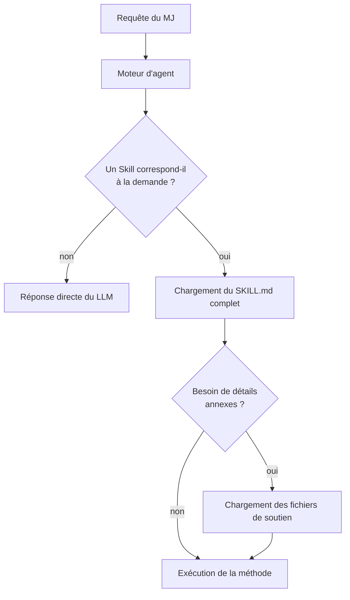
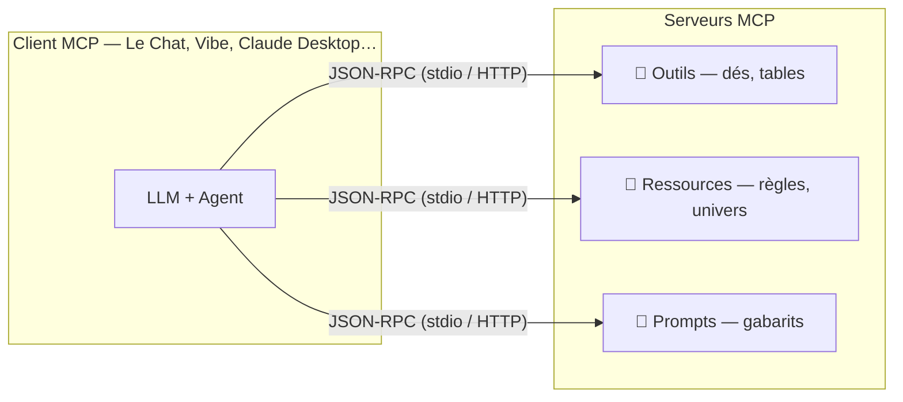
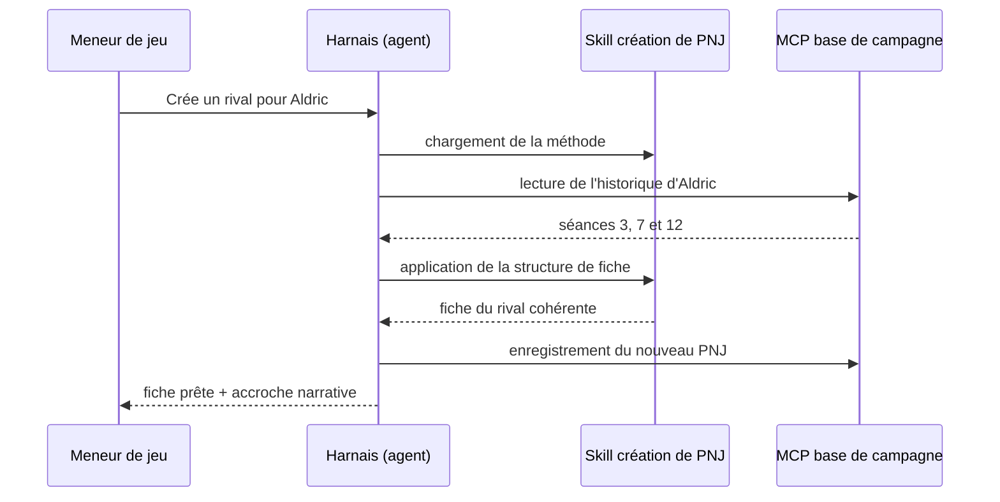

# Usage des Skills et du MCP dans le JDR

Ce document complète l'article [Usage des LLM dans le JDR](Usage%20des%20LLM%20dans%20le%20JDR.md) en présentant deux évolutions majeures de l'écosystème des LLM : les **Skills** (compétences agentiques) et le **MCP** (*Model Context Protocol*). Ces deux briques transforment un simple chatbot en véritable assistant de jeu capable d'agir sur vos outils : tables aléatoires, carnets de notes, VTT, générateurs de personnages, etc.

***

## Qu'est-ce qu'un Skill ?

Un *Skill* (compétence) est un paquet d'instructions, de scripts et de ressources que l'on fournit à un agent IA pour lui apprendre à réaliser une tâche récurrente de manière fiable et reproductible. Plutôt que de recopier la même série de prompts à chaque partie, on écrit une fois la méthode, et l'agent la charge quand le besoin apparaît.

### Objectifs d'un Skill

* **Fiabiliser** : la même procédure produit le même niveau de qualité à chaque session, sans dépendre de l'humeur ou de la mémoire du modèle.
* **Capitaliser** : le savoir-faire du meneur de jeu (structure de scénario, format de fiche, style de compte rendu) devient un actif réutilisable.
* **Réduire le contexte** : le détail de la procédure n'occupe la fenêtre contextuelle que lorsqu'il est nécessaire (chargement progressif).
* **Partager** : un Skill est un dossier de fichiers, versionnable dans un dépôt Git et diffusable à la communauté.

### Anatomie d'un Skill

Un Skill suit le standard ouvert *Agent Skills* (initié par Anthropic et adopté par d'autres plateformes comme Mistral AI avec Le Chat / Vibe) :

* un dossier nommé d'après la compétence (par ex. `generation-scenario/`) ;
* un fichier `SKILL.md` obligatoire : nom, description et instructions en langage naturel, avec une métadonnée YAML (frontmatter) ;
* des fichiers de soutien optionnels : références détaillées, gabarits, scripts Python ou JavaScript, exemples.

Le chargement est **progressif** (*progressive disclosure*) : l'agent ne lit d'abor
d que le nom et la description de chaque Skill, puis charge le `SKILL.md` complet seulement si la tâche l'exige, et enfin les fichiers annexes au besoin. C'est exactement la stratégie d'optimisation de la fenêtre contextuelle décrite dans l'article principal.

### Exemples de Skills pour le JDR

* **Génération de scénario** : structure canonique (pitch, accroches, PNJ, issues), ton et longueur imposés, audit automatique en fin de génération.
* **Compte rendu de séance** : conversion de notes brutes ou d'un enregistrement en journal de campagne au format standardisé (résumé, scènes clés, citations, points d'expérience, accroches pour la prochaine séance).
* **Création de créature** : équilibrage selon un cadre de règles donné, fiche au format attendu, nidification des capacités spéciales.
* **Mémoire de campagne** : maintien d'un état de partie (personnages, lieux, événements) dans des fichiers structurés, mis à jour après chaque séance.
* **Traduction / adaptation** : conversion d'un contenu entre systèmes de règles ou entre univers.

***

## Qu'est-ce que le MCP ?

Le *Model Context Protocol* (MCP) est un protocole ouvert introduit par Anthropic fin 2024, devenu un standard de facto pour connecter les LLM à des systèmes externes. On peut le voir comme un « port USB-C de l'IA » : une interface normalisée qui permet à n'importe quel client (Claude Desktop, Le Chat, Vibe, Cursor, etc.) de dialoguer avec n'importe quel serveur d'outils ou de données.

### Architecture client / serveur

* **Client MCP** : l'application hôte qui embarque le LLM (interface de chat ou agent).
* **Serveur MCP** : un petit programme qui expose des **outils** (fonctions appelables : lancer un dé, créer une fiche), des **ressources** (documents accessibles : règles, univers de campagne) et des **prompts** (gabarits prêts à l'emploi).
* **Transports** : communication locale (stdio) ou à distance (HTTP / Server-Sent Events).

Le meneur de jeu peut donc brancher ses propres outils sans attendre q
u'une plateforme les intègre nativement.

Schéma d'ensemble du protocole :

### Serveurs MCP utiles pour le JDR

* **Lancers de dés et tables aléatoires** : un serveur Dice Roller ou un connecteur vers Chartopia permet au LLM de tirer réellement les dés et de s'appuyer sur des résultats authentiques plutôt que de les simuler — en prolongeant la boucle LLM ↔ Chartopia décrite dans l'article principal.
* **VTT et plateformes de jeu** : des serveurs communautaires existent pour FoundryVTT, Roll20 ou Obsidian (gestion de notes de campagne), permettant au MJ de demander « mets à jour la fiche du personnage X » et de voir la modification appliquée dans l'outil.
* **Stockage documentaire** : Google Drive, Notion ou SharePoint via MCP pour stocker et relire les univers, scénarios et historiques de personnages — une mémoire de campagne persistante au-delà de la fenêtre contextuelle.
* **Automatisation** : GitHub (versionner ses scénarios), agenda (planifier les séances), messagerie (diffuser les comptes rendus au groupe).

### Skills vs MCP : quelles différences ?

| Critère | Skill | MCP |
|---|---|---|
| Nature | Savoir-faire (instructions, gabarits, scripts) | Connectivité (accès à des outils et données externes) |
| Format | Dossier de fichiers Markdown + scripts | Programme serveur exposant outils/ressources/prompts |
| Réponse au besoin | « Comment faire ? » | « Avec quoi interagir ? » |
| Exemple JDR | Méthode d'écriture d'un scénario | Lancer de dés dans FoundryVTT |

Les deux sont **complémentaires** : un Skill « création de PNJ » peut s'appuyer sur un serveur MCP « base de données de campagne » pour relire l'historique et y enregistrer le nouveau personnage.

***

En pratique, Skill et MCP coopèrent dans une même mission :

## Bonnes pratiques et précautions

* **Vie privée** : un serveur MCP expose des données réelles (notes, fichiers, comptes). Ne branchez que des serveurs de confiance, vérifiez les permissions demandées et évitez d'exposer des données personnelles des joueurs.
* **Sécurité** : privilégiez les serveurs open source auditables ; un outil MCP
 peut agir sur vos systèmes (création, modification, suppression de fichiers).
* **Coût et fenêtre contextuelle** : chaque outil connecté ajoute des définitions dans le contexte. N'activez que les serveurs nécessaires à la séance.
* **Reproductibilité** : versionnez vos Skills et serveurs (Git, Docker) pour retrouver exactement la configuration d'une campagne donnée.
* **Esprit du jeu** : les outils assistent le MJ, ils ne remplacent ni sa voix ni la négociation de table. Gardez la main finale sur les tirages et décisions sensibles.

***

## Références et sources

* Anthropic — *Agent Skills* : https://www.anthropic.com/news/skills
* Anthropic — *Model Context Protocol* : https://www.anthropic.com/news/model-context-protocol
* Spécification MCP : https://modelcontextprotocol.io
* Registre de serveurs MCP : https://github.com/modelcontextprotocol/servers
* Mistral AI — Le Chat & Vibe : https://mistral.ai

***

## Conclusion

Skills et MCP représentent le même tournant pour le JDR assisté par IA : on passe de la *conversation ponctuelle* à l'*environnement de jeu outillé et persistant*. Le Skill capture la méthode du meneur de jeu ; le MCP branche le modèle sur les dés, les tables, les fiches et les notes de campagne. Combinés à l'ingénierie du prompt et à l'optimisation du contexte décrits dans l'article principal, ils permettent de construire un poste de MJ augmenté complet, reproductible et partageable.
